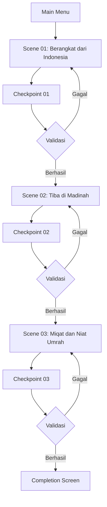

# 00_PROJECT_OVERVIEW.md
# ============================================
# VR EDUCATION HAJI & UMRAH
# PROJECT OVERVIEW
# Version : 1.0
# ============================================

---

## Daftar Isi

- [Informasi Proyek](#informasi-proyek)
- [Latar Belakang](#latar-belakang)
- [Tujuan](#tujuan)
- [Target Pengguna](#target-pengguna)
- [Learning Method](#learning-method)
- [Simulation Flow](#simulation-flow)
- [Scope](#scope)
- [Functional Requirement](#functional-requirement)
- [Non Functional Requirement](#non-functional-requirement)
- [Success Criteria](#success-criteria)
- [Deliverables](#deliverables)
- [Risk](#risk)
- [Future Development](#future-development)

---

## Informasi Proyek

| Atribut | Nilai |
|---------|-------|
| Nama Proyek | VR Education Haji & Umrah |
| Jenis Proyek | Interactive Virtual Reality Education |
| Platform | Desktop, Browser, VR Ready |
| Teknologi Utama | Blazor Server, Three.js, .NET 9 |
| Versi Dokumen | 1.0 |
| Status | Perencanaan |
| Target Rilis | Q4 2026 |

Proyek ini merupakan aplikasi edukasi berbasis Virtual Reality yang dirancang untuk memberikan simulasi interaktif mengenai rangkaian ibadah Haji dan Umrah. Aplikasi ini dibangun menggunakan Blazor Server sebagai kerangka kerja backend dan frontend, Three.js sebagai engine rendering 3D, serta JavaScript Interop untuk komunikasi antara keduanya. Platform target mencakup desktop modern dan browser yang mendukung WebGL, dengan opsi VR Ready untuk perangkat headset VR yang kompatibel.

---

## Latar Belakang

Ibadah Haji dan Umrah merupakan dua ritual penting dalam agama Islam yang memerlukan pemahaman mendalam tentang tata cara, urutan, dan adab pelaksanaannya. Setiap tahunnya, jutaan jamaah dari seluruh dunia, termasuk Indonesia, berangkat ke Tanah Suci untuk menunaikan ibadah ini. Namun, tidak semua calon jamaah memiliki kesempatan untuk mempelajari secara langsung rangkaian ibadah ini sebelum keberangkatan.

Beberapa permasalahan yang teridentifikasi adalah sebagai berikut:

1. **Keterbatasan Akses Edukasi** — Tidak semua calon jamaah dapat mengikuti bimbingan manasik secara langsung karena keterbatasan geografis dan waktu.
2. **Kurangnya Visualisasi** — Materi manasik yang disampaikan secara konvensional seringkali sulit divisualisasikan, terutama bagi jamaah yang baru pertama kali akan berangkat.
3. **Tingkat Kecemasan Tinggi** — Banyak calon jamaah mengalami kecemasan karena tidak familiar dengan lingkungan, lokasi, dan proses ibadah di Tanah Suci.
4. **Keterbatasan Simulasi Fisik** — Metode pembelajaran konvensional tidak dapat memberikan simulasi fisik mengenai lokasi-lokasi penting seperti Masjid Nabawi, Masjidil Haram, Arafah, Muzdalifah, dan Mina.

Berdasarkan permasalahan di atas, proyek VR Education Haji & Umrah hadir sebagai solusi inovatif yang memanfaatkan teknologi Virtual Reality untuk memberikan pengalaman belajar yang imersif, interaktif, dan mendekati kondisi nyata.

---

## Tujuan

Tujuan utama dari proyek ini adalah sebagai berikut:

1. **Tujuan Umum**
   - Menyediakan media pembelajaran interaktif berbasis VR untuk ibadah Haji dan Umrah.
   - Meningkatkan pemahaman calon jamaah terhadap tata cara pelaksanaan ibadah.

2. **Tujuan Khusus**
   - Mensimulasikan lingkungan 3D Bandara Indonesia untuk proses keberangkatan.
   - Mensimulasikan lingkungan 3D Madinah termasuk Masjid Nabawi dan sekitarnya.
   - Mensimulasikan lokasi Miqat dan proses niat Umrah.
   - Menyediakan edukasi interaktif tentang dalil, hikmah, dan adab ibadah.
   - Membangun sistem checkpoint dan validasi untuk memastikan pemahaman pengguna.
   - Mengintegrasikan audio narator, subtitle, dan petunjuk visual.

---

## Target Pengguna

| Segmen | Deskripsi | Kebutuhan Khusus |
|--------|-----------|------------------|
| Calon Jamaah Haji | Pengguna yang akan menunaikan ibadah Haji | Simulasi lengkap rangkaian Haji |
| Calon Jamaah Umrah | Pengguna yang akan menunaikan ibadah Umrah | Fokus pada tata cara Umrah |
| Pembimbing Manasik | Pembimbing yang membutuhkan alat bantu ajar | Mode presentasi dan kontrol penuh |
| Pelajar/Pengguna Umum | Pengguna yang ingin mempelajari ibadah | Panduan edukasi bertahap |
| Lansia | Pengguna usia lanjut dengan keterbatasan gerak | Kontrol sederhana, teks besar, audio jelas |

---

## Learning Method

Metode pembelajaran yang digunakan dalam aplikasi ini menggabungkan beberapa pendekatan:

### 1. Experiential Learning
Pengguna belajar melalui pengalaman langsung dalam lingkungan VR. Setiap scene dirancang agar pengguna dapat merasakan situasi nyata, mulai dari berada di bandara hingga berada di lokasi ibadah.

### 2. Guided Discovery Learning
Pengguna dipandu oleh NPC pembimbing dan narator audio untuk menemukan dan memahami setiap tahapan ibadah. Petunjuk visual dan subtitle mendukung proses pembelajaran.

### 3. Scaffolded Learning
Materi disajikan secara bertahap dari yang paling dasar hingga kompleks. Scene 1 fokus pada persiapan, Scene 2 pada lingkungan Madinah, dan Scene 3 pada inti ibadah Umrah.

### 4. Assessment-Based Learning
Setiap scene memiliki checkpoint dan validasi yang mengukur pemahaman pengguna sebelum melanjutkan ke tahap berikutnya.

### 5. Repetitive Learning
Pengguna dapat mengulang scene atau tahapan tertentu hingga memahami materi dengan baik.

---

## Simulation Flow

Berikut adalah alur simulasi utama aplikasi:

### Alur Scene Detail

| Scene | Lokasi | Aktivitas Utama | Durasi Estimasi |
|-------|--------|-----------------|-----------------|
| Scene 01 | Indonesia | Check-in, boarding, edukasi persiapan | 15-20 menit |
| Scene 02 | Madinah | Imigrasi, hotel, Masjid Nabawi | 20-25 menit |
| Scene 03 | Miqat | Ihram, niat, talbiyah | 20-25 menit |

---

## Scope

### In Scope

1. **Scene Development**
   - Scene 01: Berangkat dari Indonesia (Bandara, check-in, boarding, pesawat)
   - Scene 02: Tiba di Madinah (Bandara, imigrasi, hotel, Masjid Nabawi)
   - Scene 03: Miqat dan Niat Umrah (Lokasi Miqat, ihram, niat, talbiyah)

2. **Edukasi**
   - Penjelasan dalil dan hikmah setiap tahapan
   - Panduan adab dan larangan
   - Tips dan kesalahan umum

3. **Interaktivitas**
   - Navigasi walk dan teleport
   - Interaksi klik dan hover pada objek
   - Dialog dengan NPC

4. **Audio**
   - Narator penuntun
   - Ambient sound sesuai lokasi
   - Efek suara interaksi

5. **Sistem**
   - Checkpoint dan validasi
   - Progress tracking
   - Mini-map dan kompas

### Out of Scope

1. Simulasi ibadah Haji lengkap (Arafah, Muzdalifah, Mina, Tawaf, Sa'i)
2. Mode multiplayer atau multi-user
3. Integrasi dengan perangkat haptic feedback
4. Mobile platform (iOS/Android)
5. Streaming VR langsung
6. Pembelian tiket atau layanan biro perjalanan

---

## Functional Requirement

### FR-01: Manajemen Scene
| ID | Deskripsi | Prioritas |
|----|-----------|-----------|
| FR-01.01 | Sistem dapat memuat scene 3D berdasarkan urutan pembelajaran | Tinggi |
| FR-01.02 | Sistem dapat melakukan transisi antar scene secara halus | Tinggi |
| FR-01.03 | Sistem dapat menyimpan dan memuat progress pengguna | Sedang |

### FR-02: Navigasi
| ID | Deskripsi | Prioritas |
|----|-----------|-----------|
| FR-02.01 | Pengguna dapat berjalan di lingkungan 3D menggunakan kontrol keyboard | Tinggi |
| FR-02.02 | Pengguna dapat melakukan teleport ke titik tertentu | Sedang |
| FR-02.03 | Sistem menyediakan mini-map untuk navigasi | Sedang |

### FR-03: Interaksi
| ID | Deskripsi | Prioritas |
|----|-----------|-----------|
| FR-03.01 | Pengguna dapat mengklik objek untuk mendapatkan informasi | Tinggi |
| FR-03.02 | Objek interaktif menyala saat di-hover | Tinggi |
| FR-03.03 | Pengguna dapat berinteraksi dengan NPC melalui dialog | Tinggi |

### FR-04: Edukasi
| ID | Deskripsi | Prioritas |
|----|-----------|-----------|
| FR-04.01 | Sistem menampilkan penjelasan edukasi di setiap tahapan | Tinggi |
| FR-04.02 | Sistem menampilkan dalil Al-Quran dan Hadits terkait | Tinggi |
| FR-04.03 | Sistem memberikan tips dan peringatan kesalahan umum | Sedang |

### FR-05: Audio
| ID | Deskripsi | Prioritas |
|----|-----------|-----------|
| FR-05.01 | Sistem memutar audio narator sesuai konteks | Tinggi |
| FR-05.02 | Sistem memutar ambient sound sesuai lingkungan | Sedang |
| FR-05.03 | Pengguna dapat mengatur volume audio | Rendah |

### FR-06: Validasi
| ID | Deskripsi | Prioritas |
|----|-----------|-----------|
| FR-06.01 | Sistem melakukan validasi pemahaman di setiap checkpoint | Tinggi |
| FR-06.02 | Sistem memberikan feedback atas jawaban pengguna | Tinggi |
| FR-06.03 | Sistem mencatat skor dan progress pembelajaran | Sedang |

---

## Non Functional Requirement

### NFR-01: Performa
| ID | Deskripsi | Target |
|----|-----------|--------|
| NFR-01.01 | Frame rate minimal | 60 FPS |
| NFR-01.02 | Waktu muat scene maksimal | 5 detik |
| NFR-01.03 | Waktu respon interaksi maksimal | 100ms |

### NFR-02: Keamanan
| ID | Deskripsi |
|----|-----------|
| NFR-02.01 | Semua koneksi menggunakan HTTPS |
| NFR-02.02 | Autentikasi pengguna menggunakan ASP.NET Identity |
| NFR-02.03 | Validasi input di sisi server |
| NFR-02.04 | Proteksi terhadap XSS dan CSRF |

### NFR-03: Kompatibilitas
| ID | Deskripsi |
|----|-----------|
| NFR-03.01 | Mendukung browser Chrome, Firefox, Edge, dan Opera |
| NFR-03.02 | Mendukung WebGL 2.0 |
| NFR-03.03 | Mendukung resolusi layar minimal 1280x720 |

### NFR-04: Usability
| ID | Deskripsi |
|----|-----------|
| NFR-04.01 | UI mendukung Bahasa Indonesia |
| NFR-04.02 | Tersedia subtitle untuk semua audio narasi |
| NFR-04.03 | Kontrol dapat diakses melalui keyboard dan mouse |

### NFR-05: Maintainability
| ID | Deskripsi |
|----|-----------|
| NFR-05.01 | Kode mengikuti Clean Architecture |
| NFR-05.02 | Dokumentasi lengkap untuk setiap modul |
| NFR-05.03 | Konfigurasi terpusat melalui appsettings.json |

---

## Success Criteria

### Kriteria Kelulusan Fungsional

| No | Kriteria | Metrik |
|----|----------|--------|
| 1 | Seluruh scene dapat dimuat tanpa error | 100% |
| 2 | Interaksi pengguna berfungsi sesuai FR | 100% |
| 3 | Checkpoint dan validasi berjalan dengan benar | 100% |
| 4 | Audio narator dan ambient terintegrasi penuh | 100% |
| 5 | NPC dan dialog berfungsi di semua scene | 100% |

### Kriteria Kelulusan Non-Fungsional

| No | Kriteria | Metrik |
|----|----------|--------|
| 1 | Frame rate stabil di 60 FPS | Minimal 90% waktu |
| 2 | Waktu muat scene kurang dari 5 detik | 100% |
| 3 | Tidak ada bug kritis | 0 bug |
| 4 | Skor usability testing minimal | 80/100 |

---

## Deliverables

| No | Deliverable | Format | Deskripsi |
|----|-------------|--------|-----------|
| 1 | Project Overview | Markdown | Dokumen ini |
| 2 | Technology Stack | Markdown | Spesifikasi teknologi dan arsitektur |
| 3 | Scene 01 Document | Markdown | Dokumentasi implementasi Scene 01 |
| 4 | Scene 02 Document | Markdown | Dokumentasi implementasi Scene 02 |
| 5 | Scene 03 Document | Markdown | Dokumentasi implementasi Scene 03 |
| 6 | Source Code | C#/JS/HTML | Implementasi Blazor Server dan Three.js |
| 7 | 3D Assets | GLTF/GLB | Model 3D dari Fab Marketplace |
| 8 | Audio Assets | MP3/OGG/WAV | Narasi dan ambient sound |
| 9 | Database Scripts | SQL | Migration dan seed data |
| 10 | User Manual | PDF | Panduan penggunaan aplikasi |

---

## Risk

| No | Risiko | Dampak | Mitigasi |
|----|--------|--------|----------|
| 1 | Kinerja rendah pada perangkat rendah | Tinggi | Implementasi LOD, Draco compression, frustom culling |
| 2 | Keterbatasan asset 3D di Fab Marketplace | Sedang | Persiapan alternatif asset, optimasi asset |
| 3 | Kompleksitas integrasi Blazor + Three.js | Sedang | Dokumentasi interop yang jelas, prototyping awal |
| 4 | Masalah lisensi asset | Rendah | Verifikasi lisensi Fab Marketplace |
| 5 | Perubahan spesifikasi teknis | Sedang | Arsitektur modular, clean architecture |
| 6 | Ketidakakuratan konten edukasi | Tinggi | Review oleh ahli agama (ulama/pembimbing) |

---

## Future Development

Berikut adalah rencana pengembangan masa depan yang tidak termasuk dalam scope awal:

### Tahap 2: Perluasan Scene

| Scene | Deskripsi |
|-------|-----------|
| Scene 04 | Tawaf dan Sa'i di Masjidil Haram |
| Scene 05 | Wukuf di Arafah |
| Scene 06 | Mabit di Muzdalifah |
| Scene 07 | Melempar Jumrah di Mina |
| Scene 08 | Tawaf Ifadah dan Tawaf Wada |

### Tahap 3: Fitur Lanjutan

1. **Mode Multiplayer** — Pengguna dapat belajar bersama secara virtual
2. **VR Headset Integration** — Dukungan penuh untuk Oculus Quest, HTC Vive, Valve Index
3. **Haptic Feedback** — Integrasi perangkat haptic untuk pengalaman lebih imersif
4. **Mobile Platform** — Porting ke platform Android dan iOS
5. **AI Assistant** — Asisten AI untuk menjawab pertanyaan pengguna secara real-time
6. **Progress Cloud Sync** — Sinkronisasi progress antar perangkat
7. **Gamification** — Sistem achievement, leaderboard, dan badge
8. **Multi Language** — Dukungan bahasa Arab, Inggris, Urdu, dan Melayu

### Tahap 4: Konten Tambahan

1. **Virtual Tour 360** — Masjid Nabawi dan Masjidil Haram dalam 360 video
2. **Live Update** — Informasi real-time kondisi di Tanah Suci
3. **Konsultasi Online** — Fitur konsultasi dengan pembimbing melalui aplikasi
4. **Manasik Group** — Kelas virtual dengan pembimbing langsung

---

## Penutup

Dokumen Project Overview ini menjadi landasan utama dalam pengembangan VR Education Haji & Umrah. Seluruh dokumen teknis lainnya akan merujuk pada dokumen ini dan harus saling konsisten. Keberhasilan proyek ini akan diukur berdasarkan tercapainya seluruh success criteria yang telah ditetapkan.

Dengan pendekatan sistematis dan berbasis teknologi terkini, proyek ini diharapkan dapat memberikan kontribusi nyata dalam meningkatkan kualitas pembelajaran ibadah Haji dan Umrah bagi masyarakat Indonesia dan dunia.

---

> **Dokumen Terkait:**
> - [01_Technology_Stack.md](./01_Technology_Stack.md)
> - [02_Scene_01_Berangkat_Indonesia.md](./02_Scene_01_Berangkat_Indonesia.md)
> - [03_Scene_02_Tiba_Madinah.md](./03_Scene_02_Tiba_Madinah.md)
> - [04_Scene_03_Miqat_dan_Niat_Umrah.md](./04_Scene_03_Miqat_dan_Niat_Umrah.md)

---
