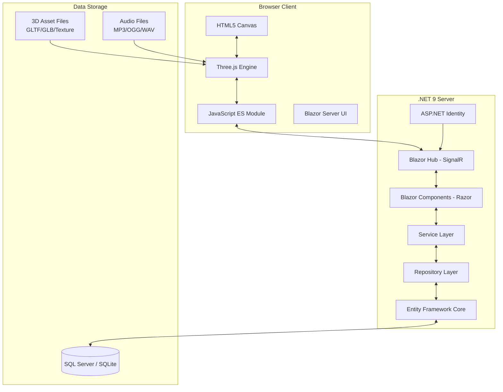
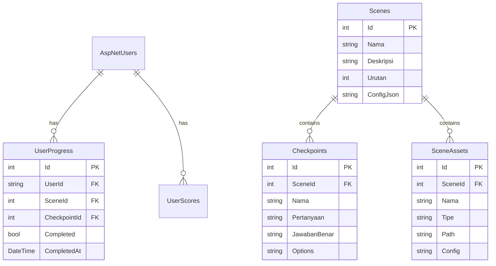

# 01_TECHNOLOGY_STACK.md
# ============================================
# VR EDUCATION HAJI & UMRAH
# TECHNOLOGY STACK
# Version : 1.0
# ============================================

---

## Daftar Isi

- [Project Information](#project-information)
- [Main Technology](#main-technology)
- [Backend](#backend)
- [Frontend](#frontend)
- [ThreeJS](#threejs)
- [Asset](#asset)
- [Database](#database)
- [Folder Standard](#folder-standard)
- [Coding Standard](#coding-standard)
- [Performance](#performance)
- [Security](#security)
- [AI Rule](#ai-rule)

---

## Project Information

| Atribut | Spesifikasi |
|---------|-------------|
| Nama Proyek | VR Education Haji & Umrah |
| Arsitektur | Clean Architecture + SOLID Principle |
| Design Pattern | Repository Pattern, Service Layer, Dependency Injection |
| Backend Framework | Blazor Server (.NET 9) |
| Frontend Engine | Three.js (ES Module) |
| Bahasa Pemrograman | C# 13, JavaScript ES2023, HTML5, CSS3 |
| Database | SQL Server (Production), SQLite (Development) |
| ORM | Entity Framework Core 9 |
| 3D Format | GLTF, GLB |
| Asset Marketplace | Fab Marketplace |
| Rendering | WebGL 2.0, PBR Material, HDRI |

---

## Main Technology

### Diagram Arsitektur



### Penjelasan Arsitektur

Arsitektur aplikasi menggunakan model **Blazor Server** dimana logika aplikasi berjalan di server .NET 9 dan UI dikirim ke browser melalui koneksi **SignalR** secara real-time. Three.js berjalan di sisi client sebagai JavaScript ES Module yang berkomunikasi dengan server melalui **JavaScript Interop**.

Setiap komponen memiliki tanggung jawab yang terpisah sesuai dengan prinsip **Clean Architecture** dan **SOLID Principle**. Pemisahan ini memungkinkan pengembangan yang modular, testable, dan maintainable.

---

## Backend

### Blazor Server (.NET 9)

| Fitur | Implementasi |
|-------|--------------|
| Framework | ASP.NET Core Blazor Server 9 |
| Hosting Model | Server-side rendering dengan SignalR |
| Komponen | .razor files dengan C# code-behind |
| Routing | @page directive, endpoint routing |
| State Management | Scoped service per circuit |
| Lifecycle | OnInitialized, OnParametersSet, OnAfterRender |

Blazor Server dipilih karena:
1. **Keamanan** — Logika aplikasi tidak terekspos ke client
2. **Performa** — Proses berat di sisi server
3. **Real-time** — Koneksi SignalR memungkinkan update langsung
4. **Produktivitas** — Satu bahasa (C#) untuk frontend dan backend

### C# 13

| Fitur | Penggunaan |
|-------|------------|
| Primary Constructors | Service dan repository |
| Collection Expressions | Inisialisasi data |
| Lambda Improvements | Event handler |
| Ref struct enhancements | Performance-critical path |
| Async/Await | Operasi database dan file I/O |

### Dependency Injection

| Service | Lifetime | Deskripsi |
|---------|----------|-----------|
| ISceneService | Scoped | Manajemen scene dan transisi |
| IAssetService | Scoped | Manajemen asset 3D |
| IAudioService | Scoped | Manajemen audio |
| IProgressService | Scoped | Tracking progress pengguna |
| IValidationService | Scoped | Validasi checkpoint |
| INavigationService | Scoped | Navigasi scene |
| IEdukasiService | Scoped | Konten edukasi |

### Repository Layer

| Interface | Implementasi | Entity |
|-----------|--------------|--------|
| IUserRepository | UserRepository | ApplicationUser |
| ISceneRepository | SceneRepository | SceneData |
| IProgressRepository | ProgressRepository | UserProgress |
| ICheckpointRepository | CheckpointRepository | CheckpointData |
| IScoreRepository | ScoreRepository | UserScore |

### Service Layer

| Service | Tanggung Jawab |
|---------|----------------|
| SceneService | Load scene, transisi, manajemen state |
| EdukasiService | Konten edukasi, dalil, hikmah |
| AudioService | Playback narasi, ambient, efek |
| ValidationService | Validasi jawaban, checkpoint |
| ProgressService | Tracking dan penyimpanan progress |
| AssetService | Manajemen dan caching asset 3D |

### Authentication & Authorization

| Fitur | Implementasi |
|-------|--------------|
| Framework | ASP.NET Core Identity |
| Database | Identity tables via EF Core |
| Roles | Admin, User, Pembimbing |
| Policy | Role-based authorization |
| Login | Email/Password, External Login |
| Session | Cookie authentication |

### Logging

| Tool | Level | Output |
|------|-------|--------|
| ILogger<T> | Information | Console (Development) |
| ILogger<T> | Warning | File (Production) |
| ILogger<T> | Error | Database (Production) |

### Configuration

```json
{
  "ConnectionStrings": {
    "DefaultConnection": "Data Source=VRHaji.db",
    "ProductionConnection": "Server=...;Database=VRHaji;..."
  },
  "ThreeJS": {
    "MaxTextureSize": 2048,
    "EnableShadows": true,
    "DefaultCameraFOV": 60,
    "RenderScale": 1.0
  },
  "Performance": {
    "TargetFPS": 60,
    "EnableLOD": true,
    "MaxDrawDistance": 200,
    "EnableFrustumCulling": true
  },
  "Audio": {
    "NaratorVolume": 0.8,
    "AmbientVolume": 0.5,
    "EffectVolume": 0.7
  }
}
```

### Entity Framework Core

| Fitur | Deskripsi |
|-------|-----------|
| Provider | SQL Server (Production) / SQLite (Development) |
| Approach | Code First dengan Migrations |
| Lazy Loading | Disabled (gunakan Include explicit) |
| Query Tracking | AsNoTracking untuk read-only queries |
| Concurrency | RowVersion untuk optimistic concurrency |

#### Entity Models

```csharp
public class SceneData
{
    public int Id { get; set; }
    public string Nama { get; set; }
    public string Deskripsi { get; set; }
    public int Urutan { get; set; }
    public string ConfigJson { get; set; }
    public ICollection<CheckpointData> Checkpoints { get; set; }
}

public class CheckpointData
{
    public int Id { get; set; }
    public int SceneId { get; set; }
    public string Nama { get; set; }
    public string Pertanyaan { get; set; }
    public string JawabanBenar { get; set; }
    public SceneData Scene { get; set; }
}

public class UserProgress
{
    public int Id { get; set; }
    public string UserId { get; set; }
    public int SceneId { get; set; }
    public int CheckpointId { get; set; }
    public bool Completed { get; set; }
    public DateTime? CompletedAt { get; set; }
}
```

### Migration Strategy

| Command | Deskripsi |
|---------|-----------|
| `dotnet ef migrations add InitialCreate` | Membuat migration awal |
| `dotnet ef database update` | Apply migration ke database |
| `dotnet ef migrations script` | Generate SQL script |

---

## Frontend

### Blazor Components

| Komponen | Lokasi | Fungsi |
|----------|--------|--------|
| MainLayout.razor | Shared/Layout | Layout utama aplikasi |
| SceneRenderer.razor | Pages | Render Three.js scene |
| EdukasiPanel.razor | Components | Panel edukasi dan dalil |
| CheckpointDialog.razor | Components | Dialog validasi checkpoint |
| ProgressBar.razor | Components | Indikator progress |
| MiniMap.razor | Components | Navigasi mini-map |
| AudioControl.razor | Components | Kontrol audio |
| NPCInteraction.razor | Components | Dialog interaksi NPC |

### Razor Structure

```razor
@* SceneRenderer.razor *@
@page "/scene/{SceneId:int}"
@using VRHaji.Components
@inject ISceneService SceneService
@inject IJSRuntime JSRuntime

<div id="threejs-container" @ref="containerRef">
    <canvas id="threejs-canvas"></canvas>
</div>

<EdukasiPanel Data="@currentEdukasi" />
<CheckpointDialog Data="@currentCheckpoint" />
<ProgressBar Progress="@currentProgress" />
<MiniMap Data="@mapData" />
<AudioControl />
```

### CSS3

| Fitur | Implementasi |
|-------|--------------|
| Layout | CSS Grid + Flexbox |
| Responsive | Media queries (breakpoints: 768px, 1024px, 1440px) |
| Animasi | CSS transitions dan keyframes |
| Variables | CSS custom properties untuk theming |
| UI Overlay | Position absolute di atas canvas Three.js |

### Accessibility

| Standar | Implementasi |
|---------|--------------|
| ARIA Labels | aria-label pada semua elemen interaktif |
| Keyboard Nav | Tab index, keyboard event handler |
| Color Contrast | Rasio kontras minimal 4.5:1 |
| Font Size | Ukuran font responsive, minimal 16px |
| Screen Reader | Semantic HTML, alt text pada gambar |
| Focus Indicator | Visible focus ring pada semua elemen |

---

## ThreeJS

### Renderer

| Parameter | Nilai | Keterangan |
|-----------|-------|------------|
| Type | WebGLRenderer | WebGL 2.0 |
| Antialiasing | Enabled | MSAA untuk tepi halus |
| ShadowMap | Enabled | PCF Soft Shadow |
| ToneMapping | ACESFilmic | Tone mapping HDR |
| OutputEncoding | sRGB | Color space encoding |
| PixelRatio | Device pixel ratio | Menyesuaikan DPI layar |

### Scene

| Komponen | Deskripsi |
|----------|-----------|
| Scene Object | THREE.Scene() — container utama |
| Background | HDRI atau Skybox |
| Fog | THREE.FogExp2 — fog eksponensial untuk atmosfer |
| Environment | HDR environment map untuk PBR reflection |
| Lighting | Ambient, Directional, Point, Spot |
| Shadow | DirectionalShadow untuk bayangan realistis |

### Camera

| Tipe | Parameter | Fungsi |
|------|-----------|--------|
| PerspectiveCamera | FOV: 60, Near: 0.1, Far: 1000 | Kamera utama first-person |
| OrbitControls | Enable/disable | Mode eksplorasi/observasi |
| Smooth Follow | Lerp interpolation | Kamera mengikuti player |
| Transition | TWEEN animation | Transisi antar posisi |

### Controls

| Control | Method | Deskripsi |
|---------|--------|-----------|
| Walk | WASD + PointerLock | Gerakan first-person |
| Look | Mouse move | Pandangan kamera |
| Teleport | Click destination | Lompat ke titik tertentu |
| Orbit | Mouse drag (mode tertentu) | Putar kamera 360° |
| Zoom | Scroll wheel | Zoom in/out |

### Lighting

| Jenis | Jumlah | Fungsi |
|-------|--------|--------|
| AmbientLight | 1 | Penerangan dasar (0.3 intensity) |
| DirectionalLight | 1 | Cahaya matahari utama (shadow) |
| HemisphereLight | 1 | Cahaya langit dan bumi |
| PointLight | 3-5 | Penerangan lokal/interior |
| SpotLight | 2-3 | Penerangan spotlight |

### Raycaster

| Parameter | Nilai | Kegunaan |
|-----------|-------|----------|
| Threshold | 0.1 | Toleransi klik |
| Recursive | true | Deteksi child object |
| Intersect | Object3D | Objek yang terkena ray |

### AnimationMixer

| Fungsi | Method | Deskripsi |
|--------|--------|-----------|
| Load Animation | GLTFLoader | Muat animasi dari GLTF |
| Play | mixer.clipAction(clip).play() | Mainkan animasi |
| CrossFade | crossFadeFrom/To | Transisi antar animasi |
| Blend | fadeIn/fadeOut | Blending weight |

### Clock

| Method | Kegunaan |
|--------|----------|
| getDelta() | Delta time untuk animasi |
| getElapsedTime() | Waktu total untuk efek kontinu |

### GLTFLoader

| Fitur | Konfigurasi |
|-------|-------------|
| Basic | GLTFLoader dari three/addons |
| Draco | DRACOLoader dengan decoder WASM |
| Path | /assets/models/ |
| Cache | Enabled (CacheStorage) |

```javascript
const loader = new GLTFLoader();
const dracoLoader = new DRACOLoader();
dracoLoader.setDecoderPath('/js/libs/draco/');
loader.setDRACOLoader(dracoLoader);
loader.load('/assets/models/scene01.glb', (gltf) => {
    scene.add(gltf.scene);
});
```

### TextureLoader

| Tipe | Format | Max Resolution |
|------|--------|----------------|
| Albedo | PNG/JPG | 2048x2048 |
| Normal | PNG | 2048x2048 |
| Roughness | PNG | 1024x1024 |
| Metalness | PNG | 1024x1024 |
| AO | PNG | 1024x1024 |
| Emissive | PNG | 512x512 |

### LOD (Level of Detail)

| Level | Distance | Detail |
|-------|----------|--------|
| LOD 0 | 0-10m | Full detail (high poly) |
| LOD 1 | 10-30m | Medium detail |
| LOD 2 | 30-60m | Low detail |
| LOD 3 | 60m+ | Simplified mesh |

### HDR & Skybox

| Fitur | Format | Lokasi |
|-------|--------|--------|
| Environment Map | HDR/EXR | /assets/environment/ |
| Skybox | CubeTexture | /assets/skybox/ |
| Irradiance Map | HDR | Auto-generated dari env map |

---

## Asset

### Fab Marketplace

| Kategori | Contoh Asset | Format |
|----------|-------------|--------|
| Bangunan | Masjid, Hotel, Bandara | GLB |
| Interior | Kursi, Meja, Lampu | GLB |
| Karakter | NPC, Player | GLB |
| Vegetasi | Pohon, Semak | GLB |
| Props | Koper, Tas, Dokumen | GLB |
| Dekorasi | Karpet, Hiasan | GLB |

### Asset Format

| Format | Kegunaan | Compression |
|--------|----------|-------------|
| GLB | 3D model + texture dalam satu file | Draco |
| GLTF | 3D model terpisah dengan texture eksternal | Draco |
| PNG | Texture albedo, normal, AO | Optimized |
| WEBP | Texture dengan ukuran lebih kecil | Lossy |
| JPG | Background, skybox texture | Lossy |

### Audio Format

| Format | Bitrate | Sample Rate | Kegunaan |
|--------|---------|-------------|----------|
| MP3 | 192kbps | 44100Hz | Narasi, voice over |
| OGG | 192kbps | 44100Hz | Narasi alternatif |
| WAV | 16-bit | 44100Hz | Efek suara pendek |

---

## Database

### Database Schema



### Connection String

```json
{
  "ConnectionStrings": {
    "Development": "Data Source=VRHaji_Dev.db",
    "Production": "Server=localhost;Database=VRHaji;Trusted_Connection=true;TrustServerCertificate=true;"
  }
}
```

---

## Folder Standard

```
VRHaji.sln
├── src/
│   ├── VRHaji.Web/                    # Blazor Server Project
│   │   ├── Components/                 # Blazor Components
│   │   │   ├── Layout/                 # Layout components
│   │   │   ├── Pages/                  # Page components
│   │   │   └── Shared/                 # Shared components
│   │   ├── wwwroot/
│   │   │   ├── css/                    # Stylesheets
│   │   │   ├── js/                     # JavaScript modules
│   │   │   │   ├── three/              # Three.js setup
│   │   │   │   ├── interactions/       # Interaction handlers
│   │   │   │   └── utils/              # Utility functions
│   │   │   ├── assets/                 # Static assets
│   │   │   │   ├── models/             # GLTF/GLB files
│   │   │   │   ├── textures/           # Texture files
│   │   │   │   ├── audio/              # Audio files
│   │   │   │   ├── environment/        # HDR/Skybox
│   │   │   │   └── icons/              # UI icons
│   │   │   └── libs/                   # External libraries
│   │   ├── Services/                   # Service layer
│   │   ├── Data/                       # EF Core DbContext
│   │   ├── Models/                     # Domain models
│   │   ├── Interfaces/                 # Interface definitions
│   │   └── Extensions/                 # Extension methods
│   └── VRHaji.Tests/                  # Test project
│       ├── UnitTests/                  # Unit tests
│       └── IntegrationTests/           # Integration tests
├── docs/                              # Documentation
│   ├── 00_Project_Overview.md
│   ├── 01_Technology_Stack.md
│   ├── 02_Scene_01_Berangkat_Indonesia.md
│   ├── 03_Scene_02_Tiba_Madinah.md
│   └── 04_Scene_03_Miqat_dan_Niat_Umrah.md
├── assets/                            # Raw assets (source)
│   ├── models_raw/                    # Uncompressed models
│   ├── textures_raw/                  # Source textures
│   └── audio_raw/                     # Source audio
├── database/                          # Database scripts
│   └── migrations/                    # Migration scripts
└── scripts/                           # Build/deploy scripts
```

---

## Coding Standard

### C# Coding Standard

| Aturan | Spesifikasi |
|--------|-------------|
| File Scoped Namespaces | Gunakan `namespace X;` (tanpa kurung) |
| Implicit Usings | Global usings di file terpisah |
| Nullable Reference Types | Enabled |
| Async Naming | Semua async method berakhiran `Async` |
| Access Modifier | Explicit untuk semua member |
| XML Documentation | Wajib untuk public API |
| Variable Naming | camelCase untuk local, _camelCase untuk private field |
| Class Naming | PascalCase |
| Interface Naming | IPrefix |

### JavaScript Coding Standard

| Aturan | Spesifikasi |
|--------|-------------|
| Module System | ES Module (import/export) |
| Variable | const (default), let (jika perlu reassign) |
| Arrow Functions | Untuk callback dan method sederhana |
| Async | async/await, hindari Promise.then |
| Naming | camelCase untuk variable dan function |
| Class | PascalCase |
| Comments | JSDoc untuk public functions |
| Strict Mode | Otomatis di ES Module |

### HTML/CSS Standard

| Aturan | Spesifikasi |
|--------|-------------|
| HTML5 | DOCTYPE html, semantic tags |
| CSS Naming | BEM convention (Block__Element--Modifier) |
| CSS Variables | Untuk warna, spacing, typography |
| Responsive | Mobile-first approach |
| Accessibility | ARIA labels, semantic HTML |

---

## Performance

### Target Performa

| Metrik | Target | Metode Monitoring |
|--------|--------|-------------------|
| Frame Rate | 60 FPS | Three.js stats panel |
| Scene Load Time | < 5 detik | Performance API |
| Interaction Response | < 100ms | Custom timer |
| Memory Usage | < 500MB | Chrome DevTools |
| Texture Memory | < 256MB | Three.js info panel |

### Optimasi

#### Lazy Loading
- Scene tidak aktif di-unload dari memory
- Asset dimuat sesuai kebutuhan scene
- Texture dimuat dengan priority queue

#### LOD (Level of Detail)
- Model jauh menggunakan mesh simplifikasi
- Jarak threshold: 10m, 30m, 60m
- Auto-switch berdasarkan jarak kamera

#### Draco Compression
- Semua GLB file dikompresi dengan Draco
- Decoder WASM untuk dekompresi client-side
- Rata-rata pengurangan ukuran: 60-80%

#### Instancing
- Object duplikat menggunakan InstancedMesh
- Vegetasi, kursi, lampu, dan objek repetitif
- Satu draw call untuk ribuan object

#### Frustum Culling
- Object di luar field-of-view tidak di-render
- Bounding box/sphere untuk setiap object
- Update otomatis saat kamera bergerak

#### Texture Optimization
- Ukuran maksimal 2048x2048
- Mipmap generation untuk view jauh
- Texture atlas untuk material sejenis
- WEBP format untuk ukuran lebih kecil

---

## Security

### HTTPS
| Aspek | Implementasi |
|-------|--------------|
| Protocol | TLS 1.3 |
| Certificate | Let's Encrypt / Cloudflare |
| HSTS | Enabled di production |

### Identity
| Fitur | Detail |
|-------|--------|
| Framework | ASP.NET Core Identity |
| Password Policy | Min 8 chars, 1 uppercase, 1 number |
| Lockout | 5 attempts, 15 menit lockout |
| 2FA | Optional (Email/Authenticator) |

### Role
| Role | Akses |
|------|-------|
| Admin | Full access, user management |
| Pembimbing | Manage konten, view progress user |
| User | Akses scene dan pembelajaran |

### Input Validation
| Layer | Validasi |
|-------|----------|
| Client | HTML5 validation, JavaScript |
| Server | Data Annotation, FluentValidation |
| Database | Constraint, parameterized queries |

### Authorization
| Method | Implementasi |
|--------|--------------|
| Role-based | [Authorize(Roles = "Admin")] |
| Policy-based | [Authorize(Policy = "CanManageContent")] |
| Resource-based | Manual check di service layer |

---

## AI Rule

### Stack Policy
Seluruh pengembangan aplikasi WAJIB menggunakan stack teknologi yang telah ditetapkan:

| Komponen | Wajib | Dilarang |
|----------|-------|----------|
| Backend | Blazor Server (.NET 9) | NodeJS, PHP, Laravel |
| Frontend | Blazor Components + Three.js | React, Angular, Vue |
| Rendering | Three.js | Unity, BabylonJS |
| Database | SQL Server / SQLite | NoSQL |
| CSS | Custom CSS (BEM) | Bootstrap sebagai utama |
| JavaScript | Vanilla ES Module | jQuery |

### Implementation Rules

1. **Tidak boleh mengganti stack** yang sudah ditentukan dalam dokumen ini.
2. **Semua kode** harus mengikuti coding standard yang telah ditetapkan.
3. **Semua dokumentasi** harus konsisten dan saling terhubung.
4. **Performa 60 FPS** adalah target yang tidak bisa dikompromikan.
5. **Setiap scene** harus memiliki dokumentasi sesuai template.
6. **Asset 3D** harus berasal dari Fab Marketplace atau dibuat sesuai standar.
7. **Setiap interaksi** harus memiliki feedback visual dan/atau audio.
8. **Konten edukasi** harus akurat sesuai syariat Islam.

---

> **Dokumen Terkait:**
> - [00_Project_Overview.md](./00_Project_Overview.md)
> - [02_Scene_01_Berangkat_Indonesia.md](./02_Scene_01_Berangkat_Indonesia.md)
> - [03_Scene_02_Tiba_Madinah.md](./03_Scene_02_Tiba_Madinah.md)
> - [04_Scene_03_Miqat_dan_Niat_Umrah.md](./04_Scene_03_Miqat_dan_Niat_Umrah.md)

---
