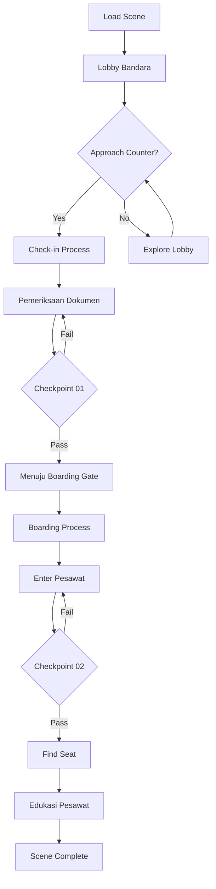

# 02_SCENE_01_BERANGKAT_INDONESIA.md
# ============================================
# VR EDUCATION HAJI & UMRAH
# SCENE 01 — BERANGKAT DARI INDONESIA
# Version : 1.0
# ============================================

---

## Daftar Isi

- [Scene Information](#scene-information)
- [Learning Objective](#learning-objective)
- [Background](#background)
- [Environment](#environment)
- [Asset List](#asset-list)
- [Asset Source](#asset-source)
- [Character](#character)
- [Animation](#animation)
- [Audio](#audio)
- [Camera](#camera)
- [UI](#ui)
- [Interaction](#interaction)
- [Education](#education)
- [Activity Flow](#activity-flow)
- [Validation](#validation)
- [Performance](#performance)
- [Acceptance Criteria](#acceptance-criteria)

---

## Scene Information

| Atribut | Nilai |
|---------|-------|
| **Nomor Scene** | 01 |
| **Nama Scene** | Berangkat dari Indonesia |
| **Versi** | 1.0 |
| **Deskripsi** | Scene ini mensimulasikan proses keberangkatan jamaah Haji dan Umrah dari bandara di Indonesia. Pengguna akan menjalani serangkaian proses mulai dari memasuki lobby bandara, check-in, pemeriksaan dokumen, boarding, hingga berada di dalam pesawat. Sepanjang perjalanan, pengguna mendapatkan edukasi tentang persiapan ibadah, checklist barang bawaan, dan adab selama perjalanan. |

---

## Learning Objective

Setelah menyelesaikan Scene 01, pengguna diharapkan mampu:

| No | Tujuan Pembelajaran | Target |
|----|---------------------|--------|
| 1 | Memahami alur keberangkatan Haji/Umrah dari bandara | 80% benar pada checkpoint |
| 2 | Mengidentifikasi dokumen penting yang diperlukan | 80% benar pada checkpoint |
| 3 | Mengetahui checklist barang bawaan yang sesuai | 80% benar pada checkpoint |
| 4 | Memahami adab dan doa selama perjalanan | 80% benar pada checkpoint |
| 5 | Mengenal persiapan fisik dan mental sebelum berangkat | 80% benar pada checkpoint |

---

## Background

Scene Berangkat dari Indonesia merupakan scene pembuka dari aplikasi VR Education Haji & Umrah. Scene ini dirancang untuk memberikan pengalaman realistis tentang proses keberangkatan jamaah dari Indonesia menuju Tanah Suci.

Proses keberangkatan Haji dan Umrah dari Indonesia melibatkan beberapa tahapan administratif dan logistik yang perlu dipahami oleh calon jamaah. Mulai dari persiapan dokumen, proses check-in bandara, pemeriksaan imigrasi, hingga proses boarding. Setiap tahapan memiliki prosedur dan adab tersendiri yang perlu diketahui.

Dalam scene ini, pengguna akan berperan sebagai calon jamaah yang akan berangkat. Pengguna akan dipandu oleh NPC petugas dan narator untuk menjalani setiap proses. Edukasi disisipkan di setiap tahapan untuk memberikan pemahaman yang komprehensif.

---

## Environment

### Lokasi

| Area | Deskripsi | Dimensi |
|------|-----------|---------|
| **Lobby Bandara** | Area utama dengan counter check-in, kursi tunggu, dan papan informasi | 50m x 30m |
| **Check-in Area** | Counter check-in maskapai dengan conveyor belt | 20m x 15m |
| **Pemeriksaan Dokumen** | Area imigrasi dengan booth petugas | 15m x 10m |
| **Boarding Gate** | Ruang tunggu boarding dengan kursi dan gate | 25m x 20m |
| **Pesawat** | Interior pesawat dengan kursi penumpang | 30m x 5m (koridor) |

### Waktu

| Aspek | Setting |
|-------|---------|
| Waktu | Siang hari (pukul 10:00 - 14:00 WIB) |
| Musim | Musim panas |

### Cuaca

| Elemen | Deskripsi |
|--------|-----------|
| Langit | Cerah dengan sedikit awan |
| Suhu | 30°C (hangat) |
| Kelembaban | 70% |

### Lighting

| Sumber | Tipe | Intensity | Shadow |
|--------|------|-----------|--------|
| Matahari | DirectionalLight | 1.0 | Enabled |
| Langit | HemisphereLight | 0.4 | - |
| Lampu Dalam | PointLight (x5) | 0.6 | Disabled |
| Emergency | SpotLight (x2) | 0.3 | Disabled |

### Atmosfer

| Efek | Implementasi |
|------|--------------|
| Skybox | Langit cerah biru dengan awan |
| Ambient | Suasana bandara ramai (audio) |
| Particle | Tidak ada (indoor scene) |
| Fog | THREE.FogExp2 dengan densitas 0.002 |

---

## Asset List

### Bangunan

| Asset | Deskripsi | LOD Levels |
|-------|-----------|------------|
| Bandara_Interior | Interior bandara Indonesia modern | LOD 0-3 |
| Counter_CheckIn | Meja check-in maskapai | LOD 0-2 |
| Conveyor_Belt | Sabuk berjalan bagasi | LOD 0-2 |
| Gate_Boarding | Gate keberangkatan | LOD 0-2 |
| Interior_Pesawat | Kabin pesawat dengan kursi | LOD 0-3 |

### Karakter

| Asset | Jumlah | Tipe |
|-------|--------|------|
| Player_Character | 1 | Main character (first person) |
| Petugas_CheckIn | 1 | NPC interaktif |
| Petugas_Imigrasi | 2 | NPC interaktif |
| Petugas_Boarding | 1 | NPC interaktif |
| Jamaah_Laki | 5 | NPC background |
| Jamaah_Perempuan | 5 | NPC background |
| Pramugari | 2 | NPC interaktif |

### Ground

| Asset | Material | Tekstur |
|-------|----------|---------|
| Lantai_Bandara | Marmer polish | 2048x2048 PBR |
| Karpet_Bandara | Karpet merah | 1024x1024 PBR |

### Vegetasi

| Asset | Jumlah | Keterangan |
|-------|--------|------------|
| Tanaman_Hias | 8 | Dalam pot di lobby |
| Pohon_Palem | 2 | Di area luar (tampak dari kaca) |

### Langit

| Asset | Format | Resolusi |
|-------|--------|----------|
| Skybox_Cerah | CubeTexture | 2048x2048 per face |

### Props

| Asset | Jumlah | Interaktif |
|-------|--------|------------|
| Kursi_Tunggu | 20 | Tidak |
| Koper | 15 | Ya (dapat diinspeksi) |
| Tas_Tangan | 10 | Ya (dapat diinspeksi) |
| Dokumen_Paspor | 5 | Ya (dapat dilihat) |
| Tiket_Pesawat | 1 | Ya (dapat dilihat) |
| Papan_Informasi | 3 | Ya (menampilkan jadwal) |
| TV_Monitor | 4 | Ya (menampilkan info penerbangan) |
| Timbangan_Bagasi | 2 | Ya (interaktif) |
| XRay_Machine | 2 | Tidak |

### Dekorasi

| Asset | Jumlah | Keterangan |
|-------|--------|------------|
| Spanduk_SelamatDatang | 2 | Banner penyambutan |
| Jam_Dinding | 3 | Menunjukkan waktu |
| Nomor_Gate | 5 | Penanda gate |
| Tanaman_Hias | 8 | Dekorasi interior |

### Kendaraan

| Asset | Format | Keterangan |
|-------|--------|------------|
| Pesawat (eksterior) | GLB | Tampak dari jendela |
| Bus_APRON | GLB | Tampak dari jendela |

---

## Asset Source

### Fab Marketplace

| Kategori | Nama Asset | Format | Texture | LOD | Ukuran |
|----------|-----------|--------|---------|-----|--------|
| Architecture | Modern Airport Interior | GLB | 2048x2048 | 3 level | 25MB |
| Furniture | Airport Check-in Counter | GLB | 1024x1024 | 2 level | 8MB |
| Furniture | Waiting Chair Set | GLB | 1024x1024 | 2 level | 3MB |
| Props | Luggage Set | GLB | 512x512 | 2 level | 2MB |
| Character | Business People | GLB | 2048x2048 | 2 level | 12MB |
| Vehicle | Commercial Airplane | GLB | 2048x2048 | 3 level | 30MB |
| Interior | Airport Interior Props | GLB | 1024x1024 | 2 level | 5MB |
| Props | Document Set | GLB | 512x512 | 1 level | 1MB |
| Electronics | Information Display | GLB | 1024x1024 | 1 level | 2MB |

---

## Character

### Player

| Atribut | Spesifikasi |
|---------|-------------|
| Perspektif | First person (kamera sebagai mata player) |
| Model | Tidak terlihat (first person) |
| Shadow | Hanya shadow saja |
| Collision | Capsule collider (0.5m radius, 1.8m height) |

### NPC

| NPC | Posisi | Fungsi | Dialog |
|-----|--------|--------|--------|
| Petugas_CheckIn | Counter CheckIn | Memandu proses check-in | 5 dialog |
| Petugas_Imigrasi1 | Booth Imigrasi | Pemeriksaan paspor | 3 dialog |
| Petugas_Imigrasi2 | Booth Imigrasi | Pemeriksaan visa | 3 dialog |
| Petugas_Boarding | Gate | Memandu boarding | 4 dialog |
| Pramugari1 | Pesawat | Menyambut di pintu | 2 dialog |
| Pramugari2 | Kabin | Memandu ke kursi | 2 dialog |

### Petugas

| Tipe | Jumlah | Pergerakan |
|------|--------|------------|
| Petugas Kebersihan | 2 | Patroli area lobby |
| Petugas Keamanan | 3 | Berdiri di pos |

### Jamaah

| Tipe | Jumlah | Aktivitas |
|------|--------|-----------|
| Jamaah Duduk | 8 | Duduk di kursi tunggu |
| Jamaah Antri | 4 | Antri di counter |
| Jamaah Jalan | 3 | Berjalan ke gate |
| Keluarga Jamaah | 4 | Berdiri mengelilingi jamaah |

---

## Animation

| Animasi | Durasi | Loop | Trigger |
|---------|--------|------|---------|
| Idle | 3s | Yes | Default |
| Walk | 1.5s | Yes | Keyboard WASD |
| Run | 1s | Yes | Shift + WASD |
| Talk (Petugas) | 4s | No | Saat dialog |
| Talk (Player) | 3s | No | Saat memilih opsi |
| CheckIn_Process | 5s | No | Interaksi check-in |
| Boarding_Walk | 3s | No | Proses boarding |
| Sit | 1s | No | Di kursi pesawat |
| HandOver | 2s | No | Menyerahkan dokumen |
| Wave | 2s | No | Melambai |
| Interaction | 2s | No | Mengklik objek |
| Transition | 1s | No | Pindah area |

---

## Audio

### Ambient

| Sumber | File | Volume | Loop |
|--------|------|--------|------|
| Suasana Bandara | ambient_airport.mp3 | 0.4 | Yes |
| Pengumuman | announcement_01.mp3 | 0.6 | No (triggered) |
| Mesin Pesawat | engine_hum.mp3 | 0.3 | Yes (di pesawat) |
| AC Bandara | ac_hum.mp3 | 0.2 | Yes |

### Narration

| Momen | File | Durasi | Prioritas |
|-------|------|--------|-----------|
| Scene Start | nar_01_intro.mp3 | 60s | High |
| Check-in | nar_02_checkin.mp3 | 45s | High |
| Dokumen | nar_03_dokumen.mp3 | 50s | High |
| Boarding | nar_04_boarding.mp3 | 40s | High |
| Pesawat | nar_05_pesawat.mp3 | 55s | High |
| Edukasi 1 | nar_06_persiapan.mp3 | 70s | Medium |
| Edukasi 2 | nar_07_checklist.mp3 | 65s | Medium |
| Checkpoint | nar_checkpoint_01.mp3 | 20s | High |

### Instruction

| Momen | File | Deskripsi |
|-------|------|-----------|
| Navigasi | instr_nav.mp3 | Panduan gerakan |
| Interaksi | instr_interact.mp3 | Cara berinteraksi |
| Checkpoint | instr_checkpoint.mp3 | Cara menjawab |

### Effect

| Efek | File | Volume |
|------|------|--------|
| Klik | sfx_click.mp3 | 0.5 |
| Hover | sfx_hover.mp3 | 0.3 |
| Success | sfx_success.mp3 | 0.7 |
| Fail | sfx_fail.mp3 | 0.5 |
| Door Open | sfx_door.mp3 | 0.6 |
| Boarding Pass Print | sfx_print.mp3 | 0.4 |
| Stempel | sfx_stamp.mp3 | 0.5 |
| Transition | sfx_transition.mp3 | 0.6 |

### Voice Over

| Karakter | File | Durasi |
|----------|------|--------|
| Petugas CheckIn | vo_checkin_01.mp3 - vo_checkin_05.mp3 | 10s each |
| Petugas Imigrasi | vo_imigrasi_01.mp3 - vo_imigrasi_03.mp3 | 8s each |
| Petugas Boarding | vo_boarding_01.mp3 - vo_boarding_04.mp3 | 10s each |
| Pramugari | vo_pramugari_01.mp3 - vo_pramugari_02.mp3 | 7s each |

---

## Camera

### Spawn

| Parameter | Nilai |
|-----------|-------|
| Posisi Awal | x: 0, y: 1.7, z: 5 (lobby bandara) |
| Look At | Arah counter check-in |
| FOV | 60 derajat |
| Near | 0.1 |
| Far | 1000 |

### Movement

| Mode | Kontrol | Kecepatan |
|------|---------|-----------|
| Walk | W/A/S/D | 3 m/s |
| Run | Shift + W/A/S/D | 6 m/s |
| Look | Mouse move | Sensitivitas 0.002 |
| Teleport | Klik titik biru | Instant |

### Reset

| Trigger | Aksi |
|---------|------|
| Tekan R | Reset ke posisi spawn terakhir |
| Bug collision | Auto-reset setelah 3 detik |

### Transition

| Momen | Durasi | Easing |
|-------|--------|--------|
| Masuk scene | 1.5s | Cubic InOut |
| Pindah area | 1s | Quad InOut |
| Mode edukasi | 0.5s | Linear |
| Checkpoint | 0.3s | Linear |

---

## UI

### Subtitle

| Atribut | Spesifikasi |
|---------|-------------|
| Posisi | Bawah tengah |
| Font | Arial, 18px |
| Warna | Putih dengan shadow |
| Background | Semi-transparan (rgba 0,0,0,0.5) |
| Max Lines | 2 baris |
| Durasi | Sesuai audio |

### Progress

| Elemen | Deskripsi |
|--------|-----------|
| Progress Bar | Horizontal bar di atas |
| Persentase | Numerik (0-100%) |
| Checkpoint | Bullet point berwarna |
| Scene Title | Nama scene aktif |

### Hint

| Tipe | Warna | Posisi |
|------|-------|--------|
| Navigasi | Biru muda | Tengah bawah |
| Interaksi | Hijau | Atas objek |
| Edukasi | Oranye | Kanan bawah |
| Peringatan | Merah | Tengah |

### Compass

| Elemen | Spesifikasi |
|--------|-------------|
| Bentuk | Circular |
| Ukuran | 80x80px |
| Posisi | Atas kanan |
| Label | Arah mata angin (U/T/S/B) |
| Marker | Titik tujuan |

### Notification

| Tipe | Durasi | Warna |
|------|--------|-------|
| Info | 3s | Biru |
| Success | 2s | Hijau |
| Warning | 4s | Kuning |
| Error | 5s | Merah |

### Mini Map

| Atribut | Spesifikasi |
|---------|-------------|
| Ukuran | 200x200px |
| Posisi | Kiri bawah |
| Style | Top-down 2D |
| Ikon | Segitiga (player), lingkaran (NPC) |
| Area | Highlight area aktif |

### Popup

| Tipe | Konten | Aksi |
|------|--------|------|
| Informasi | Teks + gambar | Tutup manual |
| Edukasi | Teks + dalil | Next/Back |
| Dialog | Opsi percakapan | Pilih opsi |
| Checkpoint | Pertanyaan + jawaban | Submit |

---

## Interaction

### Click

| Objek | Aksi | Feedback |
|-------|------|----------|
| Counter CheckIn | Mulai proses check-in | Animasi + dialog |
| Dokumen | Inspeksi detail | Popup informasi |
| Koper | Cek isi | Popup checklist |
| Tiket | Lihat detail | Popup info penerbangan |
| Papan Info | Lihat jadwal | Popup jadwal |
| NPC Petugas | Mulai dialog | UI dialog |

### Hover

| Objek | Highlight | Cursor |
|-------|-----------|--------|
| Interaktif | Outline biru | Pointer |
| NPC | Glow hijau | Pointer |
| Non-interaktif | None | Default |
| Door | Outline kuning | Pointer |

### Inspect

| Objek | Hasil | Format |
|-------|-------|--------|
| Paspor | Detail jamaah | Popup + 3D model |
| Tiket | Info penerbangan | Popup |
| Koper | Isi barang | Grid view |
| Tas | Perlengkapan | List view |

### Walk

| Metode | Kontrol | Keterangan |
|--------|---------|------------|
| Keyboard | WASD | Gerakan relatif kamera |
| Mouse | Klik kanan tahan | Look around |
| Auto-walk | Klik destinasi | Jalan otomatis ke titik |

### Teleport

| Area | Titik Teleport | Biaya |
|------|---------------|-------|
| Lobby | 3 titik | Gratis |
| Check-in | 1 titik | Gratis |
| Imigrasi | 1 titik | Gratis |
| Boarding | 1 titik | Gratis |

### Dialog

| Struktur | Format | Opsi |
|----------|--------|------|
| NPC Speech | Teks + audio | - |
| Player Choice | 2-3 opsi | Pilih salah satu |
| NPC Response | Teks + audio | Tergantung pilihan |
| End Dialog | Penutup | Lanjut atau ulang |

### Highlight

| Metode | Warna | Durasi |
|--------|-------|--------|
| Outline | Biru (0x4488ff) | Selama hover |
| Pulse | Hijau (0x44ff88) | 2 detik |
| Warning | Merah (0xff4444) | 3 detik |
| Guide | Kuning (0xffaa00) | 1 detik pulse |

### Information

| Tipe | Format | Contoh |
|------|--------|--------|
| Objek Info | Popup | "Ini adalah counter check-in" |
| Edukasi Panel | Side panel | "Persiapan sebelum berangkat" |
| Dalil | Quote box | QS Al-Hajj: 27 |
| Tips | Toast | "Siapkan dokumen di tas tangan" |

---

## Education

### Penjelasan

| Topik | Konten | Durasi |
|-------|--------|--------|
| Persiapan Fisik | Istirahat cukup, makan teratur, olahraga ringan | 60s |
| Persiapan Mental | Niat ikhlas, sabar, tawakal | 60s |
| Dokumen Perjalanan | Paspor, visa, tiket, identitas | 45s |
| Barang Bawaan | Pakaian ihram, perlengkapan ibadah, obat | 50s |
| Adab Perjalanan | Doa perjalanan, sikap di pesawat | 40s |
| Proses Bandara | Check-in, imigrasi, boarding | 55s |

### Dalil

| Referensi | Ayat | Konteks |
|-----------|------|---------|
| QS Ali Imran: 97 | "Dan di antara kewajiban manusia kepada Allah adalah melaksanakan ibadah haji ke Baitullah" | Kewajiban Haji |
| QS Al-Hajj: 27 | "Dan berserulah kepada manusia untuk mengerjakan haji" | Dakwah Haji |
| HR Bukhari | "Barangsiapa berhaji karena Allah dan tidak berbuat rafats dan fasuq, maka ia kembali seperti bayi yang baru lahir" | Keutamaan Haji |

### Hikmah

| Hikmah | Penjelasan |
|--------|------------|
| Ketaatan | Haji melatih ketaatan total kepada Allah |
| Kesabaran | Proses panjang mengajarkan kesabaran |
| Persaudaraan | Bertemu sesama muslim dari seluruh dunia |
| Pengorbanan | Meninggalkan kenyamanan demi ibadah |

### Larangan

| Larangan | Keterangan |
|----------|------------|
| Rafats | Berkata kotor atau mengucapkan kata-kata yang mengarah pada hubungan suami istri |
| Fasuq | Berbuat maksiat atau dosa |
| Jidal | Bertengkar atau berdebat yang tidak bermanfaat |

### Kesalahan Umum

| Kesalahan | Solusi |
|-----------|--------|
| Lupa membawa dokumen penting | Buat checklist dan periksa ulang |
| Kelebihan bagasi | Timbang bagasi sebelum berangkat |
| Terlambat check-in | Datang 3 jam sebelum keberangkatan |
| Panik/cemas berlebihan | Banyak berdoa dan tawakal |

### Tips

| No | Tips |
|----|------|
| 1 | Datang ke bandara 3-4 jam sebelum jadwal |
| 2 | Siapkan dokumen di tas tangan, jangan di bagasi |
| 3 | Gunakan pakaian yang nyaman dan menutup aurat |
| 4 | Bawa obat pribadi secukupnya |
| 5 | Minum air yang cukup selama perjalanan |
| 6 | Perbanyak doa dan dzikir |
| 7 | Jaga kesehatan dan istirahat |

---

## Activity Flow

### Alur Scene

### Langkah Detail

| Langkah | Area | Aksi | Durasi |
|---------|------|------|--------|
| 1 | Lobby | Spawn di lobby, dengar narator intro | 60s |
| 2 | Lobby | Navigasi ke counter check-in | 30s |
| 3 | Check-in | Interaksi dengan petugas check-in | 45s |
| 4 | Bagasi | Serahkan bagasi, dapat boarding pass | 30s |
| 5 | Imigrasi | Antri dan periksa dokumen | 40s |
| 6 | Checkpoint 01 | Jawab pertanyaan edukasi | 30s |
| 7 | Boarding | Jalan ke gate, naik pesawat | 45s |
| 8 | Pesawat | Cari kursi, duduk | 20s |
| 9 | Edukasi | Dengar edukasi perjalanan | 60s |
| 10 | Checkpoint 02 | Jawab pertanyaan final | 30s |
| 11 | Complete | Scene selesai | 5s |

---

## Validation

### Berhasil

| Checkpoint | Kriteria | Reward |
|------------|----------|--------|
| CP-01 | Menjawab benar minimal 3 dari 4 pertanyaan tentang dokumen dan barang | Scene 02 terbuka |
| CP-02 | Menjawab benar minimal 3 dari 4 pertanyaan tentang adab dan persiapan | Score +100 |

### Gagal

| Checkpoint | Kriteria | Konsekuensi |
|------------|----------|-------------|
| CP-01 | Kurang dari 3 jawaban benar | Ulang edukasi dokumen |
| CP-02 | Kurang dari 3 jawaban benar | Ulang edukasi persiapan |
| Timeout | Tidak menjawab dalam 5 menit | Scene restart |

### Checkpoint List

#### Checkpoint 01 — Dokumen dan Barang

| No | Pertanyaan | Jawaban Benar | Opsi |
|----|-----------|---------------|------|
| 1 | Dokumen apa yang WAJIB dibawa? | Paspor, visa, tiket | 4 opsi |
| 2 | Berapa jam sebaiknya datang ke bandara? | 3-4 jam sebelum | 4 opsi |
| 3 | Di mana menyimpan dokumen penting? | Tas tangan | 4 opsi |
| 4 | Apa yang dilakukan jika kelebihan bagasi? | Mengurangi barang | 4 opsi |

#### Checkpoint 02 — Adab dan Persiapan

| No | Pertanyaan | Jawaban Benar | Opsi |
|----|-----------|---------------|------|
| 1 | Apa niat utama berangkat haji/umrah? | Ibadah karena Allah | 4 opsi |
| 2 | Doa apa yang dibaca saat naik kendaraan? | Subhanalladzi sakhara | 4 opsi |
| 3 | Sikap yang baik selama perjalanan? | Sabar dan bersyukur | 4 opsi |
| 4 | Yang termasuk persiapan fisik adalah? | Istirahat cukup dan olahraga | 4 opsi |

---

## Performance

| Aspek | Target | Metrik |
|-------|--------|--------|
| Frame Rate | 60 FPS | Average FPS |
| Scene Load | < 5 detik | Load time |
| Memory | < 200MB | Memory usage |
| Texture | < 128MB | GPU memory |
| Draw Calls | < 500 | Draw call count |
| Triangles | < 500k | Triangle count |

### Optimization

| Teknik | Penerapan |
|--------|-----------|
| LOD | Bangunan 3 level, karakter 2 level |
| Texture Atlas | Material sejenis digabung |
| Draco Compression | Semua GLB file |
| Instancing | Kursi, tanaman, lampu |
| Frustum Culling | Auto untuk semua mesh |
| Occlusion Culling | Area-based |
| Object Pooling | NPC, particle effects |

### Texture Budget

| Kategori | Budget | Catatan |
|----------|--------|---------|
| Bangunan | 64MB | 2048x2048 PBR |
| Karakter | 32MB | 2048x2048 |
| Props | 16MB | 1024x1024 |
| Environment | 16MB | Skybox + ground |
| UI | 8MB | Ikon dan panel |

---

## Acceptance Criteria

| No | Kriteria | Status |
|----|----------|--------|
| 1 | Scene dapat dimuat dalam waktu < 5 detik | ☐ |
| 2 | Semua area (lobby, check-in, imigrasi, gate, pesawat) dapat dikunjungi | ☐ |
| 3 | NPC petugas check-in dapat diajak berinteraksi | ☐ |
| 4 | Proses check-in berjalan sesuai alur | ☐ |
| 5 | Pemeriksaan dokumen di imigrasi berfungsi | ☐ |
| 6 | Proses boarding berjalan lancar | ☐ |
| 7 | Interior pesawat menampilkan kursi sesuai nomor | ☐ |
| 8 | Edukasi persiapan haji/umrah ditampilkan dengan benar | ☐ |
| 9 | Checklist barang bawaan dapat diakses | ☐ |
| 10 | Audio narator berjalan di setiap tahapan | ☐ |
| 11 | NPC petugas memiliki dialog yang sesuai | ☐ |
| 12 | UI tutorial navigasi muncul saat pertama kali | ☐ |
| 13 | Checkpoint 01 berfungsi dengan validasi benar/salah | ☐ |
| 14 | Checkpoint 02 berfungsi dengan validasi benar/salah | ☐ |
| 15 | Progress bar menunjukkan perkembangan scene | ☐ |
| 16 | Mini map menampilkan posisi player | ☐ |
| 17 | Subtitle muncul sesuai audio narator | ☐ |
| 18 | Transisi antar area berjalan halus | ☐ |
| 19 | Frame rate stabil di 60 FPS | ☐ |
| 20 | Tidak ada error atau crash selama scene berjalan | ☐ |

---

> **Dokumen Terkait:**
> - [00_Project_Overview.md](./00_Project_Overview.md)
> - [01_Technology_Stack.md](./01_Technology_Stack.md)
> - [03_Scene_02_Tiba_Madinah.md](./03_Scene_02_Tiba_Madinah.md)
> - [04_Scene_03_Miqat_dan_Niat_Umrah.md](./04_Scene_03_Miqat_dan_Niat_Umrah.md)

---
