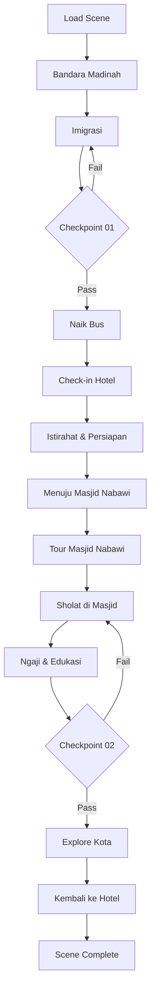

# 03_SCENE_02_TIBA_MADINAH.md
# ============================================
# VR EDUCATION HAJI & UMRAH
# SCENE 02 — TIBA DI MADINAH
# Version : 1.0
# ============================================

---

## Daftar Isi

- [Scene Information](#scene-information)
- [Learning Objective](#learning-objective)
- [Background](#background)
- [Environment](#environment)
- [Asset List](#asset-list)
- [Asset Source](#asset-source)
- [Character](#character)
- [Animation](#animation)
- [Audio](#audio)
- [Camera](#camera)
- [UI](#ui)
- [Interaction](#interaction)
- [Education](#education)
- [Activity Flow](#activity-flow)
- [Validation](#validation)
- [Performance](#performance)
- [Acceptance Criteria](#acceptance-criteria)

---

## Scene Information

| Atribut | Nilai |
|---------|-------|
| **Nomor Scene** | 02 |
| **Nama Scene** | Tiba di Madinah |
| **Versi** | 1.0 |
| **Deskripsi** | Scene ini mensimulasikan kedatangan jamaah di Bandara Madinah, proses imigrasi, perjalanan menuju hotel, kunjungan ke Masjid Nabawi, dan pengenalan lingkungan kota Madinah. Pengguna akan mendapatkan edukasi tentang sejarah Madinah, adab berkunjung ke Masjid Nabawi, dan amalan yang dianjurkan selama di Madinah. |

---

## Learning Objective

Setelah menyelesaikan Scene 02, pengguna diharapkan mampu:

| No | Tujuan Pembelajaran | Target |
|----|---------------------|--------|
| 1 | Memahami alur kedatangan dan imigrasi di Bandara Madinah | 80% benar pada checkpoint |
| 2 | Mengenal lingkungan kota Madinah dan lokasi penting | 80% benar pada checkpoint |
| 3 | Mengetahui adab berkunjung ke Masjid Nabawi | 80% benar pada checkpoint |
| 4 | Memahami sejarah dan keutamaan Madinah | 80% benar pada checkpoint |
| 5 | Mengetahui amalan yang dianjurkan selama di Madinah | 80% benar pada checkpoint |

---

## Background

Madinah Al-Munawwarah merupakan kota suci kedua setelah Mekkah dan memiliki kedudukan yang sangat istimewa dalam Islam. Kota ini menjadi tempat hijrah Rasulullah SAW dan pusat penyebaran Islam. Di Madinah terdapat Masjid Nabawi, masjid yang dibangun oleh Rasulullah SAW dan menjadi tempat peristirahatan beliau yang terakhir.

Bagi jamaah Haji dan Umrah, Madinah biasanya menjadi destinasi pertama sebelum menuju Mekkah. Jamaah akan menghabiskan beberapa hari di Madinah untuk berziarah ke Masjid Nabawi, mengunjungi tempat-tempat bersejarah, dan mempersiapkan diri sebelum melanjutkan perjalanan ke Mekkah.

Scene ini dirancang untuk memberikan simulasi realistis tentang pengalaman tiba di Madinah, mulai dari bandara, perjalanan menuju hotel, hingga beribadah di Masjid Nabawi.

---

## Environment

### Lokasi

| Area | Deskripsi | Dimensi |
|------|-----------|---------|
| **Bandara Madinah** | Bandara internasional dengan nuansa Timur Tengah | 60m x 40m |
| **Area Imigrasi** | Booth imigrasi dengan antrian | 20m x 15m |
| **Bus Shuttle** | Halte bus dan interior bus | 15m x 4m |
| **Hotel** | Lobby hotel dan kamar | 30m x 25m |
| **Masjid Nabawi** | Halaman dan area sekitar masjid | 100m x 80m |
| **Pasar Madinah** | Jalan perbelanjaan tradisional | 40m x 20m |
| **Kota Madinah** | Jalan raya, trotoar, bangunan sekitar | 200m x 150m |

### Waktu

| Aspek | Setting |
|-------|---------|
| Waktu | Sore hari (pukul 16:00 - 19:00 waktu Arab) |
| Musim | Musim dingin (25°C) |

### Cuaca

| Elemen | Deskripsi |
|--------|-----------|
| Langit | Cerah, sedikit mendung menjelang maghrib |
| Suhu | 25°C (sejuk) |
| Angin | Sejuk, ringan |

### Lighting

| Sumber | Tipe | Intensity | Shadow |
|--------|------|-----------|--------|
| Matahari | DirectionalLight (miring) | 0.8 | Enabled |
| Langit | HemisphereLight | 0.5 | - |
| Golden Hour | Warm directional | 0.3 | - |
| Lampu Kota | PointLight (x20) | 0.4 | Enabled |
| Lampu Masjid | SpotLight (x8) | 0.7 | Enabled |

### Atmosfer

| Efek | Implementasi |
|------|--------------|
| Skybox | Sunset gradasi jingga ke biru |
| Ambient | Suara kota, kumandang adzan |
| Particle | Debu ringan di udara |
| Fog | THREE.FogExp2 densitas 0.001 |
| Light Shaft | Dari celah bangunan |

---

## Asset List

### Bangunan

| Asset | Deskripsi | LOD Levels |
|-------|-----------|------------|
| Bandara_Madinah | Eksterior dan interior bandara | LOD 0-3 |
| Masjid_Nabawi | Masjid dengan menara dan kubah hijau | LOD 0-3 |
| Hotel_Madinah | Hotel bintang 4 Timur Tengah | LOD 0-2 |
| Ruko_Pasar | Toko-toko tradisional | LOD 0-2 |
| Rumah_Tinggal | Rumah khas Madinah | LOD 0-2 |
| Halte_Bus | Shelter bus antar jemput | LOD 0-1 |

### Karakter

| Asset | Jumlah | Tipe |
|-------|--------|------|
| Player_Character | 1 | Main character (first person) |
| Petugas_Imigrasi | 3 | NPC interaktif |
| Supir_Bus | 1 | NPC interaktif |
| Petugas_Hotel | 2 | NPC interaktif |
| Pemandu_Wisata | 1 | NPC interaktif |
| Pedagang_Pasar | 3 | NPC interaktif |
| Jamaah_Laki | 15 | NPC background |
| Jamaah_Perempuan | 15 | NPC background |
| Anak_Anak | 5 | NPC background |
| Tukang_Becak | 2 | NPC background |

### Ground

| Asset | Material | Tekstur |
|-------|----------|---------|
| Jalan_Madinah | Aspal dengan bebatuan | 2048x2048 PBR |
| Trotoar | Ubin batu | 2048x2048 PBR |
| Halaman_Masjid | Marmer putih | 2048x2048 PBR |
| Lobby_Hotel | Marmer polish | 2048x2048 PBR |

### Vegetasi

| Asset | Jumlah | Keterangan |
|-------|--------|------------|
| Pohon_Kurma | 25 | Di sepanjang jalan |
| Semak | 30 | Dekorasi taman |
| Rumput | Area | Taman masjid |

### Langit

| Asset | Format | Resolusi |
|-------|--------|----------|
| Skybox_Sunset | CubeTexture | 2048x2048 per face |
| Awan | Cloud texture | 1024x1024 |

### Props

| Asset | Jumlah | Interaktif |
|-------|--------|------------|
| Kursi_Tunggu | 30 | Tidak |
| Koper_Bagasi | 10 | Ya |
| Karpet_Sholat | 50 | Ya (dapat digunakan) |
| Mihrab | 1 | Visual saja |
| Mimbar | 1 | Visual saja |
| Payung_Masjid | 20 | Animasi buka/tutup |
| Lampu_Jalan | 15 | Tidak |
| Papan_Nama | 5 | Ya (informasi) |
| Bangku_Taman | 10 | Tidak |
| Air_Minum | 5 | Ya (interaktif) |

### Dekorasi

| Asset | Jumlah | Keterangan |
|-------|--------|------------|
| Lampu_Gantung | 10 | Dekorasi masjid |
| Kaligrafi | 5 | Hiasan dinding |
| Jam_Masjid | 3 | Menunjukkan waktu sholat |
| Tanaman_Hias | 15 | Dekorasi hotel |

### Kendaraan

| Asset | Format | Keterangan |
|-------|--------|------------|
| Bus_Pariwisata | GLB | Bus antar jemput |
| Mobil_Taxi | GLB | Taksi kota |
| Becak_Motor | GLB | Angkutan tradisional |

---

## Asset Source

### Fab Marketplace

| Kategori | Nama Asset | Format | Texture | LOD | Ukuran |
|----------|-----------|--------|---------|-----|--------|
| Architecture | Saudi Airport International | GLB | 2048x2048 | 3 level | 30MB |
| Architecture | Al-Masjid an-Nabawi | GLB | 4096x4096 | 3 level | 80MB |
| Architecture | Middle Eastern Hotel | GLB | 2048x2048 | 3 level | 25MB |
| Architecture | Traditional Souk Market | GLB | 2048x2048 | 2 level | 20MB |
| Architecture | City Street Arab | GLB | 2048x2048 | 3 level | 35MB |
| Character | People Middle East | GLB | 2048x2048 | 2 level | 15MB |
| Vehicle | Tourist Bus | GLB | 1024x1024 | 2 level | 8MB |
| Props | Mosque Props Set | GLB | 1024x1024 | 2 level | 5MB |
| Props | Prayer Rug Set | GLB | 1024x1024 | 1 level | 3MB |
| Vegetation | Date Palm Tree | GLB | 1024x1024 | 2 level | 4MB |

---

## Character

### Player

| Atribut | Spesifikasi |
|---------|-------------|
| Perspektif | First person (kamera sebagai mata player) |
| Pakaian | Ihram putih (setelah miqat) / pakaian biasa |
| Collision | Capsule collider (0.5m radius, 1.8m height) |

### NPC

| NPC | Posisi | Fungsi | Dialog |
|-----|--------|--------|--------|
| Petugas_Imigrasi1 | Booth 1 | Pemeriksaan paspor | 4 dialog |
| Petugas_Imigrasi2 | Booth 2 | Pemeriksaan visa | 4 dialog |
| Petugas_Imigrasi3 | Booth VIP | Layanan cepat | 3 dialog |
| Supir_Bus | Halte | Antar ke hotel | 5 dialog |
| Resepsionis | Hotel Lobby | Check-in hotel | 6 dialog |
| Pemandu | Masjid Nabawi | Tour guide | 8 dialog |
| Pedagang1 | Pasar | Jual kurma | 3 dialog |
| Pedagang2 | Pasar | Jual suvenir | 3 dialog |

### Petugas

| Tipe | Jumlah | Pergerakan |
|------|--------|------------|
| Petugas Kebersihan Masjid | 4 | Patroli area masjid |
| Petugas Keamanan | 5 | Berjaga di pintu |
| Petugas Parkir | 2 | Area parkir bus |

### Jamaah

| Tipe | Jumlah | Aktivitas |
|------|--------|-----------|
| Jamaah Sholat | 20 | Sholat di masjid |
| Jamaah Ziarah | 10 | Berjalan di halaman |
| Jamaah Belanja | 8 | Di pasar |
| Jamaah Istirahat | 6 | Di hotel |
| Keluarga | 4 | Berkelompok |

---

## Animation

| Animasi | Durasi | Loop | Trigger |
|---------|--------|------|---------|
| Idle | 3s | Yes | Default |
| Walk | 1.5s | Yes | Keyboard WASD |
| Sholat | 5s | Yes | Interaksi karpet |
| Sujud | 3s | Yes | Mode sholat |
| Duduk Tasyahud | 4s | Yes | Mode sholat |
| Talk (Pemandu) | 5s | No | Saat tour |
| Salam | 2s | No | Bertemu NPC |
| Makan | 4s | No | Di restoran |
| CheckIn Hotel | 4s | No | Proses check-in |
| Naik Bus | 3s | No | Boarding bus |
| Belanja | 3s | No | Interaksi pasar |

---

## Audio

### Ambient

| Sumber | File | Volume | Loop |
|--------|------|--------|------|
| Suara Kota | ambient_city_madinah.mp3 | 0.4 | Yes |
| Adzan Maghrib | adzan_madinah.mp3 | 0.7 | No (triggered) |
| Suara Masjid | ambient_masjid.mp3 | 0.3 | Yes (di area masjid) |
| Suara Pasar | ambient_pasar.mp3 | 0.5 | Yes (di pasar) |
| Suara Hotel | ambient_hotel.mp3 | 0.2 | Yes (di hotel) |
| Lalu Lintas | ambient_traffic.mp3 | 0.3 | Yes |

### Narration

| Momen | File | Durasi | Prioritas |
|-------|------|--------|-----------|
| Scene Start | nar_02_intro_madinah.mp3 | 70s | High |
| Bandara | nar_02_bandara.mp3 | 50s | High |
| Imigrasi | nar_02_imigrasi.mp3 | 45s | High |
| Perjalanan | nar_02_bus.mp3 | 55s | High |
| Hotel | nar_02_hotel.mp3 | 50s | High |
| Masjid Nabawi | nar_02_masjid.mp3 | 80s | High |
| Edukasi Madinah | nar_02_edukasi.mp3 | 90s | Medium |
| Adab Berkunjung | nar_02_adab.mp3 | 70s | High |
| Checkpoint | nar_checkpoint_02.mp3 | 25s | High |

### Instruction

| Momen | File | Deskripsi |
|-------|------|-----------|
| Imigrasi | instr_imigrasi.mp3 | Cara melewati imigrasi |
| Masjid | instr_masjid.mp3 | Adab masuk masjid |
| Ibadah | instr_sholat.mp3 | Cara sholat di masjid |

### Effect

| Efek | File | Volume |
|------|------|--------|
| Stamp | sfx_stamp.mp3 | 0.5 |
| Bus Door | sfx_bus_door.mp3 | 0.6 |
| Bus Engine | sfx_bus_engine.mp3 | 0.4 |
| Masjid Door | sfx_masjid_door.mp3 | 0.6 |
| Wudhu | sfx_wudhu.mp3 | 0.3 |
| Salam | sfx_salam.mp3 | 0.5 |
| Belanja | sfx_coin.mp3 | 0.4 |
| Kamar Hotel | sfx_hotel_door.mp3 | 0.5 |

### Voice Over

| Karakter | File | Durasi |
|----------|------|--------|
| Petugas Imigrasi | vo_madinah_imigrasi_01-04.mp3 | 10s each |
| Supir Bus | vo_madinah_bus_01-05.mp3 | 12s each |
| Resepsionis | vo_madinah_hotel_01-06.mp3 | 10s each |
| Pemandu | vo_madinah_pemandu_01-08.mp3 | 15s each |
| Pedagang | vo_madinah_pedagang_01-03.mp3 | 8s each |

---

## Camera

### Spawn

| Parameter | Nilai |
|-----------|-------|
| Posisi Awal | x: 0, y: 1.7, z: 3 (pintu keluar bandara) |
| Look At | Arah terminal bandara |
| FOV | 60 derajat |
| Near | 0.1 |
| Far | 1000 |

### Movement

| Mode | Kontrol | Kecepatan |
|------|---------|-----------|
| Walk | W/A/S/D | 3.5 m/s |
| Run | Shift + W/A/S/D | 6 m/s |
| Look | Mouse move | Sensitivitas 0.002 |
| Teleport | Klik titik biru | Instant |

### Reset

| Trigger | Aksi |
|---------|------|
| Tekan R | Reset ke posisi spawn terakhir |
| Out of bounds | Auto-reset ke titik aman |

### Transition

| Momen | Durasi | Easing |
|-------|--------|--------|
| Masuk scene | 2s | Cubic InOut |
| Naik bus | 1.5s | Quad InOut |
| Area masjid | 2s | Cubic InOut |
| Maghrib (time change) | 3s | Linear |

---

## UI

### Subtitle

| Atribut | Spesifikasi |
|---------|-------------|
| Posisi | Bawah tengah |
| Font | Arial, 20px |
| Warna | Putih dengan shadow |
| Background | Semi-transparan (rgba 0,0,0,0.5) |
| Max Lines | 2 baris |
| Durasi | Sesuai audio |

### Progress

| Elemen | Deskripsi |
|--------|-----------|
| Progress Bar | Horizontal bar di atas (5 segmen) |
| Segmen | Bandara → Imigrasi → Bus → Hotel → Masjid |
| Active | Segmen berwarna emas |
| Completed | Segmen berwarna hijau |

### Hint

| Tipe | Warna | Posisi |
|------|-------|--------|
| Navigasi | Biru muda | Tengah bawah |
| Interaksi | Hijau | Atas objek |
| Edukasi | Emas | Kanan bawah |
| Adab | Putih | Atas kiri |

### Compass

| Elemen | Spesifikasi |
|--------|-------------|
| Bentuk | Circular |
| Ukuran | 80x80px |
| Posisi | Atas kanan |
| Arah | U/T/S/B + Kiblat |
| Marker | Masjid Nabawi, hotel |

### Notification

| Tipe | Durasi | Warna |
|------|--------|-------|
| Info | 3s | Biru |
| Success | 2s | Hijau |
| Adab | 4s | Emas |
| Warning | 4s | Kuning |

### Mini Map

| Atribut | Spesifikasi |
|---------|-------------|
| Ukuran | 220x220px |
| Posisi | Kiri bawah |
| Style | Top-down 3D minimalis |
| Ikon | Player (segitiga), tujuan (bintang) |
| Zoom | Scroll untuk zoom |

### Popup

| Tipe | Konten | Aksi |
|------|--------|------|
| Edukasi | Teks + gambar + dalil | Next/Back |
| Dialog | Opsi percakapan | Pilih opsi |
| Informasi | Detail lokasi | Tutup |
| Checkpoint | Pertanyaan + jawaban | Submit |
| Adab | Panduan adab | Baca & tutup |

---

## Interaction

### Click

| Objek | Aksi | Feedback |
|-------|------|----------|
| Petugas Imigrasi | Mulai pemeriksaan | Animasi + dialog |
| Supir Bus | Naik bus | Animasi naik |
| Resepsionis | Check-in hotel | Dialog check-in |
| Pemandu | Mulai tour | Dialog tour |
| Karpet Sholat | Mulai sholat | Animasi sholat |
| Air Minum | Minum | Animasi minum |
| Pedagang | Belanja | UI belanja |
| Papan Info | Lihat info | Popup info |

### Hover

| Objek | Highlight | Cursor |
|-------|-----------|--------|
| NPC | Glow hijau | Pointer |
| Interaktif | Outline emas | Pointer |
| Masjid | Outline putih | Pointer |
| Non-interaktif | None | Default |

### Inspect

| Objek | Hasil | Format |
|-------|-------|--------|
| Masjid Nabawi | Info sejarah | Popup + 3D |
| Kubah Hijau | Info makam Rasul | Popup khusus |
| Mihrab | Info tempat imam | Popup |
| Papan Nama Jalan | Informasi jalan | Popup |

### Walk

| Metode | Kontrol | Keterangan |
|--------|---------|------------|
| Keyboard | WASD | Gerakan relatif kamera |
| Mouse | Klik kanan tahan | Look around |
| Auto-walk | Klik tujuan | Jalan otomatis |

### Teleport

| Area | Titik Teleport | Biaya |
|------|---------------|-------|
| Bandara | 2 titik | Gratis |
| Hotel | 1 titik | Gratis |
| Masjid | 3 titik (pintu) | Gratis |
| Pasar | 1 titik | Gratis |

### Dialog

| Struktur | Format | Opsi |
|----------|--------|------|
| NPC Speech | Teks + audio | - |
| Player Choice | 2-3 opsi | Pilih satu |
| NPC Response | Teks + audio | - |
| Info Button | Fakta tambahan | Klik info |

### Highlight

| Metode | Warna | Durasi |
|--------|-------|--------|
| Outline | Emas (0xffaa00) | Selama hover |
| Pulse | Hijau (0x44ff88) | 2 detik |
| Glow | Putih (0xffffff) | Terus menerus |
| Guide | Biru (0x4488ff) | 1 detik pulse |

### Information

| Tipe | Format | Contoh |
|------|--------|--------|
| Tempat | Info box | "Masjid Nabawi dibangun tahun 622 M" |
| Sejarah | Timeline | "Peristiwa hijrah" |
| Dalil | Quote box | Hadits keutamaan Madinah |
| Tips | Toast | "Jaga kebersihan masjid" |

---

## Education

### Penjelasan

| Topik | Konten | Durasi |
|-------|--------|--------|
| Sejarah Madinah | Kota hijrah, kota Nabi, pusat peradaban Islam | 90s |
| Masjid Nabawi | Masjid yang didirikan Rasulullah, keutamaan sholat di dalamnya | 80s |
| Raudhah | Tempat mustajab antara mimbar dan rumah Nabi | 60s |
| Makam Rasul | Adab berziarah ke makam Rasulullah SAW | 70s |
| Masjid Quba | Masjid pertama dalam Islam | 50s |
| Jabal Uhud | Tempat syuhada perang Uhud | 45s |
| Pasar Madinah | Belanja kurma dan oleh-oleh | 40s |

### Dalil

| Referensi | Ayat | Konteks |
|-----------|------|---------|
| HR Bukhari & Muslim | "Sholat di masjidku ini lebih baik dari 1000 sholat di masjid lain" | Keutamaan Masjid Nabawi |
| QS At-Taubah: 108 | "Masjid yang didirikan atas dasar takwa sejak hari pertama" | Masjid Quba |
| HR Bukhari | "Barangsiapa mengunjungiku setelah aku wafat, seperti mengunjungiku saat hidup" | Ziarah makam Nabi |
| HR Muslim | "Antara mimbarku dan rumahku adalah Raudhah dari taman surga" | Raudhah |

### Hikmah

| Hikmah | Penjelasan |
|--------|------------|
| Hijrah | Pengorbanan untuk agama |
| Persaudaraan | Ukhuwah Ansar dan Muhajirin |
| Keberkahan | Madinah kota yang diberkahi |
| Sejarah | Mengambil pelajaran dari masa lalu |

### Larangan

| Larangan | Keterangan |
|----------|------------|
| Berteriak di masjid | Menjaga kesucian masjid |
| Mengganggu jamaah sholat | Tidak boleh lewat di depan orang sholat |
| Berfoto berlebihan | Tidak mengganggu kekhusyukan |
| Mencoret-coret masjid | Menjaga kebersihan dan keindahan |

### Kesalahan Umum

| Kesalahan | Solusi |
|-----------|--------|
| Datang ke masjid saat waktu terbatas | Atur jadwal kunjungan |
| Foto di area terlarang | Ikuti aturan setempat |
| Berdesak-desakan di Raudhah | Bersabar dan antri |
| Tidak menjaga adab di masjid | Pelajari adab sebelum masuk |

### Tips

| No | Tips |
|----|------|
| 1 | Datang ke Masjid Nabawi 30 menit sebelum adzan |
| 2 | Gunakan payung karena halaman masjid terbuka |
| 3 | Bawa air zam-zam untuk minum |
| 4 | Manfaatkan waktu untuk sholat sunnah di Raudhah |
| 5 | Belajar sejarah Madinah sebelum berkunjung |
| 6 | Hormati jamaah lain, jangan berdesakan |
| 7 | Jaga kebersihan lingkungan sekitar |

---

## Activity Flow

### Alur Scene

### Langkah Detail

| Langkah | Area | Aksi | Durasi |
|---------|------|------|--------|
| 1 | Bandara | Spawn di terminal kedatangan, dengar narator | 70s |
| 2 | Imigrasi | Antri dan periksa dokumen imigrasi | 60s |
| 3 | Checkpoint 01 | Jawab pertanyaan | 30s |
| 4 | Halte Bus | Naik bus antar jemput | 45s |
| 5 | Hotel | Check-in hotel, dengar edukasi | 60s |
| 6 | Kamar | Istirahat sejenak | 30s |
| 7 | Jalan | Berjalan ke Masjid Nabawi | 60s |
| 8 | Masjid | Tour dan edukasi Masjid Nabawi | 120s |
| 9 | Sholat | Simulasi sholat berjamaah | 60s |
| 10 | Edukasi | Mendengar adab dan sejarah | 90s |
| 11 | Checkpoint 02 | Jawab pertanyaan | 30s |
| 12 | Explore | Jalan-jalan sekitar masjid dan pasar | 60s |
| 13 | Complete | Kembali ke hotel, scene selesai | 10s |

---

## Validation

### Berhasil

| Checkpoint | Kriteria | Reward |
|------------|----------|--------|
| CP-01 | Menjawab benar minimal 3 dari 4 pertanyaan tentang bandara dan imigrasi | Bus tersedia |
| CP-02 | Menjawab benar minimal 3 dari 4 pertanyaan tentang Masjid Nabawi dan adab | Scene 03 terbuka |

### Gagal

| Checkpoint | Kriteria | Konsekuensi |
|------------|----------|-------------|
| CP-01 | Kurang dari 3 jawaban benar | Ulang area imigrasi |
| CP-02 | Kurang dari 3 jawaban benar | Ulang tour masjid |
| Timeout | Tidak menjawab dalam 5 menit | Scene restart dari checkpoint |

### Checkpoint List

#### Checkpoint 01 — Kedatangan dan Imigrasi

| No | Pertanyaan | Jawaban Benar | Opsi |
|----|-----------|---------------|------|
| 1 | Madinah juga dikenal dengan sebutan? | Madinah Al-Munawwarah | 4 opsi |
| 2 | Dokumen apa yang diperlukan saat imigrasi? | Paspor dan visa | 4 opsi |
| 3 | Transportasi dari bandara ke hotel biasanya? | Bus antar jemput | 4 opsi |
| 4 | Bahasa apa yang digunakan oleh petugas imigrasi? | Arab dan Inggris | 4 opsi |

#### Checkpoint 02 — Masjid Nabawi dan Adab

| No | Pertanyaan | Jawaban Benar | Opsi |
|----|-----------|---------------|------|
| 1 | Masjid Nabawi didirikan oleh? | Nabi Muhammad SAW | 4 opsi |
| 2 | Sholat di Masjid Nabawi pahalanya? | 1000 kali lipat | 4 opsi |
| 3 | Tempat mustajab berdoa di Masjid Nabawi disebut? | Raudhah | 4 opsi |
| 4 | Adab masuk masjid adalah? | Mendahulukan kaki kanan, baca doa | 4 opsi |

---

## Performance

| Aspek | Target | Metrik |
|-------|--------|--------|
| Frame Rate | 60 FPS | Average FPS |
| Scene Load | < 5 detik | Load time |
| Memory | < 300MB | Memory usage |
| Texture | < 192MB | GPU memory |
| Draw Calls | < 800 | Draw call count |
| Triangles | < 800k | Triangle count |

### Optimization

| Teknik | Penerapan |
|--------|-----------|
| LOD | Masjid 3 level, bangunan 2-3 level |
| Texture Atlas | Ubin marmer, bangunan sejenis |
| Draco Compression | Semua GLB file |
| Instancing | Payung, lampu, kursi |
| Frustum Culling | Auto |
| Occlusion Culling | Area masjid, hotel |
| LOD Distance | Dinamis berdasarkan jarak |

### Texture Budget

| Kategori | Budget | Catatan |
|----------|--------|---------|
| Masjid | 80MB | Detail tinggi (4096x4096) |
| Bangunan Kota | 48MB | 2048x2048 |
| Karakter | 32MB | 2048x2048 |
| Props | 16MB | 1024x1024 |
| Environment | 16MB | Skybox + ground |

---

## Acceptance Criteria

| No | Kriteria | Status |
|----|----------|--------|
| 1 | Scene dapat dimuat dalam waktu < 5 detik | ☐ |
| 2 | Bandara Madinah menampilkan interior dan eksterior yang realistis | ☐ |
| 3 | Proses imigrasi berjalan sesuai alur dengan NPC petugas | ☐ |
| 4 | Bus antar jemput dapat ditumpangi | ☐ |
| 5 | Check-in hotel berfungsi dengan dialog yang sesuai | ☐ |
| 6 | Masjid Nabawi dirender dengan detail arsitektur yang akurat | ☐ |
| 7 | Halaman masjid dengan payung otomatis berfungsi | ☐ |
| 8 | Tour Masjid Nabawi dengan pemandu berjalan lengkap | ☐ |
| 9 | Edukasi sejarah Madinah ditampilkan dengan benar | ☐ |
| 10 | Edukasi adab berkunjung ke Masjid Nabawi ditampilkan | ☐ |
| 11 | NPC jamaah beraktivitas realistis di sekitar masjid | ☐ |
| 12 | Area pasar Madinah dapat dikunjungi | ☐ |
| 13 | Audio adzan maghrib dipicu pada waktu yang tepat | ☐ |
| 14 | Checkpoint 01 berfungsi dengan validasi | ☐ |
| 15 | Checkpoint 02 berfungsi dengan validasi | ☐ |
| 16 | Mini map menampilkan lokasi-lokasi penting | ☐ |
| 17 | Kompas menunjukkan arah kiblat dengan benar | ☐ |
| 18 | Subtitle muncul untuk semua audio narasi | ☐ |
| 19 | Transisi waktu dari siang ke maghrib berjalan halus | ☐ |
| 20 | Frame rate stabil di 60 FPS | ☐ |

---

> **Dokumen Terkait:**
> - [00_Project_Overview.md](./00_Project_Overview.md)
> - [01_Technology_Stack.md](./01_Technology_Stack.md)
> - [02_Scene_01_Berangkat_Indonesia.md](./02_Scene_01_Berangkat_Indonesia.md)
> - [04_Scene_03_Miqat_dan_Niat_Umrah.md](./04_Scene_03_Miqat_dan_Niat_Umrah.md)

---
