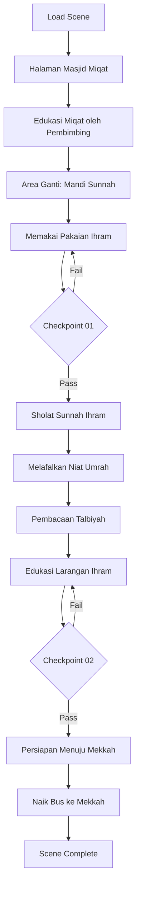

# 04_SCENE_03_MIQAT_DAN_NIAT_UMRAH.md
# ============================================
# VR EDUCATION HAJI & UMRAH
# SCENE 03 — MIQAT DAN NIAT UMRAH
# Version : 1.0
# ============================================

---

## Daftar Isi

- [Scene Information](#scene-information)
- [Learning Objective](#learning-objective)
- [Background](#background)
- [Environment](#environment)
- [Asset List](#asset-list)
- [Asset Source](#asset-source)
- [Character](#character)
- [Animation](#animation)
- [Audio](#audio)
- [Camera](#camera)
- [UI](#ui)
- [Interaction](#interaction)
- [Education](#education)
- [Activity Flow](#activity-flow)
- [Validation](#validation)
- [Performance](#performance)
- [Acceptance Criteria](#acceptance-criteria)

---

## Scene Information

| Atribut | Nilai |
|---------|-------|
| **Nomor Scene** | 03 |
| **Nama Scene** | Miqat dan Niat Umrah |
| **Versi** | 1.0 |
| **Deskripsi** | Scene ini merupakan scene paling penting dalam aplikasi, yaitu simulasi proses Miqat dan Niat Umrah. Pengguna akan berada di lokasi Miqat, mempelajari pengertian dan jenis Miqat, memakai pakaian Ihram, melafalkan Niat Umrah, membaca Talbiyah, dan mempersiapkan diri menuju Mekkah. Scene ini menjadi inti dari pembelajaran tata cara Umrah. |

---

## Learning Objective

Setelah menyelesaikan Scene 03, pengguna diharapkan mampu:

| No | Tujuan Pembelajaran | Target |
|----|---------------------|--------|
| 1 | Memahami pengertian dan jenis-jenis Miqat | 90% benar pada checkpoint |
| 2 | Mengetahui tata cara memakai pakaian Ihram | 90% benar pada checkpoint |
| 3 | Mengetahui larangan-larangan dalam Ihram | 90% benar pada checkpoint |
| 4 | Mampu melafalkan Niat Umrah dengan benar | 90% benar pada checkpoint |
| 5 | Mampu melafalkan Talbiyah dengan benar | 90% benar pada checkpoint |

---

## Background

Miqat merupakan salah satu rukun penting dalam pelaksanaan ibadah Haji dan Umrah. Secara bahasa, Miqat berarti batas waktu dan tempat yang telah ditentukan. Dalam konteks ibadah Haji dan Umrah, Miqat adalah batas yang telah ditetapkan oleh syariat untuk memulai niat ibadah Haji atau Umrah.

Terdapat dua jenis Miqat: Miqat Zamani (batas waktu) dan Miqat Makani (batas tempat). Miqat Zamani untuk Haji adalah bulan-bulan Syawal, Dzulqa'dah, dan Dzulhijjah, sedangkan untuk Umrah, Miqat Zamani-nya adalah sepanjang tahun. Miqat Makani adalah batas tempat yang berbeda-beda tergantung arah kedatangan jamaah.

Scene Miqat dan Niat Umrah merupakan klimaks dari pembelajaran dalam aplikasi VR Education Haji & Umrah. Di scene ini, pengguna akan mempraktikkan langsung proses berpakaian Ihram, melafalkan niat, dan membaca Talbiyah dengan bimbingan NPC pembimbing.

---

## Environment

### Lokasi

| Area | Deskripsi | Dimensi |
|------|-----------|---------|
| **Masjid Miqat (Bir Ali)** | Masjid Dzulhulaifah (Bir Ali), Miqat penduduk Madinah | 40m x 30m |
| **Area Ganti Ihram** | Ruang ganti khusus untuk memakai pakaian Ihram | 15m x 10m |
| **Halaman Masjid** | Area terbuka untuk persiapan dan edukasi | 50m x 40m |
| **Tempat Niat** | Area khusus tempat melafalkan niat | 10m x 10m |
| **Area Edukasi** | Ruang terbuka dengan papan edukasi | 20m x 15m |
| **Bus Menuju Mekkah** | Bus yang akan membawa jamaah ke Mekkah | 12m x 3m |

### Waktu

| Aspek | Setting |
|-------|---------|
| Waktu | Pagi hari (pukul 07:00 - 09:00 waktu Arab) |
| Musim | Musim dingin |

### Cuaca

| Elemen | Deskripsi |
|--------|-----------|
| Langit | Cerah dengan semburat jingga pagi |
| Suhu | 20°C (sejuk) |
| Angin | Sejuk, lembut |

### Lighting

| Sumber | Tipe | Intensity | Shadow |
|--------|------|-----------|--------|
| Matahari Pagi | DirectionalLight | 0.9 | Enabled |
| Langit | HemisphereLight | 0.5 | - |
| Lampu Masjid | PointLight (x4) | 0.5 | Disabled |
| Warm Ambient | AmbientLight | 0.3 | - |

### Atmosfer

| Efek | Implementasi |
|------|--------------|
| Skybox | Sunrise gradasi jingga ke biru muda |
| Ambient | Suasana pagi di Miqat, suara jamaah |
| Particle | Debu gurun halus |
| Fog | THREE.FogExp2 densitas 0.0015 |
| Sun Shaft | Efek cahaya matahari pagi |

---

## Asset List

### Bangunan

| Asset | Deskripsi | LOD Levels |
|-------|-----------|------------|
| Masjid_Miqat | Masjid Dzulhulaifah (Bir Ali) | LOD 0-3 |
| Area_Ganti | Bangunan ruang ganti Ihram | LOD 0-2 |
| Taman_Miqat | Taman dan halaman masjid | LOD 0-2 |
| Halte_Bus_Mekkah | Halte pemberangkatan ke Mekkah | LOD 0-1 |
| Papan_Edukasi | Papan informasi Miqat | LOD 0-1 |

### Karakter

| Asset | Jumlah | Tipe |
|-------|--------|------|
| Player_Character | 1 | Main character (first person) |
| Pembimbing_Miqat | 1 | NPC interaktif (pembimbing utama) |
| Petugas_Masjid | 2 | NPC interaktif |
| Ustadz_Pembimbing | 1 | NPC interaktif (ahli ibadah) |
| Jamaah_Laki | 20 | NPC background (sudah berihram) |
| Jamaah_Perempuan | 15 | NPC background |

### Ground

| Asset | Material | Tekstur |
|-------|----------|---------|
| Tanah_Miqat | Pasir gurun halus | 2048x2048 PBR |
| Lantai_Masjid | Marmer putih | 2048x2048 PBR |
| Halaman | Ubin batu | 2048x2048 PBR |
| Area_Wudhu | Keramik anti-slip | 1024x1024 PBR |

### Vegetasi

| Asset | Jumlah | Keterangan |
|-------|--------|------------|
| Pohon_Zaitun | 10 | Di halaman masjid |
| Semak_Gurun | 15 | Vegetasi kering |
| Rumput | Area | Taman masjid |

### Langit

| Asset | Format | Resolusi |
|-------|--------|----------|
| Skybox_Sunrise | CubeTexture | 2048x2048 per face |

### Props

| Asset | Jumlah | Interaktif |
|-------|--------|------------|
| Kain_Ihram_Putih | 3 | Ya (dapat diambil) |
| Sabuk_Ihram | 3 | Ya (dapat diambil) |
| Sandal_Karet | 5 | Ya (dapat digunakan) |
| Tempat_Wudhu | 6 | Ya (interaktif) |
| Karpet_Sholat | 15 | Ya |
| Mihrab | 1 | Visual |
| Mimbar | 1 | Visual |
| Jam_Dinding | 2 | Visual |
| Papan_Pengumuman | 2 | Ya (informasi) |
| Al_Quran | 5 | Ya (dapat dibuka) |
| Buku_Panduan | 3 | Ya (dapat dibaca) |
| Tasbih | 5 | Ya (interaktif) |

### Dekorasi

| Asset | Jumlah | Keterangan |
|-------|--------|------------|
| Lampu_Gantung | 6 | Dekorasi masjid |
| Kaligrafi_Allah | 2 | Hiasan dinding |
| Kaligrafi_Muhammad | 2 | Hiasan dinding |
| Spanduk_Tuntunan | 3 | Informasi ihram |

### Kendaraan

| Asset | Format | Keterangan |
|-------|--------|------------|
| Bus_Mekkah | GLB | Bus pemberangkatan ke Mekkah |
| Mobil_Pickup | GLB | Kendaraan petugas |

---

## Asset Source

### Fab Marketplace

| Kategori | Nama Asset | Format | Texture | LOD | Ukuran |
|----------|-----------|--------|---------|-----|--------|
| Architecture | Desert Mosque | GLB | 2048x2048 | 3 level | 35MB |
| Architecture | Mosque Interior Classic | GLB | 2048x2048 | 2 level | 20MB |
| Architecture | Washing Area | GLB | 1024x1024 | 2 level | 5MB |
| Character | People Arab Traditional | GLB | 2048x2048 | 2 level | 15MB |
| Props | Ihram Cloth Set | GLB | 512x512 | 1 level | 2MB |
| Props | Islamic Prayer Items | GLB | 1024x1024 | 1 level | 3MB |
| Props | Desert Environment Props | GLB | 1024x1024 | 2 level | 4MB |
| Vehicle | Long Distance Bus | GLB | 2048x2048 | 2 level | 10MB |
| Architecture | Prayer Hall | GLB | 2048x2048 | 2 level | 18MB |

---

## Character

### Player

| Atribut | Spesifikasi |
|---------|-------------|
| Perspektif | First person (kamera sebagai mata player) |
| Pakaian Awal | Pakaian biasa (belum ihram) |
| Pakaian Setelah | Pakaian Ihram putih (setelah proses) |
| Collision | Capsule collider (0.5m radius, 1.8m height) |

### NPC

| NPC | Posisi | Fungsi | Dialog |
|-----|--------|--------|--------|
| Pembimbing_Miqat | Area masjid | Memandu seluruh proses Miqat | 12 dialog |
| Ustadz_Pembimbing | Area Edukasi | Menjelaskan tata cara | 10 dialog |
| Petugas_Masjid1 | Pintu masjid | Menyambut jamaah | 2 dialog |
| Petugas_Masjid2 | Area wudhu | Membantu wudhu | 3 dialog |
| Petugas_Ihram | Area ganti | Membantu memakai ihram | 5 dialog |

### Petugas

| Tipe | Jumlah | Pergerakan |
|------|--------|------------|
| Petugas Kebersihan | 2 | Patroli area |
| Petugas Parkir | 2 | Area parkir |

### Jamaah

| Tipe | Jumlah | Aktivitas |
|------|--------|-----------|
| Jamaah Berihram | 10 | Sedang memakai kain ihram |
| Jamaah Berdoa | 8 | Berdoa di area masjid |
| Jamaah Membaca Talbiyah | 6 | Membaca talbiyah bersama |
| Jamaah Duduk | 5 | Istirahat di halaman |
| Jamaah Sholat | 8 | Sholat sunnah |

---

## Animation

| Animasi | Durasi | Loop | Trigger |
|---------|--------|------|---------|
| Idle | 3s | Yes | Default |
| Walk | 1.5s | Yes | Keyboard WASD |
| Memakai Ihram | 5s | No | Interaksi kain ihram |
| Melipat Kain | 3s | No | Persiapan ihram |
| Memasang Sabuk | 2s | No | Pasang sabuk ihram |
| Wudhu | 8s | No | Interaksi tempat wudhu |
| Sholat Sunnah | 6s | No | Di karpet sholat |
| Niat Berdiri | 3s | No | Saat melafalkan niat |
| Angkat Tangan Doa | 2s | No | Berdoa |
| Talbiyah | 4s | No | Membaca talbiyah |
| Duduk Baca Alquran | 10s | Yes | Interaksi Alquran |
| Berjalan ke Bus | 3s | No | Menuju bus |

---

## Audio

### Ambient

| Sumber | File | Volume | Loop |
|--------|------|--------|------|
| Suasana Pagi | ambient_pagi_miqat.mp3 | 0.3 | Yes |
| Suara Jamaah | ambient_jamaah.mp3 | 0.4 | Yes |
| Suara Masjid | ambient_masjid_miqat.mp3 | 0.3 | Yes |
| Suara Hewan Gurun | ambient_desert.mp3 | 0.1 | Yes |
| Angin Pagi | ambient_wind.mp3 | 0.2 | Yes |

### Narration

| Momen | File | Durasi | Prioritas |
|-------|------|--------|-----------|
| Scene Start | nar_03_intro_miqat.mp3 | 80s | High |
| Pengertian Miqat | nar_03_pengertian.mp3 | 70s | High |
| Jenis Miqat | nar_03_jenis_miqat.mp3 | 90s | High |
| Cara Pakai Ihram | nar_03_cara_ihram.mp3 | 75s | High |
| Larangan Ihram | nar_03_larangan_ihram.mp3 | 80s | High |
| Niat Umrah | nar_03_niat_umrah.mp3 | 65s | High |
| Talbiyah | nar_03_talbiyah.mp3 | 70s | High |
| Persiapan Mekkah | nar_03_persiapan.mp3 | 60s | Medium |
| Checkpoint | nar_checkpoint_03.mp3 | 25s | High |

### Instruction

| Momen | File | Deskripsi |
|-------|------|-----------|
| Cara Memakai Ihram | instr_ihram_pakai.mp3 | Panduan visual memakai ihram |
| Cara Niat | instr_niat.mp3 | Panduan lafadz niat |
| Cara Talbiyah | instr_talbiyah.mp3 | Panduan lafadz talbiyah |

### Effect

| Efek | File | Volume |
|------|------|--------|
| Kain Bergerak | sfx_cloth.mp3 | 0.3 |
| Air Wudhu | sfx_wudhu_water.mp3 | 0.5 |
| Pintu Masjid | sfx_masjid_door_miqat.mp3 | 0.5 |
| Bus Engine | sfx_bus_start.mp3 | 0.6 |
| Talbiyah Massal | sfx_talbiyah_mass.mp3 | 0.7 |
| Adzan Subuh | adzan_subuh.mp3 | 0.6 |
| Takbir | sfx_takbir.mp3 | 0.5 |
| Salam | sfx_salam_miqat.mp3 | 0.4 |

### Voice Over

| Karakter | File | Durasi |
|----------|------|--------|
| Pembimbing Miqat | vo_miqat_pembimbing_01-12.mp3 | 12s each |
| Ustadz Pembimbing | vo_miqat_ustadz_01-10.mp3 | 15s each |
| Petugas Ihram | vo_miqat_petugas_01-5.mp3 | 8s each |

---

## Camera

### Spawn

| Parameter | Nilai |
|-----------|-------|
| Posisi Awal | x: 0, y: 1.7, z: 5 (halaman Masjid Miqat) |
| Look At | Arah pintu masjid |
| FOV | 60 derajat |
| Near | 0.1 |
| Far | 1000 |

### Movement

| Mode | Kontrol | Kecepatan |
|------|---------|-----------|
| Walk | W/A/S/D | 3.5 m/s |
| Run | Shift + W/A/S/D | 5 m/s |
| Look | Mouse move | Sensitivitas 0.002 |
| Teleport | Klik titik biru | Instant |

### Reset

| Trigger | Aksi |
|---------|------|
| Tekan R | Reset ke posisi spawn terakhir |
| Out of bounds | Auto-reset ke area masjid |

### Transition

| Momen | Durasi | Easing |
|-------|--------|--------|
| Masuk scene | 2s | Cubic InOut |
| Ganti pakaian | 1.5s | Fade to white |
| Menuju bus | 1s | Quad InOut |
| End scene | 2s | Fade to white |

---

## UI

### Subtitle

| Atribut | Spesifikasi |
|---------|-------------|
| Posisi | Bawah tengah |
| Font | Arabic + Latin (Arial), 20px |
| Warna | Putih dengan shadow |
| Background | Semi-transparan (rgba 0,0,0,0.5) |
| Max Lines | 2 baris |
| Arabic Support | Arabic script untuk niat dan talbiyah |

### Progress

| Elemen | Deskripsi |
|--------|-----------|
| Progress Bar | Horizontal bar di atas (6 segmen) |
| Segmen | Masuk → Ganti Ihram → Niat → Talbiyah → Edukasi → Selesai |
| Active | Segmen berwarna emas |
| Completed | Segmen berwarna hijau |
| Guide | Panah penunjuk langkah |

### Hint

| Tipe | Warna | Posisi |
|------|-------|--------|
| Navigasi | Biru muda | Tengah bawah |
| Interaksi | Hijau | Atas objek |
| Edukasi | Emas | Kanan bawah |
| Ibadah | Putih | Atas kiri |
| Peringatan | Merah | Tengah |

### Compass

| Elemen | Spesifikasi |
|--------|-------------|
| Bentuk | Circular |
| Ukuran | 80x80px |
| Posisi | Atas kanan |
| Arah | U/T/S/B + Kiblat |
| Marker | Masjid, bus, area ganti |

### Notification

| Tipe | Durasi | Warna |
|------|--------|-------|
| Info | 3s | Biru |
| Success | 3s | Hijau |
| Ibadah | 5s | Emas |
| Warning | 4s | Merah |

### Mini Map

| Atribut | Spesifikasi |
|---------|-------------|
| Ukuran | 200x200px |
| Posisi | Kiri bawah |
| Style | Top-down minimalis |
| Ikon | Player, NPC penting, tujuan |

### Popup

| Tipe | Konten | Aksi |
|------|--------|------|
| Edukasi | Teks + dalil + arab | Next/Back |
| Panduan | Langkah memakai ihram | Next/Back |
| Dialog | Opsi percakapan | Pilih opsi |
| Checkpoint | Pertanyaan + jawaban | Submit |
| Doa | Teks doa arab + latin | Baca & tutup |

---

## Interaction

### Click

| Objek | Aksi | Feedback |
|-------|------|----------|
| Kain Ihram | Ambil dan pakai | Animasi memakai |
| Sabuk Ihram | Pasang | Animasi memasang |
| Sandal | Gunakan | Ganti footwear |
| Tempat Wudhu | Mulai wudhu | Animasi wudhu |
| Karpet Sholat | Mulai sholat sunnah | Animasi sholat |
| Pembimbing | Mulai dialog | UI dialog |
| Ustadz | Mulai dialog edukasi | UI edukasi |
| Al Quran | Buka dan baca | Popup Al Quran |
| Buku Panduan | Baca panduan | Popup buku |
| Bus | Naik bus | Transisi keluar |

### Hover

| Objek | Highlight | Cursor |
|-------|-----------|--------|
| NPC | Glow emas | Pointer |
| Kain Ihram | Outline putih | Pointer |
| Interaktif | Outline emas | Pointer |
| Buku | Outline biru | Pointer |

### Inspect

| Objek | Hasil | Format |
|-------|-------|--------|
| Kain Ihram | Cara pakai | Animasi + panduan |
| Al Quran | Ayat pilihan | Popup + audio |
| Papan Edukasi | Info Miqat | Popup info |

### Walk

| Metode | Kontrol | Keterangan |
|--------|---------|------------|
| Keyboard | WASD | Gerakan relatif kamera |
| Mouse | Klik kanan tahan | Look around |
| Auto-walk | Klik tujuan | Jalan otomatis |

### Teleport

| Area | Titik Teleport | Biaya |
|------|---------------|-------|
| Halaman | 2 titik | Gratis |
| Masuk Masjid | 1 titik | Gratis |
| Area Ganti | 1 titik | Gratis |
| Halte Bus | 1 titik | Gratis |

### Dialog

| Struktur | Format | Opsi |
|----------|--------|------|
| NPC Speech | Teks + audio | - |
| Player Choice | 2-3 opsi | Pilih satu |
| NPC Response | Teks + audio | - |
| Edukasi | Info tambahan | Klik untuk detail |
| Konfirmasi | Ya/Tidak | Konfirmasi tindakan |

### Highlight

| Metode | Warna | Durasi |
|--------|-------|--------|
| Outline | Emas (0xffaa00) | Selama hover |
| Pulse | Hijau (0x44ff88) | 2 detik |
| Glow | Putih (0xffffff) | Terus menerus |
| Guide | Biru (0x4488ff) | 1 detik pulse |
| Warning | Merah (0xff4444) | 3 detik |

### Information

| Tipe | Format | Contoh |
|------|--------|--------|
| Tempat | Info box | "Masjid Dzulhulaifah (Bir Ali)" |
| Hukum | Fatwa box | "Miqat Makani untuk penduduk Madinah" |
| Dalil | Quote box arab | HR Bukhari & Muslim |
| Panduan | Step cards | "Langkah 1: Ambil kain ihram" |

---

## Education

### Penjelasan

| Topik | Konten | Durasi |
|-------|--------|--------|
| Pengertian Miqat | Batas waktu dan tempat untuk memulai ibadah Haji/Umrah | 80s |
| Miqat Zamani | Waktu pelaksanaan Haji (Syawal - Dzulhijjah) dan Umrah (sepanjang tahun) | 60s |
| Miqat Makani | Lima lokasi Miqat: Dzulhulaifah, Juhfah, Qarnul Manazil, Yalamlam, Dzatu Irq | 90s |
| Pakaian Ihram | Dua helai kain putih tanpa jahitan untuk laki-laki, pakaian longgar untuk perempuan | 75s |
| Tata Cara Ihram | Mandi, wudhu, memakai wewangian, sholat sunnah ihram | 80s |
| Niat Umrah | Lafadz niat Umrah dalam bahasa Arab dan artinya | 65s |
| Talbiyah | Lafadz talbiyah: "Labbaik Allahumma Labbaik..." | 70s |
| Larangan Ihram | Larangan saat ihram: memakai wewangian, memotong kuku/rambut, berburu, dll | 80s |

### Dalil

| Referensi | Ayat/Hadits | Konteks |
|-----------|-------------|---------|
| QS Al-Baqarah: 196 | "Dan sempurnakanlah ibadah haji dan umrah karena Allah" | Perintah Umrah |
| HR Bukhari & Muslim | "Rasulullah SAW miqat dari Dzulhulaifah" | Miqat Rasulullah |
| QS Al-Hajj: 26-27 | "Bersihkan rumah-Ku untuk orang yang tawaf, i'tikaf, ruku, dan sujud" | Persiapan ibadah |
| HR Muslim | "Talbiyah Rasulullah: Labbaik Allahumma Labbaik..." | Bacaan talbiyah |
| QS Al-Maidah: 1 | "Janganlah menghalalkan syiar-syiar Allah" | Larangan ihram |

### Hikmah

| Hikmah | Penjelasan |
|--------|------------|
| Ketaatan | Ihram melambangkan kepatuhan total kepada Allah |
| Kesederhanaan | Pakaian ihram putih mengajarkan kesetaraan |
| Pembersihan Diri | Melepaskan atribut dunia |
| Fokus Ibadah | Meninggalkan kesibukan duniawi |
| Persaudaraan | Semua sama di hadapan Allah |

### Larangan

| Larangan | Keterangan |
|----------|------------|
| Memakai wewangian | Termasuk parfum, minyak wangi |
| Memotong kuku/rambut | Termasuk mencabut, memotong |
| Berburu/membunuh hewan | Kecuali hewan berbahaya |
| Berkata kotor (rafats) | Termasuk rayuan, hubungan suami istri |
| Berbuat fasik (fasuq) | Segala bentuk maksiat |
| Bertengkar (jidal) | Debat tidak bermanfaat |
| Memakai pakaian berjahit | Khusus laki-laki |
| Menutup kepala | Khusus laki-laki |
| Menutup muka (cadar) | Khusus perempuan |

### Kesalahan Umum

| Kesalahan | Solusi |
|-----------|--------|
| Tidak mandi sebelum ihram | Mandi sunnah sebelum niat ihram |
| Lupa niat dari miqat | Wajib berniat di miqat |
| Tidak membaca talbiyah | Perbanyak talbiyah setelah ihram |
| Melanggar larangan ihram | Pelajari dan hafalkan larangan |
| Ragu-ragu dalam niat | Pastikan niat karena Allah |
| Tidak sholat sunnah ihram | Sholat 2 rakaat setelah mandi |

### Tips

| No | Tips |
|----|------|
| 1 | Mandi dan bersuci sebelum memakai pakaian ihram |
| 2 | Gunakan wewangian SEBELUM ihram (jangan setelah) |
| 3 | Pastikan kain ihram menutup aurat dengan sempurna |
| 4 | Hafalkan niat umrah dan talbiyah sebelum tiba di miqat |
| 5 | Perbanyak membaca talbiyah setelah niat ihram |
| 6 | Jaga lisan dan perbuatan selama dalam ihram |
| 7 | Siapkan sandal karet yang nyaman untuk dipakai |
| 8 | Bawa kain ihram cadangan |

---

## Activity Flow

### Alur Scene

### Langkah Detail

| Langkah | Area | Aksi | Durasi |
|---------|------|------|--------|
| 1 | Halaman | Spawn di halaman Masjid Miqat, dengar narator intro | 80s |
| 2 | Halaman | Bertemu pembimbing, edukasi Miqat | 90s |
| 3 | Area Ganti | Mandi sunnah dan wudhu | 60s |
| 4 | Area Ganti | Memakai pakaian ihram | 75s |
| 5 | Area Ganti | Checkpoint 01 — Ihram | 30s |
| 6 | Masjid | Sholat sunnah 2 rakaat | 45s |
| 7 | Tempat Niat | Melafalkan niat Umrah | 40s |
| 8 | Halaman | Membaca talbiyah bersama | 50s |
| 9 | Halaman | Edukasi larangan ihram | 80s |
| 10 | Halaman | Checkpoint 02 — Niat & Talbiyah | 30s |
| 11 | Halte | Persiapan menuju Mekkah | 45s |
| 12 | Bus | Naik bus, scene berakhir | 10s |

---

## Validation

### Berhasil

| Checkpoint | Kriteria | Reward |
|------------|----------|--------|
| CP-01 | Menjawab benar minimal 4 dari 5 pertanyaan tentang Ihram | Dapat melanjutkan ke niat |
| CP-02 | Menjawab benar minimal 4 dari 5 pertanyaan tentang Niat & Talbiyah | Scene selesai + complete certificate |

### Gagal

| Checkpoint | Kriteria | Konsekuensi |
|------------|----------|-------------|
| CP-01 | Kurang dari 4 jawaban benar | Ulang proses memakai ihram |
| CP-02 | Kurang dari 4 jawaban benar | Ulang edukasi talbiyah |
| Timeout | Tidak menjawab dalam 5 menit | Scene restart dari checkpoint |

### Checkpoint List

#### Checkpoint 01 — Ihram

| No | Pertanyaan | Jawaban Benar | Opsi |
|----|-----------|---------------|------|
| 1 | Apa yang dimaksud dengan Miqat? | Batas memulai ibadah Haji/Umrah | 4 opsi |
| 2 | Berapa helai kain ihram untuk laki-laki? | 2 helai | 4 opsi |
| 3 | Mana yang dilarang saat ihram? | Memakai wewangian | 4 opsi |
| 4 | Apa yang dilakukan sebelum memakai ihram? | Mandi sunnah | 4 opsi |
| 5 | Sholat apa yang dianjurkan setelah ihram? | Sholat sunnah 2 rakaat | 4 opsi |

#### Checkpoint 02 — Niat dan Talbiyah

| No | Pertanyaan | Jawaban Benar | Opsi |
|----|-----------|---------------|------|
| 1 | Di mana niat Umrah dimulai? | Di Miqat | 4 opsi |
| 2 | Bunyi talbiyah yang benar adalah? | "Labbaik Allahumma Labbaik..." | 4 opsi |
| 3 | Niat Umrah dibaca dalam hati atau lisan? | Keduanya (hati dan lisan) | 4 opsi |
| 4 | Apa yang dimaksud Miqat Makani? | Batas tempat | 4 opsi |
| 5 | Berapa jumlah Miqat Makani? | 5 tempat | 4 opsi |

---

## Performance

| Aspek | Target | Metrik |
|-------|--------|--------|
| Frame Rate | 60 FPS | Average FPS |
| Scene Load | < 4 detik | Load time |
| Memory | < 200MB | Memory usage |
| Texture | < 128MB | GPU memory |
| Draw Calls | < 400 | Draw call count |
| Triangles | < 400k | Triangle count |

### Optimization

| Teknik | Penerapan |
|--------|-----------|
| LOD | Masjid 3 level, bangunan 2 level |
| Texture Atlas | Marmer, ubin sejenis |
| Draco Compression | Semua GLB file |
| Instancing | Lampu gantung, karpet, tanaman |
| Frustum Culling | Auto |
| Occlusion Culling | Area masjid |
| Draw Call Batching | Material sejenis |

### Texture Budget

| Kategori | Budget | Catatan |
|----------|--------|---------|
| Masjid | 48MB | Detail sedang |
| Bangunan | 32MB | 2048x2048 |
| Karakter | 24MB | 2048x2048 |
| Props | 16MB | 1024x1024 |
| Environment | 8MB | Skybox + ground |

---

## Acceptance Criteria

| No | Kriteria | Status |
|----|----------|--------|
| 1 | Scene dapat dimuat dalam waktu < 4 detik | ☐ |
| 2 | Masjid Miqat (Bir Ali) dirender dengan detail arsitektur | ☐ |
| 3 | Edukasi pengertian Miqat ditampilkan dengan jelas | ☐ |
| 4 | Edukasi jenis-jenis Miqat (Zamani & Makani) ditampilkan | ☐ |
| 5 | Proses memakai pakaian ihram dapat dilakukan secara interaktif | ☐ |
| 6 | Kain ihram putih dan sabuk tersedia sebagai objek interaktif | ☐ |
| 7 | Area ganti ihram dengan privasi tersedia | ☐ |
| 8 | Simulasi wudhu berfungsi dengan benar | ☐ |
| 9 | Sholat sunnah ihram 2 rakaat dapat dilakukan | ☐ |
| 10 | Niat Umrah dapat dilafalkan dengan panduan audio dan teks | ☐ |
| 11 | Bacaan Talbiyah ditampilkan dengan teks Arab dan Latin | ☐ |
| 12 | Edukasi larangan ihram ditampilkan lengkap | ☐ |
| 13 | NPC pembimbing memandu seluruh proses dengan dialog | ☐ |
| 14 | NPC ustadz memberikan penjelasan tata cara dengan benar | ☐ |
| 15 | Audio narator berjalan di setiap tahapan penting | ☐ |
| 16 | Subtitle Arab dan Latin untuk niat dan talbiyah | ☐ |
| 17 | Checkpoint 01 berfungsi dengan validasi | ☐ |
| 18 | Checkpoint 02 berfungsi dengan validasi | ☐ |
| 19 | Transisi scene keluar (naik bus) berjalan halus | ☐ |
| 20 | Frame rate stabil di 60 FPS | ☐ |

---

> **Dokumen Terkait:**
> - [00_Project_Overview.md](./00_Project_Overview.md)
> - [01_Technology_Stack.md](./01_Technology_Stack.md)
> - [02_Scene_01_Berangkat_Indonesia.md](./02_Scene_01_Berangkat_Indonesia.md)
> - [03_Scene_02_Tiba_Madinah.md](./03_Scene_02_Tiba_Madinah.md)

---
