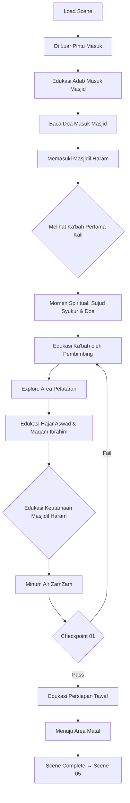

# 05_SCENE_04_MASUK_MASJIDIL_HARAM.md
# ============================================
# VR EDUCATION HAJI & UMRAH
# SCENE 04 — MASUK MASJIDIL HARAM
# Version : 1.0
# ============================================

---

## Daftar Isi

- [Scene Information](#scene-information)
- [Learning Objective](#learning-objective)
- [Background](#background)
- [Environment](#environment)
- [Asset List](#asset-list)
- [Asset Source](#asset-source)
- [Character](#character)
- [Animation](#animation)
- [Audio](#audio)
- [Camera](#camera)
- [UI](#ui)
- [Interaction](#interaction)
- [Education](#education)
- [Activity Flow](#activity-flow)
- [Validation](#validation)
- [Performance](#performance)
- [Acceptance Criteria](#acceptance-criteria)

---

## Scene Information

| Atribut | Nilai |
|---------|-------|
| **Nomor Scene** | 04 |
| **Nama Scene** | Masuk Masjidil Haram |
| **Versi** | 1.0 |
| **Deskripsi** | Scene ini mensimulasikan pengalaman pertama kali jamaah memasuki Masjidil Haram di Mekkah. Pengguna akan berjalan menuju pintu masuk masjid, melihat keagungan Ka'bah untuk pertama kalinya, mempelajari adab memasuki masjid, melafalkan doa masuk masjid, dan berkeliling area pelataran Masjidil Haram. Scene ini menjadi momen spiritual yang sangat penting karena untuk pertama kalinya jamaah melihat Baitullah secara langsung. |

---

## Learning Objective

Setelah menyelesaikan Scene 04, pengguna diharapkan mampu:

| No | Tujuan Pembelajaran | Target |
|----|---------------------|--------|
| 1 | Memahami gambaran umum Masjidil Haram dan bagian-bagiannya | 85% benar pada checkpoint |
| 2 | Mengetahui adab memasuki Masjidil Haram dengan benar | 85% benar pada checkpoint |
| 3 | Mampu melafalkan doa masuk masjid dengan benar | 85% benar pada checkpoint |
| 4 | Memahami keutamaan Masjidil Haram dan Ka'bah | 85% benar pada checkpoint |
| 5 | Mengenal area-area penting di sekitar Masjidil Haram | 85% benar pada checkpoint |

---

## Background

Scene Masuk Masjidil Haram merupakan scene keempat dari aplikasi VR Education Haji & Umrah. Scene ini menjadi puncak spiritualitas karena untuk pertama kalinya pengguna akan melihat Ka'bah secara langsung dalam lingkungan virtual.

Masjidil Haram adalah masjid terbesar di dunia yang terletak di kota Mekkah, Arab Saudi. Di tengah-tengah masjid ini terdapat Ka'bah, kiblat umat Islam di seluruh dunia. Masjidil Haram memiliki luas lebih dari 400.000 meter persegi dan mampu menampung lebih dari 2 juta jamaah. Masjid ini terus mengalami perluasan dari masa ke masa.

Setelah menyelesaikan perjalanan dari Madinah dan melaksanakan ihram di Miqat, jamaah kemudian menuju Mekkah. Momen pertama kali melihat Ka'bah adalah pengalaman spiritual yang sangat mendalam. Banyak jamaah yang menangis terharu saat pertama kali melihat Baitullah. Dalam scene ini, pengguna akan merasakan pengalaman tersebut secara virtual.

Masjidil Haram memiliki beberapa pintu masuk utama, area pelataran yang luas (Mataf), serta berbagai bangunan bersejarah di sekitarnya seperti Bukit Shafa dan Marwah yang akan digunakan pada scene Sa'i nantinya.

---

## Environment

### Lokasi

| Area | Deskripsi | Dimensi |
|------|-----------|---------|
| **Pintu Masuk Utama** | Pintu gerbang Masjidil Haram dengan arsitektur megah | 30m x 20m |
| **Koridor Masuk** | Lorong panjang menuju area pelataran | 50m x 10m |
| **Area Pelataran** | Halaman luas di sekitar Ka'bah | 150m x 120m |
| **Area Mataf (Tepi)** | Area tepi mataf yang masih terlihat | 40m x 30m |
| **Tempat Pertama Melihat Ka'bah** | Titik pandang ikonik saat pertama melihat Ka'bah | 20m x 15m |
| **Area Sholat** | Area dengan karpet sholat yang luas | 100m x 80m |
| **Area Wudhu** | Tempat wudhu di luar masjid | 25m x 15m |
| **Area Persiapan Tawaf** | Area transisi menuju scene Tawaf | 15m x 10m |

### Waktu

| Aspek | Setting |
|-------|---------|
| Waktu | Menjelang siang (pukul 09:00 - 11:00 waktu Arab) |
| Musim | Musim dingin (25°C) |

### Cuaca

| Elemen | Deskripsi |
|--------|-----------|
| Langit | Cerah dengan sedikit awan putih |
| Suhu | 25°C (sejuk) |
| Cahaya | Golden hour pagi |

### Lighting

| Sumber | Tipe | Intensity | Shadow |
|--------|------|-----------|--------|
| Matahari Pagi | DirectionalLight | 1.0 | Enabled |
| Langit | HemisphereLight | 0.5 | - |
| Pantulan Marmer | AmbientLight | 0.3 | - |
| Lampu Masjid | PointLight (x12) | 0.6 | Disabled |
| Cahaya Ka'bah | SpotLight (x4) | 0.8 | Enabled |

### Atmosfer

| Efek | Implementasi |
|------|--------------|
| Skybox | Langit cerah biru jernih |
| Ambient | Suasana Masjidil Haram ramai, suara talbiyah |
| Particle | Partikel cahaya lembut |
| Fog | THREE.FogExp2 densitas 0.0008 |
| Glow | Efek cahaya di sekitar Ka'bah |
| Vignette | Efek pinggiran gelap untuk fokus ke Ka'bah |

---

## Asset List

### Bangunan

| Asset | Deskripsi | LOD Levels |
|-------|-----------|------------|
| Masjidil_Haram_Eksterior | Eksterior Masjidil Haram dengan menara | LOD 0-3 |
| Ka'bah | Bangunan Ka'bah dengan kiswah hitam | LOD 0-3 |
| Pintu_Masuk_Utama | Pintu gerbang megah Masjidil Haram | LOD 0-2 |
| Menara_Masjid | Menara-menara tinggi Masjidil Haram | LOD 0-3 |
| Area_Pelataran | Pelataran marmer putih luas | LOD 0-3 |
| Maqam_Ibrahim | Bangunan kecil dekat Ka'bah | LOD 0-2 |
| Hijr_Ismail | Area setengah lingkaran di samping Ka'bah | LOD 0-2 |

### Karakter

| Asset | Jumlah | Tipe |
|-------|--------|------|
| Player_Character | 1 | Main character (first person) |
| Pembimbing_Mekkah | 1 | NPC interaktif (pembimbing utama) |
| Petugas_MasjidilHaram | 3 | NPC interaktif |
| Imam_Masjid | 1 | NPC (visual di kejauhan) |
| Jamaah_Laki | 30 | NPC background |
| Jamaah_Perempuan | 25 | NPC background |
| Jamaah_Lansia | 5 | NPC background |
| Keluarga_Jamaah | 6 | NPC background |

### Ground

| Asset | Material | Tekstur |
|-------|----------|---------|
| Lantai_Pelataran | Marmer putih mengkilap | 4096x4096 PBR |
| Lantai_Masjid | Karpet tebal merah | 2048x2048 PBR |
| Area_Thawaf | Marmer khusus anti-slip | 4096x4096 PBR |
| Trotoar_Luar | Ubin batu | 2048x2048 PBR |

### Vegetasi

| Asset | Jumlah | Keterangan |
|-------|--------|------------|
| Tanaman_Hias | 20 | Di area luar masjid |
| Pohon_Palem | 15 | Di sekitar halaman |
| Bunga | 10 | Dekorasi taman |

### Langit

| Asset | Format | Resolusi |
|-------|--------|----------|
| Skybox_Mekkah | CubeTexture | 4096x4096 per face |
| Awan_Detail | Cloud texture 3D | 2048x2048 |

### Props

| Asset | Jumlah | Interaktif |
|-------|--------|------------|
| Kiswah_Ka'bah | 1 | Visual (detail kain penutup Ka'bah) |
| Pintu_Ka'bah | 1 | Visual |
| Batu_HajarAswad | 1 | Ya (dilihat dari jauh) |
| Karpet_Sholat_Area | 50 | Ya |
| Mihrab_Masjid | 3 | Visual |
| Mimbar | 1 | Visual |
| Lampu_Gantung_Besar | 20 | Dekorasi interior |
| Payung_Pelataran | 15 | Pelindung matahari |
| Air_ZamZam_Minum | 5 | Ya (interaktif) |
| Papan_Petunjuk | 10 | Ya (informasi) |
| Tempat_Sampah | 15 | Tidak |
| Jam_Dinding_Raksasa | 4 | Menunjukkan waktu |

### Dekorasi

| Asset | Jumlah | Keterangan |
|-------|--------|------------|
| Kaligrafi_Ayat | 10 | Hiasan dinding masjid |
| Lampu_Gantung_Kristal | 30 | Dekorasi interior mewah |
| Hiasan_Pilar | 50 | Pilar marmer berukir |
| Karpet_Merah | Area | Karpet area sholat |
| Tirai_Pintu | 8 | Tirai pintu masuk |

### Bangunan Sekitar

| Asset | Format | Keterangan |
|-------|--------|------------|
| Hotel_Mekkah | GLB | Hotel di sekitar masjid |
| Menara_Jam | GLB | Menara jam raksasa (Abraj Al-Bait) |
| Bukit_Shafa | GLB | Bukit kecil untuk Sa'i |
| Bukit_Marwah | GLB | Bukit kecil untuk Sa'i |

---

## Asset Source

### Fab Marketplace

| Kategori | Nama Asset | Format | Texture | LOD | Ukuran |
|----------|-----------|--------|---------|-----|--------|
| Architecture | Masjidil Haram Grand Mosque | GLB | 4096x4096 | 3 level | 100MB |
| Architecture | Ka'bah Detailed | GLB | 4096x4096 | 3 level | 45MB |
| Architecture | Mecca Hotel Tower | GLB | 2048x2048 | 3 level | 35MB |
| Architecture | Marble Floor Tiles | GLB | 4096x4096 | 2 level | 20MB |
| Character | Middle Eastern People Pack | GLB | 2048x2048 | 2 level | 25MB |
| Props | Mosque Lighting Chandelier | GLB | 2048x2048 | 2 level | 8MB |
| Props | Islamic Architecture Details | GLB | 2048x2048 | 2 level | 15MB |
| Architecture | Abraj Al-Bait Clock Tower | GLB | 4096x4096 | 3 level | 60MB |
| Props | ZamZam Water Dispenser | GLB | 1024x1024 | 1 level | 3MB |
| Vegetation | Desert Palm Tree | GLB | 1024x1024 | 2 level | 4MB |

---

## Character

### Player

| Atribut | Spesifikasi |
|---------|-------------|
| Perspektif | First person (kamera sebagai mata player) |
| Pakaian | Pakaian Ihram putih (setelah scene sebelumnya) |
| Collision | Capsule collider (0.5m radius, 1.8m height) |
| Kondisi Emosi | Decoupled emotion state: terharu, khusyuk |

### NPC

| NPC | Posisi | Fungsi | Dialog |
|-----|--------|--------|--------|
| Pembimbing_Mekkah | Pintu Masuk | Memandu memasuki Masjidil Haram | 10 dialog |
| Petugas_Pintu1 | Pintu Utama | Menyambut jamaah, panduan adab | 4 dialog |
| Petugas_Pintu2 | Pintu Samping | Mengarahkan jamaah | 3 dialog |
| Petugas_AirZamZam | Area Air ZamZam | Membagikan air zamzam | 3 dialog |
| Ustadz_Pembimbing | Area Pelataran | Edukasi keutamaan Ka'bah | 8 dialog |

### Petugas

| Tipe | Jumlah | Pergerakan |
|------|--------|------------|
| Petugas Kebersihan | 5 | Patroli area masjid |
| Petugas Keamanan | 8 | Berjaga di pintu dan area |
| Petugas Parkir | 3 | Area parkir luar |

### Jamaah

| Tipe | Jumlah | Aktivitas |
|------|--------|-----------|
| Jamaah Sholat | 25 | Sholat di area masjid |
| Jamaah Thawaf | 20 | Melakukan tawaf di mataf |
| Jamaah Berdoa | 15 | Berdoa menghadap Ka'bah |
| Jamaah Duduk | 10 | Istirahat di pelataran |
| Jamaah Membaca Alquran | 8 | Membaca Alquran di area |
| Jamaah Berjalan | 12 | Berjalan menuju pintu |

---

## Animation

| Animasi | Durasi | Loop | Trigger |
|---------|--------|------|---------|
| Idle | 3s | Yes | Default |
| Walk | 1.5s | Yes | Keyboard WASD |
| Melihat Ka'bah | 5s | No | Trigger pertama lihat Ka'bah |
| Mengangkat Tangan Doa | 3s | No | Berdoa |
| Sujud Syukur | 4s | No | Trigger setelah lihat Ka'bah |
| Duduk Berdoa | 8s | Yes | Di karpet sholat |
| Berjalan Khusyuk | 2s | No | Saat mendekati Ka'bah |
| Memegang Hajar Aswad | 3s | No | Interaksi istilam |
| Salam | 2s | No | Bertemu NPC |
| Thawaf Berjalan | 5s | Yes | Di area mataf |
| Istirahat | 4s | Yes | Duduk istirahat |
| Minum Air ZamZam | 3s | No | Interaksi air zamzam |

---

## Audio

### Ambient

| Sumber | File | Volume | Loop |
|--------|------|--------|------|
| Suasana Masjidil Haram | ambient_haram.mp3 | 0.4 | Yes |
| Suara Talbiyah Jamaah | ambient_talbiyah_haram.mp3 | 0.5 | Yes |
| Kumandang Adzan | adzan_mekkah.mp3 | 0.7 | No (triggered) |
| Suara Air ZamZam | ambient_zamzam.mp3 | 0.2 | Yes |
| Suara Doa | ambient_doa.mp3 | 0.3 | Yes |
| Suara Burung | ambient_burung.mp3 | 0.1 | Yes |

### Narration

| Momen | File | Durasi | Prioritas |
|-------|------|--------|-----------|
| Scene Start | nar_04_intro_haram.mp3 | 90s | High |
| Melihat Ka'bah | nar_04_melihat_kabah.mp3 | 75s | High |
| Adab Masuk Masjid | nar_04_adab_masuk.mp3 | 80s | High |
| Doa Masuk Masjid | nar_04_doa_masuk.mp3 | 60s | High |
| Keutamaan Masjidil Haram | nar_04_keutamaan_haram.mp3 | 95s | High |
| Sejarah Ka'bah | nar_04_sejarah_kabah.mp3 | 100s | Medium |
| Hajar Aswad | nar_04_hajar_aswad.mp3 | 70s | Medium |
| Persiapan Tawaf | nar_04_persiapan_tawaf.mp3 | 65s | High |
| Checkpoint | nar_checkpoint_04.mp3 | 30s | High |

### Instruction

| Momen | File | Deskripsi |
|-------|------|-----------|
| Navigasi | instr_nav_haram.mp3 | Panduan gerakan di Masjidil Haram |
| Doa | instr_doa_masjid.mp3 | Cara melafalkan doa masuk masjid |
| Adab | instr_adab_masjid.mp3 | Panduan adab memasuki masjid |

### Effect

| Efek | File | Volume |
|------|------|--------|
| Pintu Masjid Terbuka | sfx_pintu_besar.mp3 | 0.6 |
| Langkah Kaki di Marmer | sfx_footstep_marble.mp3 | 0.3 |
| Suara Kiswah | sfx_kiswah.mp3 | 0.2 |
| Air ZamZam Tuang | sfx_zamzam_pour.mp3 | 0.5 |
| Adzan Bergema | sfx_adzan_echo.mp3 | 0.7 |
| Talbiyah Bersama | sfx_talbiyah_ramai.mp3 | 0.6 |
| Tangisan Haru | sfx_tangisan_haru.mp3 | 0.3 |
| Suara Sholat | sfx_sholat_jamaah.mp3 | 0.4 |
| Transition | sfx_transition_haram.mp3 | 0.5 |

### Voice Over

| Karakter | File | Durasi |
|----------|------|--------|
| Pembimbing Mekkah | vo_haram_pembimbing_01-10.mp3 | 12s each |
| Petugas Pintu | vo_haram_petugas_01-04.mp3 | 8s each |
| Ustadz Pembimbing | vo_haram_ustadz_01-08.mp3 | 15s each |
| Petugas ZamZam | vo_haram_zamzam_01-03.mp3 | 10s each |

---

## Camera

### Spawn

| Parameter | Nilai |
|-----------|-------|
| Posisi Awal | x: 0, y: 1.7, z: -15 (di luar pintu masuk utama) |
| Look At | Arah pintu masuk Masjidil Haram |
| FOV | 60 derajat |
| Near | 0.1 |
| Far | 1500 |

### Movement

| Mode | Kontrol | Kecepatan |
|------|---------|-----------|
| Walk | W/A/S/D | 3 m/s |
| Run | Shift + W/A/S/D | 4 m/s |
| Look | Mouse move | Sensitivitas 0.002 |
| Teleport | Klik titik biru | Instant |
| Slow Walk | Ctrl + W/A/S/D | 1.5 m/s (mode khusyuk) |

### Reset

| Trigger | Aksi |
|---------|------|
| Tekan R | Reset ke posisi spawn terakhir |
| Out of bounds | Auto-reset ke area pelataran |
| Bug collision | Auto-reset setelah 3 detik |

### Transition

| Momen | Durasi | Easing |
|-------|--------|--------|
| Masuk scene | 2.5s | Cubic InOut |
| Pertama lihat Ka'bah | 3s (slow motion) | Smooth Sine |
| Pindah area | 1.5s | Quad InOut |
| Mode edukasi | 0.8s | Linear |
| Persiapan tawaf | 2s | Fade to white |

### Special Camera — First Sight of Ka'bah

| Parameter | Nilai |
|-----------|-------|
| Mode | Cinematic fixed angle |
| Durasi | 5 detik |
| Efek | Slow zoom + lens flare |
| Audio | Narasi khusus + background talbiyah |
| UI | Fade out sementara untuk momen emosional |

---

## UI

### Subtitle

| Atribut | Spesifikasi |
|---------|-------------|
| Posisi | Bawah tengah |
| Font | Arial, 20px |
| Warna | Putih dengan shadow |
| Background | Semi-transparan (rgba 0,0,0,0.5) |
| Max Lines | 2 baris |
| Arabic Support | Arabic script untuk doa |
| Emotion Tag | [Haru], [Khusyuk], [Semangat] |

### Progress

| Elemen | Deskripsi |
|--------|-----------|
| Progress Bar | Horizontal bar di atas (5 segmen) |
| Segmen | Pintu Masuk → Lihat Ka'bah → Edukasi → Checkpoint → Persiapan Tawaf |
| Active | Segmen berwarna emas |
| Completed | Segmen berwarna hijau |
| Locked | Segmen berwarna abu-abu |

### Hint

| Tipe | Warna | Posisi |
|------|-------|--------|
| Navigasi | Biru muda | Tengah bawah |
| Interaksi | Hijau | Atas objek |
| Edukasi | Emas | Kanan bawah |
| Ibadah | Putih | Atas kiri |
| Momen Penting | Gradien emas | Tengah layar |

### Compass

| Elemen | Spesifikasi |
|--------|-------------|
| Bentuk | Circular dengan arah kiblat |
| Ukuran | 80x80px |
| Posisi | Atas kanan |
| Arah | U/T/S/B + penanda khusus Ka'bah |
| Marker | Ka'bah (bintang), pintu, toilet, air zamzam |

### Notification

| Tipe | Durasi | Warna |
|------|--------|-------|
| Info | 3s | Biru |
| Success | 3s | Hijau |
| Spiritual | 5s | Emas dengan efek glow |
| Warning | 4s | Merah |
| Adab | 4s | Putih |

### Mini Map

| Atribut | Spesifikasi |
|---------|-------------|
| Ukuran | 220x220px |
| Posisi | Kiri bawah |
| Style | Top-down detail |
| Ikon | Player, Ka'bah, NPC penting, titik teleport |
| Zoom | 3 level zoom |

### Popup

| Tipe | Konten | Aksi |
|------|--------|------|
| Edukasi | Teks + gambar + dalil + arab | Next/Back |
| Doa | Teks doa arab + latin + arti | Baca & tutup |
| Dialog | Opsi percakapan | Pilih opsi |
| Checkpoint | Pertanyaan + jawaban | Submit |
| Informasi | Detail objek | Tutup |
| Momen Istimewa | Animasi + teks emosional | Otomatis |

---

## Interaction

### Click

| Objek | Aksi | Feedback |
|-------|------|----------|
| Pintu Masuk | Membuka pintu, animasi masuk | Animasi pintu terbuka + transisi |
| Petugas Pintu | Dialog adab masuk masjid | UI dialog + audio |
| Pembimbing | Memulai panduan | UI dialog + edukasi |
| Ustadz | Memulai edukasi | Panel edukasi + audio |
| Air ZamZam | Minum air zamzam | Animasi minum + notifikasi |
| Karpet Sholat | Mulai sholat sunnah | Animasi sholat |
| Papan Informasi | Lihat informasi | Popup info |
| Hajar Aswad | Isyarat istilam (dari jauh) | Animasi angkat tangan |

### Hover

| Objek | Highlight | Cursor |
|-------|-----------|--------|
| NPC | Glow emas | Pointer |
| Pintu | Outline emas | Pointer |
| Interaktif | Outline biru | Pointer |
| Ka'bah | Glow lembut | Pointer (info) |
| Hajar Aswad | Outline putih | Pointer |

### Inspect

| Objek | Hasil | Format |
|-------|-------|--------|
| Ka'bah | Info detail + sejarah | Popup 3D interaktif |
| Kiswah | Detail kain penutup Ka'bah | Popup + tekstur zoom |
| Hajar Aswad | Info asal-usul dan keutamaan | Popup |
| Maqam Ibrahim | Info sejarah | Popup |
| Hijr Ismail | Info tempat mustajab | Popup |

### Walk

| Metode | Kontrol | Keterangan |
|--------|---------|------------|
| Keyboard | WASD | Gerakan relatif kamera |
| Mouse | Klik kanan tahan | Look around |
| Auto-walk | Klik tujuan | Jalan otomatis ke titik |
| Slow Walk | CTRL + W | Berjalan pelan (khusyuk) |

### Teleport

| Area | Titik Teleport | Biaya |
|------|---------------|-------|
| Luar Masjid | 2 titik | Gratis |
| Pelataran | 3 titik | Gratis |
| Area Ka'bah | 2 titik (dibatasi) | Gratis |
| Area ZamZam | 1 titik | Gratis |
| Area Persiapan | 1 titik | Gratis |

### Dialog

| Struktur | Format | Opsi |
|----------|--------|------|
| NPC Speech | Teks + audio | - |
| Player Choice | 2-3 opsi | Pilih satu |
| NPC Response | Teks + audio | - |
| Edukasi | Info tambahan | Klik untuk detail |
| Konfirmasi | Ya/Tidak | Konfirmasi pemahaman |
| Refleksi | Perenungan | Pilih respon emosi |

### Highlight

| Metode | Warna | Durasi |
|--------|-------|--------|
| Outline | Emas (0xffaa00) | Selama hover |
| Pulse | Hijau (0x44ff88) | 2 detik |
| Glow | Putih (0xffffff) | Terus menerus |
| Guide | Biru (0x4488ff) | 1 detik pulse |
| Spiritual | Gradien emas (0xffd700) | 3 detik |
| Warning | Merah (0xff4444) | 3 detik |

### Information

| Tipe | Format | Contoh |
|------|--------|--------|
| Tempat | Info box | "Masjidil Haram - Masjid terbesar di dunia" |
| Sejarah | Timeline interaktif | "Sejarah pembangunan Ka'bah" |
| Dalil | Quote box arab | QS Ali Imran: 96-97 |
| Keutamaan | Cards | "Pahala sholat 100.000 kali lipat" |
| Adab | List | "Adab memasuki masjid" |
| Doa | Teks arab + latin + arti | "Doa masuk masjid" |

---

## Education

### Penjelasan

| Topik | Konten | Durasi |
|-------|--------|--------|
| Masjidil Haram | Masjid terbesar dan tersuci di dunia, lokasi, luas, kapasitas | 90s |
| Ka'bah | Baitullah, kiblat umat Islam, sejarah pembangunan oleh Nabi Ibrahim | 100s |
| Kiswah | Kain penutup Ka'bah, bahan, warna hitam dengan ayat Alquran | 60s |
| Hajar Aswad | Batu dari surga, sejarah, cara istilam | 70s |
| Maqam Ibrahim | Tempat pijakan Nabi Ibrahim saat membangun Ka'bah | 50s |
| Hijr Ismail | Bekas rumah Siti Hajar dan Ismail, tempat mustajab doa | 45s |
| Bukit Shafa dan Marwah | Dua bukit bersejarah untuk Sa'i | 55s |
| Air ZamZam | Mata air yang memancar untuk Siti Hajar dan Ismail | 50s |
| Keutamaan Sholat | Sholat di Masjidil Haram pahalanya 100.000 kali lipat | 60s |

### Dalil

| Referensi | Ayat/Hadits | Konteks |
|-----------|-------------|---------|
| QS Ali Imran: 96-97 | "Sesungguhnya rumah (ibadah) pertama yang dibangun untuk manusia ialah (Baitullah) yang di Bakkah (Mekkah) yang diberkahi..." | Keutamaan Ka'bah |
| QS Al-Baqarah: 125 | "Dan (ingatlah) ketika Kami menjadikan rumah (Ka'bah) sebagai tempat berkumpul dan tempat yang aman bagi manusia" | Fungsi Ka'bah |
| QS Al-Baqarah: 127 | "Dan (ingatlah) ketika Ibrahim meninggikan fondasi Baitullah bersama Ismail" | Pembangunan Ka'bah |
| HR Ahmad & Tirmidzi | "Sholat di Masjidil Haram sama dengan 100.000 sholat" | Keutamaan Masjidil Haram |
| HR Bukhari | "Hajar Aswad turun dari surga, putih seperti susu, lalu hitam karena dosa manusia" | Hajar Aswad |

### Hikmah

| Hikmah | Penjelasan |
|--------|------------|
| Tauhid | Ka'bah sebagai simbol keesaan Allah |
| Kerendahan Hati | Semua jamaah sama di hadapan Allah |
| Sejarah | Mengingat perjuangan Nabi Ibrahim dan Ismail |
| Keberkahan | Masjidil Haram sebagai tempat mustajab doa |
| Persaudaraan | Umat Islam dari seluruh dunia berkumpul |
| Spiritual | Momen pertama lihat Ka'bah sebagai puncak kerinduan |

### Larangan

| Larangan | Keterangan |
|----------|------------|
| Berteriak di dalam masjid | Menjaga kesucian Masjidil Haram |
| Berlari-lari di area masjid | Kecuali jika darurat |
| Berdesak-desakan saat thawaf | Mengganggu jamaah lain |
| Membuang sampah sembarangan | Menjaga kebersihan masjid |
| Berfoto/video berlebihan | Mengganggu kekhusyukan ibadah |
| Makan di area masjid | Kecuali di tempat yang ditentukan |
| Tidur di area sholat | Menghalangi jamaah sholat |

### Kesalahan Umum

| Kesalahan | Solusi |
|-----------|--------|
| Lupa membaca doa masuk masjid | Hafalkan doa sebelum tiba |
| Tidak mengetahui adab berpakaian | Pastikan pakaian menutup aurat |
| Merasa terlalu terharu sampai lemah | Berpegangan pada teman atau duduk |
| Foto berlebihan di momen pertama | Nikmati momen, foto secukupnya |
| Tidak fokus saat melihat Ka'bah | Perbanyak doa dan dzikir |
| Bingung arah kiblat | Gunakan kompas atau penanda di lantai |

### Tips

| No | Tips |
|----|------|
| 1 | Persiapkan hati dengan memperbanyak doa sebelum masuk Masjidil Haram |
| 2 | Hafalkan doa masuk masjid agar tidak terbebani saat melihat Ka'bah |
| 3 | Masuk dengan kaki kanan dan baca doa dengan khusyuk |
| 4 | Jangan langsung mengambil foto, nikmati momen pertama melihat Ka'bah |
| 5 | Perbanyak sholat sunnah dan doa di area pelataran |
| 6 | Manfaatkan waktu untuk berdoa di Hijr Ismail dan Multazam |
| 7 | Minum air zamzam dengan niat ibadah dan doa |
| 8 | Jaga pandangan, perbanyak dzikir dan istighfar |

---

## Activity Flow

### Alur Scene

### Langkah Detail

| Langkah | Area | Aksi | Durasi |
|---------|------|------|--------|
| 1 | Luar Masjid | Spawn di luar pintu, dengar narator intro | 90s |
| 2 | Pintu Masuk | Edukasi adab masuk masjid dari pembimbing | 60s |
| 3 | Pintu Masuk | Melafalkan doa masuk masjid | 30s |
| 4 | Koridor | Berjalan masuk dengan khusyuk | 20s |
| 5 | Pelataran | **Momen pertama melihat Ka'bah** — cinematic | 10s |
| 6 | Pelataran | Sujud syukur, berdoa, menangis haru | 45s |
| 7 | Pelataran | Edukasi tentang Ka'bah oleh pembimbing | 100s |
| 8 | Area Ka'bah | Edukasi Hajar Aswad dan Maqam Ibrahim | 70s |
| 9 | Pelataran | Berjalan mengelilingi area | 60s |
| 10 | Area ZamZam | Minum air zamzam sambil berdoa | 40s |
| 11 | Edukasi | Dengar keutamaan Masjidil Haram | 95s |
| 12 | Checkpoint | Checkpoint 01 — 5 pertanyaan | 45s |
| 13 | Edukasi | Persiapan menuju tawaf | 65s |
| 14 | Mataf | Berjalan ke area mataf | 30s |
| 15 | Complete | Scene selesai, transisi ke Scene 05 | 5s |

---

## Validation

### Berhasil

| Checkpoint | Kriteria | Reward |
|------------|----------|--------|
| CP-01 | Menjawab benar minimal 4 dari 5 pertanyaan tentang Masjidil Haram dan adab | Scene 05 (Tawaf) terbuka |
| CP-01 Nilai Sempurna | Menjawab benar 5 dari 5 pertanyaan | Score +100, badge "Pengunjung Masjidil Haram" |

### Gagal

| Checkpoint | Kriteria | Konsekuensi |
|------------|----------|-------------|
| CP-01 | Kurang dari 4 jawaban benar | Ulang edukasi Masjidil Haram |
| Timeout | Tidak menjawab dalam 5 menit | Scene restart dari checkpoint |
| Skip | Melewati edukasi penting | Peringatan, tidak bisa lanjut |

### Checkpoint List

#### Checkpoint 01 — Masjidil Haram dan Adab

| No | Pertanyaan | Jawaban Benar | Opsi |
|----|-----------|---------------|------|
| 1 | Di kota manakah Masjidil Haram berada? | Mekkah | 4 opsi |
| 2 | Apa yang pertama kali dilihat setelah memasuki Masjidil Haram? | Ka'bah | 4 opsi |
| 3 | Doa masuk masjid dibaca ketika? | Saat masuk dengan kaki kanan | 4 opsi |
| 4 | Berapa pahala sholat di Masjidil Haram? | 100.000 kali lipat | 4 opsi |
| 5 | Batu Hajar Aswad berasal dari? | Surga | 4 opsi |

---

## Performance

| Aspek | Target | Metrik |
|-------|--------|--------|
| Frame Rate | 60 FPS | Average FPS |
| Scene Load | < 5 detik | Load time |
| Memory | < 350MB | Memory usage |
| Texture | < 256MB | GPU memory |
| Draw Calls | < 1000 | Draw call count |
| Triangles | < 1.000.000 | Triangle count |
| Shader Complexity | Tinggi (PBR + Reflection) | Shader instruction count |

### Optimization

| Teknik | Penerapan |
|--------|-----------|
| LOD | Masjid 3 level, Ka'bah 3 level, menara 3 level |
| Texture Atlas | Marmer, karpet area sejenis |
| Draco Compression | Semua GLB file (target 60% compression) |
| Instancing | Lampu gantung, pilar, karpet, tanaman |
| Frustum Culling | Auto untuk semua mesh |
| Occlusion Culling | Area-based (pilar besar sebagai occluder) |
| LOD Distance | Dinamis berdasarkan jarak ke Ka'bah |
| Render Scale | 0.8 untuk perangkat menengah, 1.0 untuk high-end |

### Texture Budget

| Kategori | Budget | Catatan |
|----------|--------|---------|
| Masjidil Haram | 96MB | Detail tinggi (4096x4096) |
| Ka'bah + Kiswah | 48MB | Detail sangat tinggi |
| Bangunan Sekitar | 48MB | 2048x2048 |
| Karakter | 32MB | 2048x2048 (variasi 10 outfit) |
| Props | 16MB | 1024x1024 |
| Environment | 16MB | Skybox + ground |

---

## Acceptance Criteria

| No | Kriteria | Status |
|----|----------|--------|
| 1 | Scene dapat dimuat dalam waktu < 5 detik | ☐ |
| 2 | Masjidil Haram dirender dengan detail arsitektur yang akurat | ☐ |
| 3 | Ka'bah dengan kiswah hitam dirender dengan detail tekstur | ☐ |
| 4 | Momen pertama melihat Ka'bah memiliki efek cinematic yang emosional | ☐ |
| 5 | Pintu masuk Masjidil Haram berfungsi dengan animasi | ☐ |
| 6 | Doa masuk masjid ditampilkan dengan teks Arab, Latin, dan audio | ☐ |
| 7 | Edukasi adab memasuki masjid ditampilkan dengan benar | ☐ |
| 8 | NPC pembimbing memandu seluruh proses dengan dialog yang sesuai | ☐ |
| 9 | NPC ustadz memberikan edukasi keutamaan Masjidil Haram | ☐ |
| 10 | Edukasi tentang Ka'bah lengkap dengan sejarah dan dalil | ☐ |
| 11 | Edukasi tentang Hajar Aswad dan Maqam Ibrahim tersedia | ☐ |
| 12 | Air zamzam dapat diminum secara interaktif | ☐ |
| 13 | Audio narator berjalan di setiap tahapan penting | ☐ |
| 14 | Subtitle muncul untuk semua audio narasi dan dialog | ☐ |
| 15 | Audio talbiyah ambiente terdengar di latar | ☐ |
| 16 | Mini map menampilkan area Masjidil Haram dengan detail | ☐ |
| 17 | Kompas menunjukkan arah kiblat dan Ka'bah | ☐ |
| 18 | Checkpoint 01 berfungsi dengan validasi benar/salah | ☐ |
| 19 | Transisi menuju Scene 05 (Tawaf) berjalan halus | ☐ |
| 20 | Frame rate stabil di 60 FPS | ☐ |
| 21 | Koreksi warna dan tone mapping sesuai suasana spiritual | ☐ |
| 22 | Tidak ada artefak visual atau texture pop-in yang mengganggu | ☐ |
| 23 | Seluruh teks Arab ditampilkan dengan benar | ☐ |
| 24 | UI progress menunjukkan perkembangan scene dengan jelas | ☐ |
| 25 | Tidak ada error atau crash selama scene berjalan | ☐ |

---

## Integrasi dengan Scene Lain

### Hubungan Scene

| Scene Sebelumnya | Scene Saat Ini | Scene Selanjutnya |
|-----------------|----------------|-------------------|
| Scene 03 — Miqat dan Niat Umrah | **Scene 04 — Masuk Masjidil Haram** | Scene 05 — Tawaf Umrah |

### Data yang Dilewatkan

| Data | Dari Scene | Ke Scene | Format |
|------|-----------|----------|--------|
| Status Ihram | Scene 03 | Scene 04 | Boolean (sudah ihram / belum) |
| Progress Pembelajaran | Scene 03 | Scene 04 | Persentase (0-100%) |
| Skor Checkpoint | Scene 03 | Scene 04 | Integer (0-100) |
| Kondisi Player | Scene 03 | Scene 04 | State object |

### Trigger Scene Berikutnya

Setelah menyelesaikan Scene 04, sistem akan secara otomatis mengarahkan pengguna ke Scene 05 (Tawaf Umrah) dengan:
- Transisi fade to white (2 detik)
- Load screen dengan info scene berikutnya
- Progress tersimpan otomatis

---

> **Dokumen Terkait:**
> - [00_Project_Overview.md](./00_Project_Overview.md)
> - [01_Technology_Stack.md](./01_Technology_Stack.md)
> - [02_Scene_01_Berangkat_Indonesia.md](./02_Scene_01_Berangkat_Indonesia.md)
> - [03_Scene_02_Tiba_Madinah.md](./03_Scene_02_Tiba_Madinah.md)
> - [04_Scene_03_Miqat_dan_Niat_Umrah.md](./04_Scene_03_Miqat_dan_Niat_Umrah.md)
> - [06_Scene_05_Tawaf_Umrah.md](./06_Scene_05_Tawaf_Umrah.md)
> - [07_Scene_06_Sai_Umrah.md](./07_Scene_06_Sai_Umrah.md)
> - [MASTER_GENERATOR.md](./MASTER_GENERATOR.md)

---
