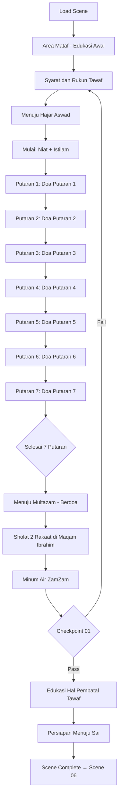

# 06_SCENE_05_TAWAF_UMRAH.md
# ============================================
# VR EDUCATION HAJI & UMRAH
# SCENE 05 — TAWAF UMRAH
# Version : 1.0
# ============================================

---

## Daftar Isi

- [Scene Information](#scene-information)
- [Learning Objective](#learning-objective)
- [Background](#background)
- [Environment](#environment)
- [Asset List](#asset-list)
- [Asset Source](#asset-source)
- [Character](#character)
- [Animation](#animation)
- [Audio](#audio)
- [Camera](#camera)
- [UI](#ui)
- [Interaction](#interaction)
- [Education](#education)
- [Activity Flow](#activity-flow)
- [Validation](#validation)
- [Performance](#performance)
- [Acceptance Criteria](#acceptance-criteria)

---

## Scene Information

| Atribut | Nilai |
|---------|-------|
| **Nomor Scene** | 05 |
| **Nama Scene** | Tawaf Umrah |
| **Versi** | 1.0 |
| **Deskripsi** | Scene ini mensimulasikan pelaksanaan Tawaf Umrah di area Mataf Masjidil Haram. Pengguna akan mempelajari pengertian, syarat, dan rukun Tawaf, memulai tawaf dari Hajar Aswad, melakukan 7 putaran mengelilingi Ka'bah dengan arah berlawanan jarum jam, berdoa di Multazam, sholat sunnah di Maqam Ibrahim, dan mempersiapkan diri melanjutkan ke Sa'i. Scene ini merupakan inti dari rangkaian ibadah Umrah. |

---

## Learning Objective

Setelah menyelesaikan Scene 05, pengguna diharapkan mampu:

| No | Tujuan Pembelajaran | Target |
|----|---------------------|--------|
| 1 | Memahami pengertian, syarat, dan rukun Tawaf | 90% benar pada checkpoint |
| 2 | Mengetahui tata cara memulai Tawaf dari Hajar Aswad | 90% benar pada checkpoint |
| 3 | Mampu melakukan 7 putaran Tawaf dengan benar | 90% benar pada checkpoint |
| 4 | Mengetahui bacaan doa dan dzikir saat Tawaf | 90% benar pada checkpoint |
| 5 | Memahami hal-hal yang membatalkan Tawaf | 90% benar pada checkpoint |

---

## Background

Tawaf merupakan salah satu rukun Umrah yang wajib dilaksanakan. Secara bahasa, Tawaf berarti berkeliling. Dalam konteks ibadah, Tawaf adalah mengelilingi Ka'bah sebanyak 7 kali putaran dengan niat ibadah kepada Allah SWT, dimulai dan diakhiri di Hajar Aswad.

Tawaf dilaksanakan di area Mataf, yaitu area terbuka berbentuk oval yang mengelilingi Ka'bah di Masjidil Haram. Area ini memiliki kapasitas yang sangat besar untuk menampung ribuan jamaah yang melakukan tawaf secara bersamaan.

Terdapat beberapa jenis Tawaf: Tawaf Qudum (kedatangan), Tawaf Ifadah (rukun Haji), Tawaf Wada' (perpisahan), dan Tawaf Umrah. Dalam scene ini, pengguna akan melaksanakan Tawaf Umrah sebagai bagian dari rangkaian ibadah Umrah.

Tawaf memiliki adab dan tata cara yang ketat, mulai dari niat, posisi Ka'bah di sebelah kiri, putaran berlawanan arah jarum jam, hingga doa-doa yang dibaca di setiap putaran. Pemahaman yang benar tentang Tawaf sangat penting agar ibadah Umrah diterima oleh Allah SWT.

---

## Environment

### Lokasi

| Area | Deskripsi | Dimensi |
|------|-----------|---------|
| **Area Mataf** | Area tawaf berbentuk oval mengelilingi Ka'bah | 120m x 100m |
| **Area Hajar Aswad** | Titik start dan finish tawaf (pojok Ka'bah) | 10m x 8m |
| **Area Maqam Ibrahim** | Tempat sholat sunnah 2 rakaat setelah tawaf | 15m x 12m |
| **Area Multazam** | Area antara Hajar Aswad dan pintu Ka'bah | 8m x 5m |
| **Area ZamZam** | Tempat minum air zamzam setelah tawaf | 20m x 15m |
| **Area Istirahat** | Area tepi mataf untuk istirahat | 30m x 20m |
| **Jalur Putaran** | 7 jalur konsentris sesuai jarak dari Ka'bah | 5 jalur |

### Waktu

| Aspek | Setting |
|-------|---------|
| Waktu | Siang menjelang sore (pukul 10:00 - 14:00 waktu Arab) |
| Musim | Musim dingin |

### Cuaca

| Elemen | Deskripsi |
|--------|-----------|
| Langit | Cerah dengan awan tipis |
| Suhu | 26°C (nyaman) |
| Cahaya | Natural daylight |

### Lighting

| Sumber | Tipe | Intensity | Shadow |
|--------|------|-----------|--------|
| Matahari | DirectionalLight | 1.0 | Enabled |
| Langit | HemisphereLight | 0.5 | - |
| Pantulan Marmer | AmbientLight | 0.3 | - |
| Lampu Area | PointLight (x15) | 0.5 | Disabled |
| Lampu Sorot Ka'bah | SpotLight (x6) | 0.8 | Enabled |

### Atmosfer

| Efek | Implementasi |
|------|--------------|
| Skybox | Langit cerah biru dengan siluet menara |
| Ambient | Suasana mataf ramai, suara doa dan dzikir |
| Particle | Debu halus dari pergerakan jamaah |
| Fog | THREE.FogExp2 densitas 0.0005 |
| Heat Haze | Efek shimmer di atas area mataf |

---

## Asset List

### Bangunan

| Asset | Deskripsi | LOD Levels |
|-------|-----------|------------|
| Area_Mataf | Area oval mengelilingi Ka'bah | LOD 0-3 |
| Ka'bah_Detail | Ka'bah dengan kiswah tekstur resolusi tinggi | LOD 0-3 |
| Hajar_Aswad | Batu hitam di pojok Ka'bah dengan bingkai perak | LOD 0-2 |
| Maqam_Ibrahim | Bangunan kaca berisi batu pijakan Nabi Ibrahim | LOD 0-2 |
| Hijr_Ismail | Area setengah lingkaran di utara Ka'bah | LOD 0-2 |
| Batas_Mataf | Pembatas area tawaf | LOD 0-1 |

### Karakter

| Asset | Jumlah | Tipe |
|-------|--------|------|
| Player_Character | 1 | Main character (first person) dalam ihram |
| Pembimbing_Tawaf | 1 | NPC interaktif (pembimbing tawaf) |
| Imam_Mataf | 1 | NPC (memimpin doa) |
| Petugas_Mataf | 4 | NPC pengatur jalur tawaf |
| Jamaah_Tawaf_Laki | 30 | NPC melakukan tawaf |
| Jamaah_Tawaf_Perempuan | 25 | NPC melakukan tawaf |
| Jamaah_Duduk_Doa | 10 | NPC berdoa di tepi |
| Jamaah_Istirahat | 8 | NPC istirahat di area tepi |

### Ground

| Asset | Material | Tekstur |
|-------|----------|---------|
| Lantai_Mataf | Marmer putih halus | 4096x4096 PBR |
| Lantai_HajarAswad | Marmer khusus area start | 2048x2048 PBR |
| Area_Sholat | Karpet area sholat | 2048x2048 PBR |
| Jalur_Putaran | Penanda jalur di lantai | 2048x2048 PBR |

### Vegetasi

| Asset | Jumlah | Keterangan |
|-------|--------|------------|
| Tanaman_Hias | 10 | Area tepi mataf |
| Pohon_Palem | 5 | Area luar mataf |

### Langit

| Asset | Format | Resolusi |
|-------|--------|----------|
| Skybox_Mekkah_Siang | CubeTexture | 4096x4096 per face |

### Props

| Asset | Jumlah | Interaktif |
|-------|--------|------------|
| Penanda_HajarAswad | 5 | Ya (lampu hijau sebagai penanda) |
| Lampu_Hijau_Start | 3 | Ya (penanda start putaran) |
| Karpet_Sholat_Sunnah | 10 | Ya (untuk sholat di Maqam Ibrahim) |
| Air_ZamZam_Dispenser | 3 | Ya (interaktif) |
| Kursi_Roda_Lansia | 5 | Ya (opsi aksesibilitas) |
| Payung_Matahari | 10 | Ya (dapat digunakan) |
| Botol_Air_Minum | 20 | Ya |
| Papan_Petunjuk_Tawaf | 5 | Ya (informasi) |
| Counter_Putaran_Digital | 3 | Ya (informasi putaran) |
| Tempat_Sholat_Tutup | 4 | Untuk sholat di Hijr Ismail |

### Dekorasi

| Asset | Jumlah | Keterangan |
|-------|--------|------------|
| Lampu_Gantung | 15 | Dekorasi area mataf |
| Kaligrafi_Ayat_Kursi | 3 | Hiasan dinding area |
| Jam_Raksasa | 2 | Jam digital di menara |
| Spanduk_Panduan | 4 | Informasi tata cara tawaf |

### Karakter Tambahan

| Asset | Jumlah | Tipe |
|-------|--------|------|
| Jamaah_Lansia_Duduk | 4 | NPC lansia di kursi roda |
| Jamaah_Anak | 6 | NPC anak-anak |
| Keluarga_Jamaah | 5 | NPC keluarga |

---

## Asset Source

### Fab Marketplace

| Kategori | Nama Asset | Format | Texture | LOD | Ukuran |
|----------|-----------|--------|---------|-----|--------|
| Architecture | Grand Mosque Mataf Area | GLB | 4096x4096 | 3 level | 80MB |
| Architecture | Ka'bah Ultra HD | GLB | 4096x4096 | 3 level | 50MB |
| Architecture | Maqam Ibrahim Glass Structure | GLB | 2048x2048 | 2 level | 15MB |
| Architecture | Hijr Ismail Marble Floor | GLB | 2048x2048 | 2 level | 10MB |
| Character | Pilgrims Tawaf Animation | GLB | 2048x2048 | 2 level | 25MB |
| Props | Tawaf Guidance Props Set | GLB | 1024x1024 | 1 level | 8MB |
| Props | Marble Floor Markers | GLB | 1024x1024 | 1 level | 5MB |
| Architecture | Mataf Lighting System | GLB | 2048x2048 | 2 level | 12MB |
| Props | ZamZam Dispenser Set | GLB | 1024x1024 | 1 level | 3MB |
| Props | Wheelchair Accessible | GLB | 512x512 | 1 level | 4MB |

---

## Character

### Player

| Atribut | Spesifikasi |
|---------|-------------|
| Perspektif | First person (kamera sebagai mata player) |
| Pakaian | Pakaian Ihram putih (dari scene sebelumnya) |
| Collision | Capsule collider (0.5m radius, 1.8m height) |
| Mode Berjalan | Normal + Tawaf mode (kecepatan disesuaikan) |

### NPC

| NPC | Posisi | Fungsi | Dialog |
|-----|--------|--------|--------|
| Pembimbing_Tawaf | Area Hajar Aswad | Memandu tata cara tawaf | 12 dialog |
| Petugas_Jalur | Mataf | Mengatur jalur tawaf | 4 dialog |
| Petugas_HajarAswad | Hajar Aswad | Membantu istilam | 3 dialog |
| Imam_Doa | Area Multazam | Memimpin doa | 5 dialog |
| Petugas_ZamZam | Area ZamZam | Membantu minum zamzam | 3 dialog |

### Petugas

| Tipe | Jumlah | Pergerakan |
|------|--------|------------|
| Petugas Kebersihan | 4 | Patroli area mataf |
| Petugas Keamanan | 6 | Berjaga di area mataf |
| Petugas Medis | 2 | Area istirahat |

### Jamaah

| Tipe | Jumlah | Aktivitas |
|------|--------|-----------|
| Jamaah Tawaf Aktif | 20 | Berjalan melakukan tawaf |
| Jamaah Tawaf Lambat | 10 | Tawaf dengan kecepatan pelan |
| Jamaah Berdoa | 12 | Berdoa di Multazam |
| Jamaah Sholat | 10 | Sholat sunnah di area |
| Jamaah Istirahat | 8 | Duduk di tepi mataf |
| Jamaah Minum | 5 | Minum air zamzam |
| Jamaah Lansia | 4 | Tawaf menggunakan kursi roda |

---

## Animation

| Animasi | Durasi | Loop | Trigger |
|---------|--------|------|---------|
| Idle | 3s | Yes | Default |
| Walk | 1.5s | Yes | Keyboard WASD |
| Walk Tawaf | 2s | Yes | Auto-walk saat tawaf |
| Istilam Hajar Aswad | 4s | No | Interaksi Hajar Aswad |
| Angkat Tangan | 2s | No | Saat berdoa |
| Sholat 2 Rakaat | 8s | No | Sholat di Maqam Ibrahim |
| Sujud | 3s | No | Sujud syukur |
| Duduk Doa | 6s | Yes | Duduk berdoa |
| Minum Air | 3s | No | Minum zamzam |
| Menunjuk Ka'bah | 2s | No | Doa menghadap Ka'bah |
| Istirahat | 5s | Yes | Duduk istirahat |
| Transisi Putaran | 2s | No | Ganti putaran |
| Wudhu | 6s | No | Berwudhu |

---

## Audio

### Ambient

| Sumber | File | Volume | Loop |
|--------|------|--------|------|
| Suasana Mataf | ambient_mataf.mp3 | 0.4 | Yes |
| Suara Doa Jamaah | ambient_doa_mataf.mp3 | 0.3 | Yes |
| Suara Talbiyah Ramai | ambient_talbiyah_mataf.mp3 | 0.4 | Yes |
| Suara Langkah Kaki | ambient_footsteps_mataf.mp3 | 0.2 | Yes |
| Suara Air ZamZam | ambient_zamzam_mataf.mp3 | 0.1 | Yes |

### Narration

| Momen | File | Durasi | Prioritas |
|-------|------|--------|-----------|
| Scene Start | nar_05_intro_tawaf.mp3 | 85s | High |
| Pengertian Tawaf | nar_05_pengertian_tawaf.mp3 | 75s | High |
| Syarat Tawaf | nar_05_syarat_tawaf.mp3 | 80s | High |
| Cara Memulai Tawaf | nar_05_mulai_tawaf.mp3 | 70s | High |
| Putaran 1-7 | nar_05_putaran_1_7.mp3 | 60s | High |
| Doa Setiap Putaran | nar_05_doa_putaran.mp3 | 65s | High |
| Multazam dan Maqam | nar_05_multazam_maqam.mp3 | 70s | High |
| Hal yang Membatalkan | nar_05_pembatal_tawaf.mp3 | 55s | Medium |
| Persiapan Sa'i | nar_05_persiapan_sai.mp3 | 60s | High |
| Checkpoint | nar_checkpoint_05.mp3 | 30s | High |

### Instruction

| Momen | File | Deskripsi |
|-------|------|-----------|
| Panduan Tawaf | instr_tawaf_panduan.mp3 | Cara melakukan tawaf |
| Navigasi | instr_nav_tawaf.mp3 | Kontrol selama tawaf |
| Counter | instr_counter.mp3 | Cara membaca counter putaran |

### Effect

| Efek | File | Volume |
|------|------|--------|
| Langkah Kaki | sfx_footstep_mataf.mp3 | 0.3 |
| Suara Kain Ihram | sfx_cloth_movement.mp3 | 0.2 |
| Pintu Multazam | sfx_pintu_multazam.mp3 | 0.4 |
| Air ZamZam Tuang | sfx_zamzam_pour.mp3 | 0.5 |
| Suara Hajar Aswad | sfx_hajar_aswad.mp3 | 0.3 |
| Counter Suara | sfx_counter_beep.mp3 | 0.4 |
| Suara Sujud | sfx_sujud.mp3 | 0.2 |
| Talbiyah Massal | sfx_talbiyah_massal.mp3 | 0.6 |
| Adzan Dengar | sfx_adzan_jauh.mp3 | 0.3 |
| Transition | sfx_transition_tawaf.mp3 | 0.5 |

### Voice Over

| Karakter | File | Durasi |
|----------|------|--------|
| Pembimbing Tawaf | vo_tawaf_pembimbing_01-12.mp3 | 12s each |
| Petugas Hajar Aswad | vo_tawaf_hajar_01-03.mp3 | 8s each |
| Imam Doa | vo_tawaf_imam_01-05.mp3 | 10s each |
| Petugas ZamZam | vo_tawaf_zamzam_01-03.mp3 | 8s each |

---

## Camera

### Spawn

| Parameter | Nilai |
|-----------|-------|
| Posisi Awal | x: 0, y: 1.7, z: -20 (tepi area mataf) |
| Look At | Arah Ka'bah dari kejauhan |
| FOV | 65 derajat (lebih luas untuk melihat Ka'bah) |
| Near | 0.1 |
| Far | 1500 |

### Movement

| Mode | Kontrol | Kecepatan |
|------|---------|-----------|
| Walk | W/A/S/D | 3 m/s |
| Tawaf Mode | Auto-walk | 2.5 m/s (otomatis mengelilingi) |
| Look | Mouse move | Sensitivitas 0.002 |
| Teleport | Klik titik biru | Instant |
| Slow Walk | CTRL + W | 1.5 m/s |

### Reset

| Trigger | Aksi |
|---------|------|
| Tekan R | Reset ke posisi spawn terakhir |
| Out of bounds | Auto-reset ke area mataf |
| Bug collision | Auto-reset setelah 3 detik |

### Transition

| Momen | Durasi | Easing |
|-------|--------|--------|
| Masuk scene | 2s | Cubic InOut |
| Memulai tawaf | 1.5s | Quad InOut |
| Ganti putaran | 0.5s | Smooth Sine |
| Mode edukasi | 0.8s | Linear |
| Sholat di Maqam | 1s | Fade |
| Selesai tawaf | 2s | Fade to white |

### Special Camera — Tawaf View

| Parameter | Nilai |
|-----------|-------|
| Mode | Third person (opsional) untuk melihat diri sendiri tawaf |
| Alternatif | First person tetap (default) |
| Switch | Tekan V untuk ganti mode |

---

## UI

### Subtitle

| Atribut | Spesifikasi |
|---------|-------------|
| Posisi | Bawah tengah |
| Font | Arial, 20px |
| Warna | Putih dengan shadow |
| Background | Semi-transparan (rgba 0,0,0,0.5) |
| Max Lines | 2 baris |
| Arabic Support | Doa-doa tawaf dalam Arab |
| Doa Display | Doa khusus per putaran (toggle) |

### Progress — Tawaf Counter

| Elemen | Deskripsi |
|--------|-----------|
| Counter Putaran | Lingkaran besar di tengah atas: "Putaran 3/7" |
| Visual Progress | 7 lingkaran kecil (bullet) yang terisi |
| Lap Counter | Hitungan setiap kali melewati Hajar Aswad |
| Putaran Time | Waktu tempuh per putaran |
| Total Time | Total waktu tawaf |

### Hint

| Tipe | Warna | Posisi |
|------|-------|--------|
| Navigasi | Biru muda | Tengah bawah |
| Interaksi | Hijau | Atas objek |
| Edukasi | Emas | Kanan bawah |
| Ibadah | Putih | Atas kiri |
| Peringatan | Merah | Tengah |
| Counter Info | Cyan | Atas tengah |

### Compass

| Elemen | Spesifikasi |
|--------|-------------|
| Bentuk | Circular dengan arah kiblat |
| Ukuran | 80x80px |
| Posisi | Atas kanan |
| Arah | U/T/S/B |
| Marker | Hajar Aswad (bintang merah), Ka'bah (pusat) |

### Notification

| Tipe | Durasi | Warna |
|------|--------|-------|
| Info | 3s | Biru |
| Success | 3s | Hijau |
| Ibadah | 5s | Emas |
| Putaran Selesai | 4s | Emas dengan efek confetti |
| Warning | 4s | Merah |
| Peringatan Batalkan | 5s | Merah tebal |

### Mini Map

| Atribut | Spesifikasi |
|---------|-------------|
| Ukuran | 200x200px |
| Posisi | Kiri bawah |
| Style | Top-down circular (sesuai bentuk mataf) |
| Ikon | Player (segitiga) bergerak melingkar |
| Jalur | Lingkaran putus-putus menunjukkan jalur tawaf |
| Count | Nomor putaran di mini map |

### Popup

| Tipe | Konten | Aksi |
|------|--------|------|
| Edukasi | Teks + dalil + arab | Next/Back |
| Doa | Teks doa arab + latin + arti per putaran | Baca & tutup |
| Dialog | Opsi percakapan | Pilih opsi |
| Checkpoint | Pertanyaan + jawaban | Submit |
| Panduan | Langkah-langkah tawaf | Next/Back |
| Konfirmasi | Konfirmasi lanjut/ulang | Ya/Tidak |
| Selesai Tawaf | Ringkasan + doa selesai | Tutup |

---

## Interaction

### Click

| Objek | Aksi | Feedback |
|-------|------|----------|
| Hajar Aswad | Istilam (isyarat) | Animasi angkat tangan + suara |
| Lampu Hijau | Memulai/mengakhiri putaran | Counter bertambah + notifikasi |
| Maqam Ibrahim | Sholat 2 rakaat | Animasi sholat + popup |
| Multazam | Berdoa | Animasi doa + popup doa |
| Air ZamZam | Minum | Animasi minum + notifikasi |
| Pembimbing | Dialog panduan | UI dialog + audio |
| Petugas | Dialog | UI dialog |
| Karpet Sholat | Mulai sholat sunnah | Animasi sholat |
| Counter Display | Lihat detail | Popup info putaran |

### Hover

| Objek | Highlight | Cursor |
|-------|-----------|--------|
| NPC | Glow emas | Pointer |
| Hajar Aswad | Outline putih | Pointer |
| Maqam Ibrahim | Outline emas | Pointer |
| Interaktif | Outline biru | Pointer |
| Counter | Highlight cyan | Pointer |

### Inspect

| Objek | Hasil | Format |
|-------|-------|--------|
| Hajar Aswad | Info dan keutamaan | Popup detail |
| Maqam Ibrahim | Info sejarah | Popup |
| Ka'bah | Info dari jarak dekat | Popup + 3D |
| Kiswah | Detail tekstur | Zoom texture |

### Walk (Tawaf Mode)

| Metode | Kontrol | Keterangan |
|--------|---------|------------|
| Keyboard | WASD | Gerakan normal |
| Tawaf Auto | Klik "Mulai Tawaf" | Berjalan otomatis mengelilingi Ka'bah |
| Manual | W (maju) + A/D (belok) | Mode manual untuk pengguna mahir |
| Stop | Spasi | Berhenti tawaf (sementara) |

### Teleport

| Area | Titik Teleport | Biaya |
|------|---------------|-------|
| Start Tawaf | 1 titik (Hajar Aswad) | Gratis |
| Area Maqam | 1 titik | Gratis |
| Area ZamZam | 1 titik | Gratis |
| Area Istirahat | 2 titik | Gratis |
| Area Multazam | 1 titik | Gratis |

### Dialog

| Struktur | Format | Opsi |
|----------|--------|------|
| NPC Speech | Teks + audio | - |
| Player Choice | 2-3 opsi | Pilih satu |
| NPC Response | Teks + audio | - |
| Edukasi | Info tambahan | Klik untuk detail |
| Konfirmasi | Ya/Tidak | Konfirmasi tindakan |
| Tanya Jawab | Pertanyaan | Pilih jawaban |

### Highlight

| Metode | Warna | Durasi |
|--------|-------|--------|
| Outline | Emas (0xffaa00) | Selama hover |
| Pulse | Hijau (0x44ff88) | 2 detik |
| Glow | Putih (0xffffff) | Terus menerus |
| Guide | Biru (0x4488ff) | 1 detik pulse |
| Jalur Tawaf | Cyan (0x00ffcc) | Selama tawaf |
| Warning | Merah (0xff4444) | 3 detik |

### Information

| Tipe | Format | Contoh |
|------|--------|--------|
| Tempat | Info box | "Hajar Aswad berasal dari surga" |
| Hukum | Fatwa box | "Syarat sah tawaf: suci dari hadas" |
| Dalil | Quote box arab | HR Bukhari & Muslim tentang tawaf |
| Panduan | Step cards | "Putaran 1: Mulai dari Hajar Aswad" |
| Doa | Teks arab + latin | "Doa putaran 1: Rabbana atina..."

---

## Education

### Penjelasan

| Topik | Konten | Durasi |
|-------|--------|--------|
| Pengertian Tawaf | Berkeliling Ka'bah 7 putaran dengan niat ibadah | 75s |
| Syarat Tawaf | Suci dari hadas, menutup aurat, niat ikhlas | 80s |
| Rukun Tawaf | Niat, 7 putaran, dimulai dari Hajar Aswad, doa | 70s |
| Sunnah Tawaf | Istilam, idtiba, raml, sholat di Maqam Ibrahim | 65s |
| Arah Putaran | Berlawanan arah jarum jam, Ka'bah di kiri | 50s |
| Perhitungan 7 Putaran | Setiap putaran dihitung dari Hajar Aswad | 55s |
| Doa Setiap Putaran | Doa-doa yang dianjurkan di setiap putaran | 90s |
| Multazam | Tempat mustajab doa antara Hajar Aswad dan pintu | 60s |
| Maqam Ibrahim | Tempat mengerjakan sholat 2 rakaat setelah tawaf | 50s |
| Hal Pembatal Tawaf | Berhadas, berbicara duniawi, berhenti lama | 55s |

### Dalil

| Referensi | Ayat/Hadits | Konteks |
|-----------|-------------|---------|
| QS Al-Hajj: 29 | "Kemudian hendaklah mereka menghilangkan kotoran (rambut) dan menyempurnakan nazar-nazar mereka dan melakukan tawaf sekeliling Baitul Atiq (Ka'bah)" | Perintah Tawaf |
| QS Al-Baqarah: 125 | "Dan (ingatlah) ketika Kami menjadikan rumah (Ka'bah) sebagai tempat berkumpul dan tempat yang aman bagi manusia" | Tempat Tawaf |
| HR Bukhari & Muslim | "Barangsiapa yang tawaf di Baitullah ini sebanyak 7 putaran dan sholat 2 rakaat, seperti ia memerdekakan seorang budak" | Keutamaan Tawaf |
| QS Ali Imran: 97 | "Dan di antara kewajiban manusia kepada Allah adalah melaksanakan ibadah haji ke Baitullah" | Kewajiban Tawaf |
| HR Muslim | "Rasulullah SAW tawaf dengan naik unta, dan beliau mengisyaratkan Hajar Aswad dengan tongkat" | Tata cara tawaf |

### Hikmah

| Hikmah | Penjelasan |
|--------|------------|
| Ketaatan | Mengelilingi Ka'bah sebagai simbol ketaatan |
| Kekhusyukan | Fokus hanya kepada Allah dalam setiap putaran |
| Kesabaran | Tawaf di tengah keramaian melatih kesabaran |
| Doa | 7 putaran sebagai kesempatan memperbanyak doa |
| Perenungan | Setiap putaran mengingatkan pada siklus kehidupan |
| Kebersamaan | Beribadah bersama jutaan muslim dari seluruh dunia |

### Larangan

| Larangan | Keterangan |
|----------|------------|
| Berbicara duniawi | Hindari percakapan yang tidak perlu |
| Berdesak-desakan | Mengganggu jamaah lain |
| Meludah di area tawaf | Menjaga kebersihan masjid |
| Berhenti lama di jalur | Menghalangi jamaah di belakang |
| Tawaf tanpa wudhu | Tawaf tidak sah jika berhadas |
| Melangkahi jamaah | Tidak sopan dan mengganggu |
| Sholat fardhu di mataf | Sholat fardhu di area sholat yang ditentukan |

### Kesalahan Umum

| Kesalahan | Solusi |
|-----------|--------|
| Tidak niat tawaf sebelum memulai | Niatkan dalam hati sebelum mulai |
| Lupa hitungan putaran | Gunakan counter putaran |
| Berhenti di tengah tawaf tanpa alasan | Jika terpaksa, ulang dari stop terakhir |
| Tidak sholat 2 rakaat setelah tawaf | Segera sholat di Maqam Ibrahim |
| Berdoa terlalu lama di Multazam | Berdoa secukupnya, jangan lama-lama |
| Tawaf di luar area mataf | Pastikan di dalam batas mataf |
| Tidak istilam di Hajar Aswad | Cukup isyarat jika tidak bisa mendekat |

### Tips

| No | Tips |
|----|------|
| 1 | Berwudhu sebelum tawaf dan jaga wudhu selama tawaf |
| 2 | Niat tawaf dalam hati: "Nawaitut tawafa 'an umrati..." |
| 3 | Mulai dari Hajar Aswad dengan menghadap ke arahnya |
| 4 | Posisikan Ka'bah di sebelah kiri Anda selama tawaf |
| 5 | Gunakan counter putaran untuk menghindari lupa hitungan |
| 6 | Perbanyak doa dan dzikir, jangan banyak bicara |
| 7 | Setelah selesai 7 putaran, segera sholat 2 rakaat di Maqam Ibrahim |
| 8 | Manfaatkan Multazam untuk berdoa setelah tawaf |
| 9 | Minum air zamzam setelah tawaf untuk mengisi tenaga |
| 10 | Jika tidak bisa mendekati Hajar Aswad, cukup isyarat dari jauh |

---

## Activity Flow

### Alur Scene

### Langkah Detail

| Langkah | Area | Aksi | Durasi |
|---------|------|------|--------|
| 1 | Mataf | Spawn di area mataf, dengar narator intro | 85s |
| 2 | Mataf | Edukasi syarat dan rukun tawaf | 80s |
| 3 | Hajar Aswad | Berjalan ke Hajar Aswad, niat tawaf | 30s |
| 4 | Hajar Aswad | Istilam (isyarat ke Hajar Aswad) | 15s |
| 5 | Putaran 1 | Tawaf putaran 1 + doa | 60s |
| 6 | Putaran 2 | Tawaf putaran 2 + doa | 55s |
| 7 | Putaran 3 | Tawaf putaran 3 + doa | 55s |
| 8 | Putaran 4 | Tawaf putaran 4 + doa | 55s |
| 9 | Putaran 5 | Tawaf putaran 5 + doa | 55s |
| 10 | Putaran 6 | Tawaf putaran 6 + doa | 55s |
| 11 | Putaran 7 | Tawaf putaran 7 + doa | 60s |
| 12 | Multazam | Berdoa di Multazam | 45s |
| 13 | Maqam Ibrahim | Sholat sunnah 2 rakaat | 30s |
| 14 | ZamZam | Minum air zamzam | 20s |
| 15 | Checkpoint | Checkpoint 01 — 5 pertanyaan tentang tawaf | 45s |
| 16 | Edukasi | Edukasi hal pembatal tawaf | 55s |
| 17 | Persiapan | Persiapan menuju Sa'i | 30s |
| 18 | Complete | Scene selesai, transisi ke Scene 06 | 5s |

---

## Validation

### Berhasil

| Checkpoint | Kriteria | Reward |
|------------|----------|--------|
| CP-01 | Menjawab benar minimal 4 dari 5 pertanyaan tentang Tawaf | Scene 06 (Sa'i) terbuka |
| CP-01 Nilai Sempurna | Menjawab benar 5 dari 5 pertanyaan | Score +100, badge "Muttafa" |

### Gagal

| Checkpoint | Kriteria | Konsekuensi |
|------------|----------|-------------|
| CP-01 | Kurang dari 4 jawaban benar | Ulang edukasi tawaf |
| Timeout | Tidak menjawab dalam 5 menit | Scene restart dari checkpoint |
| Tawaf Gagal | Berhenti > 5 menit di tengah | Peringatan, restart tawaf |

### Checkpoint List

#### Checkpoint 01 — Tawaf

| No | Pertanyaan | Jawaban Benar | Opsi |
|----|-----------|---------------|------|
| 1 | Tawaf dilakukan sebanyak berapa putaran? | 7 putaran | 4 opsi |
| 2 | Tawaf dimulai dari? | Hajar Aswad | 4 opsi |
| 3 | Arah tawaf yang benar adalah? | Berlawanan jarum jam (Ka'bah di kiri) | 4 opsi |
| 4 | Sholat sunnah setelah tawaf di lakukan di? | Maqam Ibrahim | 4 opsi |
| 5 | Syarat sah tawaf adalah? | Suci dari hadas | 4 opsi |

---

## Performance

| Aspek | Target | Metrik |
|-------|--------|--------|
| Frame Rate | 60 FPS | Average FPS |
| Scene Load | < 5 detik | Load time |
| Memory | < 300MB | Memory usage |
| Texture | < 200MB | GPU memory |
| Draw Calls | < 800 | Draw call count |
| Triangles | < 800.000 | Triangle count |

### Optimization

| Teknik | Penerapan |
|--------|-----------|
| LOD | Ka'bah 3 level, bangunan 2-3 level |
| Texture Atlas | Marmer area sejenis |
| Draco Compression | Semua GLB file |
| Instancing | Lampu, pilar, karpet |
| Frustum Culling | Auto untuk semua mesh |
| Occlusion Culling | Pilar besar sebagai occluder |
| LOD Distance | Dinamis berdasarkan jarak ke Ka'bah |

### Texture Budget

| Kategori | Budget | Catatan |
|----------|--------|---------|
| Ka'bah | 48MB | Detail sangat tinggi (4096x4096) |
| Area Mataf | 64MB | Detail tinggi (4096x4096) |
| Bangunan | 32MB | 2048x2048 |
| Karakter | 32MB | 2048x2048 (variasi 10 outfit) |
| Props | 16MB | 1024x1024 |
| Environment | 8MB | Skybox + ground |

---

## Acceptance Criteria

| No | Kriteria | Status |
|----|----------|--------|
| 1 | Scene dapat dimuat dalam waktu < 5 detik | ☐ |
| 2 | Area Mataf dirender dengan detail arsitektur yang akurat | ☐ |
| 3 | Ka'bah dengan kiswah hitam detail tinggi | ☐ |
| 4 | Hajar Aswad dengan bingkai perak terlihat jelas | ☐ |
| 5 | Maqam Ibrahim dengan struktur kaca dirender detail | ☐ |
| 6 | Lampu hijau sebagai penanda start/finish berfungsi | ☐ |
| 7 | Jalur tawaf ditandai dengan highlight di lantai | ☐ |
| 8 | Counter putaran digital berfungsi dan akurat | ☐ |
| 9 | Edukasi pengertian tawaf ditampilkan dengan benar | ☐ |
| 10 | Edukasi syarat dan rukun tawaf ditampilkan lengkap | ☐ |
| 11 | Cara memulai tawaf dari Hajar Aswad dipandu | ☐ |
| 12 | Arah putaran tawaf dipandu dengan visual | ☐ |
| 13 | Perhitungan 7 putaran otomatis dengan counter | ☐ |
| 14 | Highlight jalur tawaf terlihat jelas | ☐ |
| 15 | Audio talbiyah berjalan selama tawaf | ☐ |
| 16 | Audio narasi berjalan di setiap tahapan | ☐ |
| 17 | Subtitle muncul untuk semua audio | ☐ |
| 18 | Progress tawaf ditampilkan dengan jelas | ☐ |
| 19 | UI tutorial untuk memulai tawaf tersedia | ☐ |
| 20 | Sholat 2 rakaat di Maqam Ibrahim dapat dilakukan | ☐ |
| 21 | Minum air zamzam berfungsi interaktif | ☐ |
| 22 | Checkpoint 01 berfungsi dengan validasi | ☐ |
| 23 | Persiapan menuju Sa'i ditampilkan dengan jelas | ☐ |
| 24 | Transisi ke Scene 06 berjalan halus | ☐ |
| 25 | Frame rate stabil di 60 FPS | ☐ |

---

## Integrasi dengan Scene Lain

### Hubungan Scene

| Scene Sebelumnya | Scene Saat Ini | Scene Selanjutnya |
|-----------------|----------------|-------------------|
| Scene 04 — Masuk Masjidil Haram | **Scene 05 — Tawaf Umrah** | Scene 06 — Sa'i Umrah |

### Data yang Dilewatkan

| Data | Dari Scene | Ke Scene | Format |
|------|-----------|----------|--------|
| Status Ihram | Scene 04 | Scene 05 | Boolean (sudah ihram) |
| Checkpoint Scene 04 | Scene 04 | Scene 05 | Score integer |
| Progress Pembelajaran | Scene 04 | Scene 05 | Persentase (0-100%) |
| Status Tawaf Selesai | Scene 05 | Scene 06 | Boolean |
| Skor Tawaf | Scene 05 | Scene 06 | Integer (0-100) |

### Trigger Scene Berikutnya

Setelah menyelesaikan Scene 05, sistem akan mengarahkan pengguna ke Scene 06 (Sa'i Umrah) dengan:
- Transisi fade to white (2 detik)
- Load scene informasi Sa'i
- Progress tersimpan otomatis

---

> **Dokumen Terkait:**
> - [00_Project_Overview.md](./00_Project_Overview.md)
> - [01_Technology_Stack.md](./01_Technology_Stack.md)
> - [04_Scene_03_Miqat_dan_Niat_Umrah.md](./04_Scene_03_Miqat_dan_Niat_Umrah.md)
> - [05_Scene_04_Masuk_Masjidil_Haram.md](./05_Scene_04_Masuk_Masjidil_Haram.md)
> - [07_Scene_06_Sai_Umrah.md](./07_Scene_06_Sai_Umrah.md)

---
