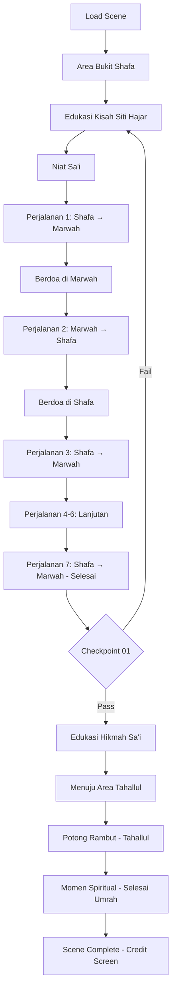

# 07_SCENE_06_SAI_UMRAH.md
# ============================================
# VR EDUCATION HAJI & UMRAH
# SCENE 06 — SA'I UMRAH
# Version : 1.0
# ============================================

---

## Daftar Isi

- [Scene Information](#scene-information)
- [Learning Objective](#learning-objective)
- [Background](#background)
- [Environment](#environment)
- [Asset List](#asset-list)
- [Asset Source](#asset-source)
- [Character](#character)
- [Animation](#animation)
- [Audio](#audio)
- [Camera](#camera)
- [UI](#ui)
- [Interaction](#interaction)
- [Education](#education)
- [Activity Flow](#activity-flow)
- [Validation](#validation)
- [Performance](#performance)
- [Acceptance Criteria](#acceptance-criteria)

---

## Scene Information

| Atribut | Nilai |
|---------|-------|
| **Nomor Scene** | 06 |
| **Nama Scene** | Sa'i Umrah |
| **Versi** | 1.0 |
| **Deskripsi** | Scene ini mensimulasikan pelaksanaan Sa'i Umrah, yaitu berlari-lari kecil antara Bukit Shafa dan Bukit Marwah sebanyak 7 perjalanan. Pengguna akan mempelajari kisah Siti Hajar, hikmah Sa'i, tata cara Sa'i, memulai dari Bukit Shafa, melakukan 7 perjalanan pulang-pergi, berdoa di setiap perjalanan, dan mempersiapkan diri untuk Tahallul. Scene ini merupakan penutup dari rangkaian inti ibadah Umrah. |

---

## Learning Objective

Setelah menyelesaikan Scene 06, pengguna diharapkan mampu:

| No | Tujuan Pembelajaran | Target |
|----|---------------------|--------|
| 1 | Memahami pengertian dan hukum Sa'i | 90% benar pada checkpoint |
| 2 | Mengetahui kisah Siti Hajar dan hikmah Sa'i | 90% benar pada checkpoint |
| 3 | Mampu melakukan 7 perjalanan Sa'i dengan benar | 90% benar pada checkpoint |
| 4 | Mengetahui doa dan dzikir yang dibaca saat Sa'i | 90% benar pada checkpoint |
| 5 | Memahami tata cara Tahallul setelah Sa'i | 90% benar pada checkpoint |

---

## Background

Sa'i merupakan salah satu rukun Umrah yang wajib dilaksanakan. Secara bahasa, Sa'i berarti berjalan atau berlari. Dalam konteks ibadah, Sa'i adalah berjalan kaki antara Bukit Shafa dan Bukit Marwah sebanyak 7 kali perjalanan, dimulai dari Bukit Shafa dan berakhir di Bukit Marwah.

Sa'i memiliki sejarah yang sangat bermakna. Ibadah ini mengenang perjuangan Siti Hajar, istri Nabi Ibrahim AS, yang berlari-lari kecil antara Bukit Shafa dan Bukit Marwah mencari air untuk putranya, Ismail AS. Allah SWT kemudian memancarkan mata air ZamZam sebagai pertolongan-Nya.

Bukit Shafa dan Bukit Marwah terletak di dalam kompleks Masjidil Haram, tidak jauh dari Ka'bah. Jarak antara kedua bukit ini sekitar 394 meter. Saat ini, jalur Sa'i telah dilengkapi dengan pendingin ruangan, eskalator, dan fasilitas lainnya untuk kenyamanan jamaah.

Scene Sa'i Umrah merupakan scene keenam dan penutup dari rangkaian inti ibadah Umrah dalam aplikasi VR Education Haji & Umrah. Setelah menyelesaikan Sa'i, pengguna akan melaksanakan Tahallul (memotong rambut) sebagai tanda selesainya ibadah Umrah.

---

## Environment

### Lokasi

| Area | Deskripsi | Dimensi |
|------|-----------|---------|
| **Bukit Shafa** | Titik start Sa'i, area berbukit dengan penanda | 30m x 20m |
| **Bukit Marwah** | Titik finish Sa'i, area berbukit dengan penanda | 30m x 20m |
| **Jalur Sa'i** | Koridor panjang antara Shafa dan Marwah | 400m x 15m |
| **Area Lari Kecil** | Jalur hijau untuk bagian berlari | 50m x 15m (bagian tengah) |
| **Lampu Hijau** | Penanda area lari kecil | 2 titik (depan dan belakang) |
| **Area Istirahat** | Tempat duduk di tepi jalur | 20 titik |
| **Area Tahallul** | Tempat potong rambut setelah Sa'i | 15m x 10m |

### Waktu

| Aspek | Setting |
|-------|---------|
| Waktu | Sore menjelang malam (pukul 15:00 - 18:00 waktu Arab) |
| Musim | Musim dingin |

### Cuaca

| Elemen | Deskripsi |
|--------|-----------|
| Langit | Cerah berawan, menjelang senja |
| Suhu | 24°C (nyaman) |
| Cahaya | Golden hour afternoon |

### Lighting

| Sumber | Tipe | Intensity | Shadow |
|--------|------|-----------|--------|
| Matahari Sore | DirectionalLight (rendah) | 0.7 | Enabled |
| Langit | HemisphereLight | 0.5 | - |
| Lampu Koridor | PointLight (x20) | 0.6 | Disabled |
| Lampu Hijau | SpotLight (x4) | 0.8 (warna hijau) | Disabled |
| Lampu Shafa | SpotLight (x2) | 0.7 | Enabled |

### Atmosfer

| Efek | Implementasi |
|------|--------------|
| Skybox | Senja gradien jingga ke biru |
| Ambient | Suasana koridor Sa'i, suara doa jamaah |
| Particle | Debu halus |
| Fog | THREE.FogExp2 densitas 0.001 |
| Warm Tone | Tone mapping hangat untuk suasana sore |

---

## Asset List

### Bangunan

| Asset | Deskripsi | LOD Levels |
|-------|-----------|------------|
| Bukit_Shafa | Area berbukit dengan struktur marmer | LOD 0-3 |
| Bukit_Marwah | Area berbukit dengan struktur marmer | LOD 0-3 |
| Koridor_Sai | Koridor lurus panjang dengan atap | LOD 0-3 |
| Area_Lari_Cepat | Bagian tengah dengan penanda hijau | LOD 0-2 |
| Tempat_Tahallul | Area potong rambut | LOD 0-2 |
| Pilar_Petunjuk | Pilar penanda jarak dan arah | LOD 0-1 |

### Karakter

| Asset | Jumlah | Tipe |
|-------|--------|------|
| Player_Character | 1 | Main character (first person) dalam ihram |
| Pembimbing_Sai | 1 | NPC interaktif (pembimbing sa'i) |
| Ustadz_Pembimbing | 1 | NPC interaktif (edukasi sa'i) |
| Petugas_Jalur_Sai | 3 | NPC pengatur jalur |
| Petugas_Tahallul | 2 | NPC tukang potong rambut |
| Jamaah_Sai_Laki | 25 | NPC melakukan sa'i |
| Jamaah_Sai_Perempuan | 20 | NPC melakukan sa'i |
| Jamaah_Istirahat | 8 | NPC istirahat di tepi |
| Jamaah_Tahallul | 5 | NPC antri potong rambut |

### Ground

| Asset | Material | Tekstur |
|-------|----------|---------|
| Lantai_Koridor | Marmer putih | 2048x2048 PBR |
| Jalur_Hijau | Karpet hijau (area lari) | 2048x2048 PBR |
| Area_Shafa | Marmer khusus Bukit Shafa | 2048x2048 PBR |
| Area_Marwah | Marmer khusus Bukit Marwah | 2048x2048 PBR |

### Vegetasi

| Asset | Jumlah | Keterangan |
|-------|--------|------------|
| Tanaman_Hias | 8 | Area Shafa dan Marwah |
| Pohon_Palem | 4 | Area luar koridor |

### Langit

| Asset | Format | Resolusi |
|-------|--------|----------|
| Skybox_Senja_Mekkah | CubeTexture | 4096x4096 per face |

### Props

| Asset | Jumlah | Interaktif |
|-------|--------|------------|
| Penanda_Bukit | 4 | Ya (informasi) |
| Lampu_Hijau_Sai | 4 | Ya (penanda area lari) |
| Kursi_Istirahat | 20 | Ya (dapat duduk) |
| Air_Minum_Dispenser | 5 | Ya (interaktif) |
| Karpet_Sholat | 10 | Ya (untuk sholat di bukit) |
| Gunting_Rambut | 5 | Ya (untuk tahallul) |
| Cermin_Kecil | 5 | Ya (untuk tahallul) |
| Papan_Petunjuk_Sai | 8 | Ya (informasi) |
| Counter_Sai_Digital | 4 | Ya (informasi perjalanan) |
| Al_Quran | 5 | Ya (dapat dibaca) |
| Buku_Doa_Sai | 3 | Ya (dapat dibaca) |
| Botol_Air_Minum | 15 | Ya |

### Dekorasi

| Asset | Jumlah | Keterangan |
|-------|--------|------------|
| Lampu_Gantung | 10 | Dekorasi koridor |
| Kaligrafi_AsmaulHusna | 4 | Hiasan dinding |
| Spanduk_Panduan_Sai | 6 | Informasi tata cara sa'i |
| Poster_Kisah_Siti_Hajar | 3 | Edukasi visual |

### Karakter Tambahan

| Asset | Jumlah | Tipe |
|-------|--------|------|
| Jamaah_Lansia_Sai | 4 | NPC lansia pelan |
| Jamaah_Kursi_Roda | 2 | NPC pakai kursi roda |
| Ibu_Anak | 3 | NPC ibu dengan anak |

---

## Asset Source

### Fab Marketplace

| Kategori | Nama Asset | Format | Texture | LOD | Ukuran |
|----------|-----------|--------|---------|-----|--------|
| Architecture | Safa Marwa Corridor | GLB | 2048x2048 | 3 level | 50MB |
| Architecture | Marble Hill Structure | GLB | 2048x2048 | 2 level | 20MB |
| Architecture | Green Running Track | GLB | 2048x2048 | 2 level | 15MB |
| Character | Pilgrims Sa'i Animation | GLB | 2048x2048 | 2 level | 25MB |
| Props | Sa'i Guidance Signs | GLB | 1024x1024 | 1 level | 5MB |
| Props | Corridor Lighting Set | GLB | 1024x1024 | 2 level | 8MB |
| Architecture | Rest Area Furniture | GLB | 1024x1024 | 1 level | 6MB |
| Props | Hair Cutting Area Set | GLB | 1024x1024 | 1 level | 4MB |
| Character | Barber Shop Tools | GLB | 512x512 | 1 level | 2MB |
| Props | Water Dispenser Set | GLB | 1024x1024 | 1 level | 3MB |

---

## Character

### Player

| Atribut | Spesifikasi |
|---------|-------------|
| Perspektif | First person (kamera sebagai mata player) |
| Pakaian | Pakaian Ihram putih (dari scene sebelumnya) |
| Collision | Capsule collider (0.5m radius, 1.8m height) |
| Mode Berjalan | Normal + Sa'i mode (kecepatan disesuaikan) |

### NPC

| NPC | Posisi | Fungsi | Dialog |
|-----|--------|--------|--------|
| Pembimbing_Sai | Bukit Shafa | Memandu tata cara sa'i | 10 dialog |
| Ustadz_Pembimbing | Area Edukasi | Menjelaskan kisah Siti Hajar | 8 dialog |
| Petugas_Jalur1 | Tengah koridor | Mengatur jalur | 3 dialog |
| Petugas_Jalur2 | Tengah koridor | Mengatur jalur | 3 dialog |
| Petugas_Tahallul1 | Area Tahallul | Memotong rambut | 4 dialog |
| Petugas_Tahallul2 | Area Tahallul | Membantu tahallul | 3 dialog |

### Petugas

| Tipe | Jumlah | Pergerakan |
|------|--------|------------|
| Petugas Kebersihan | 3 | Patroli koridor |
| Petugas Keamanan | 4 | Berjaga di pintu masuk |
| Petugas Medis | 2 | Area istirahat |

### Jamaah

| Tipe | Jumlah | Aktivitas |
|------|--------|-----------|
| Jamaah Sa'i Aktif | 15 | Berjalan melakukan sa'i |
| Jamaah Sa'i Cepat | 8 | Lari kecil di area hijau |
| Jamaah Sa'i Lambat | 10 | Berjalan pelan |
| Jamaah Berdoa | 8 | Berdoa di Shafa/Marwah |
| Jamaah Istirahat | 8 | Duduk istirahat |
| Jamaah Minum | 5 | Minum air |
| Jamaah Antri Tahallul | 5 | Antri potong rambut |

---

## Animation

| Animasi | Durasi | Loop | Trigger |
|---------|--------|------|---------|
| Idle | 3s | Yes | Default |
| Walk | 1.5s | Yes | Keyboard WASD |
| Walk Sa'i | 2s | Yes | Auto-walk saat sa'i |
| Run Sa'i | 1.2s | Yes | Lari kecil di area hijau |
| Naik Bukit | 2.5s | No | Mendaki Shafa/Marwah |
| Berdiri Doa | 3s | No | Berdoa di bukit |
| Angkat Tangan | 2s | No | Doa menghadap kiblat |
| Duduk Istirahat | 5s | Yes | Duduk di kursi |
| Minum Air | 3s | No | Minum |
| Potong Rambut | 4s | No | Tahallul |
| Cermin | 3s | No | Melihat hasil potong |
| Sujud Syukur | 4s | No | Selesai umrah |

---

## Audio

### Ambient

| Sumber | File | Volume | Loop |
|--------|------|--------|------|
| Suasana Koridor Sa'i | ambient_koridor_sai.mp3 | 0.4 | Yes |
| Suara Doa Jamaah Sai | ambient_doa_sai.mp3 | 0.3 | Yes |
| Suara Langkah Kaki | ambient_footsteps_sai.mp3 | 0.3 | Yes |
| Suara Air | ambient_water_sai.mp3 | 0.1 | Yes |
| Suara Gunting | ambient_scissors.mp3 | 0.2 | Yes (area tahallul) |

### Narration

| Momen | File | Durasi | Prioritas |
|-------|------|--------|-----------|
| Scene Start | nar_06_intro_sai.mp3 | 80s | High |
| Kisah Siti Hajar | nar_06_kisah_hajar.mp3 | 120s | High |
| Hikmah Sa'i | nar_06_hikmah_sai.mp3 | 90s | High |
| Tata Cara Sa'i | nar_06_tata_cara_sai.mp3 | 85s | High |
| Arah Perjalanan | nar_06_arah_sai.mp3 | 60s | High |
| Doa di Shafa | nar_06_doa_shafa.mp3 | 55s | High |
| Doa di Marwah | nar_06_doa_marwah.mp3 | 55s | High |
| Perjalanan 1-7 | nar_06_perjalanan_1_7.mp3 | 70s | High |
| Tahallul | nar_06_tahallul.mp3 | 65s | High |
| Selesai Umrah | nar_06_selesai.mp3 | 75s | High |
| Checkpoint | nar_checkpoint_06.mp3 | 30s | High |

### Instruction

| Momen | File | Deskripsi |
|-------|------|-----------|
| Panduan Sa'i | instr_sai_panduan.mp3 | Cara melakukan sa'i |
| Lari Kecil | instr_lari_sai.mp3 | Panduan lari di area hijau |
| Tahallul | instr_tahallul.mp3 | Cara tahallul |

### Effect

| Efek | File | Volume |
|------|------|--------|
| Langkah Kaki Koridor | sfx_footstep_sai.mp3 | 0.3 |
| Lari Kecil | sfx_run_sai.mp3 | 0.4 |
| Lampu Hijau | sfx_green_light.mp3 | 0.4 |
| Gunting Rambut | sfx_scissors_cut.mp3 | 0.5 |
| Air Minum | sfx_water_drink.mp3 | 0.3 |
| Suara Bukit | sfx_hill_step.mp3 | 0.2 |
| Doa Bersama | sfx_doa_jamaah_sai.mp3 | 0.5 |
| Suara Tangis Haru | sfx_tangis_haru_sai.mp3 | 0.3 |
| Suara Salam | sfx_salam_sai.mp3 | 0.4 |
| Transition | sfx_transition_sai.mp3 | 0.5 |

### Voice Over

| Karakter | File | Durasi |
|----------|------|--------|
| Pembimbing Sa'i | vo_sai_pembimbing_01-10.mp3 | 12s each |
| Ustadz Pembimbing | vo_sai_ustadz_01-08.mp3 | 15s each |
| Petugas Tahallul | vo_sai_tahallul_01-04.mp3 | 8s each |

---

## Camera

### Spawn

| Parameter | Nilai |
|-----------|-------|
| Posisi Awal | x: 0, y: 1.7, z: 0 (di depan Bukit Shafa) |
| Look At | Arah Bukit Shafa |
| FOV | 65 derajat |
| Near | 0.1 |
| Far | 1000 |

### Movement

| Mode | Kontrol | Kecepatan |
|------|---------|-----------|
| Walk | W/A/S/D | 3.5 m/s |
| Sa'i Auto | Klik "Mulai Sa'i" | 3 m/s (otomatis) |
| Run Sa'i | Auto di area hijau | 4.5 m/s |
| Look | Mouse move | Sensitivitas 0.002 |
| Teleport | Klik titik biru | Instant |

### Reset

| Trigger | Aksi |
|---------|------|
| Tekan R | Reset ke posisi spawn terakhir |
| Out of bounds | Auto-reset ke area Shafa |
| Bug collision | Auto-reset setelah 3 detik |

### Transition

| Momen | Durasi | Easing |
|-------|--------|--------|
| Masuk scene | 2s | Cubic InOut |
| Memulai sa'i | 1.5s | Quad InOut |
| Naik bukit | 1s | Smooth Sine |
| Lari area hijau | 0.5s | Ease In |
| Selesai perjalanan | 1s | Quad InOut |
| Tahallul | 1.5s | Fade |
| Selesai umrah | 3s | Fade to white + credit |

### Special Camera — Sa'i Corridor View

| Parameter | Nilai |
|-----------|-------|
| Mode | First person (default) |
| Overview | Tekan O untuk melihat overview koridor |
| Perjalanan | Kamera mengikuti gerakan player |

---

## UI

### Subtitle

| Atribut | Spesifikasi |
|---------|-------------|
| Posisi | Bawah tengah |
| Font | Arial, 20px |
| Warna | Putih dengan shadow |
| Background | Semi-transparan (rgba 0,0,0,0.5) |
| Max Lines | 2 baris |
| Arabic Support | Doa-doa sa'i dalam Arab |

### Progress — Sa'i Counter

| Elemen | Deskripsi |
|--------|-----------|
| Counter Perjalanan | Lingkaran besar: "Perjalanan 3/7" |
| Visual Progress | 7 lingkaran (bullet) dengan label Shafa → Marwah |
| Trip Counter | Hitungan setiap sampai di bukit |
| Jarak Tempuh | Total jarak yang sudah ditempuh |

### Hint

| Tipe | Warna | Posisi |
|------|-------|--------|
| Navigasi | Biru muda | Tengah bawah |
| Interaksi | Hijau | Atas objek |
| Edukasi | Emas | Kanan bawah |
| Ibadah | Putih | Atas kiri |
| Peringatan | Merah | Tengah |
| Lari Kecil | Hijau terang | Atas area hijau |

### Compass

| Elemen | Spesifikasi |
|--------|-------------|
| Bentuk | Circular |
| Ukuran | 80x80px |
| Posisi | Atas kanan |
| Arah | U/T/S/B + arah kiblat |
| Marker | Shafa (S), Marwah (M), posisi player |

### Notification

| Tipe | Durasi | Warna |
|------|--------|-------|
| Info | 3s | Biru |
| Success | 3s | Hijau |
| Ibadah | 5s | Emas |
| Perjalanan Selesai | 4s | Emas |
| Warning | 4s | Merah |
| Umrah Selesai | 7s | Emas dengan efek confetti |

### Mini Map

| Atribut | Spesifikasi |
|---------|-------------|
| Ukuran | 250x100px (horizontal) |
| Posisi | Bawah kiri |
| Style | Top-down horizontal (sesuai bentuk koridor) |
| Ikon | Player bergerak horizontal |
| Marker | Shafa (kiri), Marwah (kanan), area hijau (tengah) |

### Popup

| Tipe | Konten | Aksi |
|------|--------|------|
| Edukasi | Teks + gambar + dalil | Next/Back |
| Kisah | Kisah Siti Hajar (berseri) | Next/Back |
| Doa | Teks doa arab + latin + arti | Baca & tutup |
| Dialog | Opsi percakapan | Pilih opsi |
| Checkpoint | Pertanyaan + jawaban | Submit |
| Panduan | Langkah-langkah sa'i | Next/Back |
| Selesai Umrah | Ringkasan + doa selesai | Tutup + credit |

---

## Interaction

### Click

| Objek | Aksi | Feedback |
|-------|------|----------|
| Bukit Shafa | Mulai sa'i dari Shafa | Counter mulai + animasi |
| Bukit Marwah | Checkpoint perjalanan | Counter bertambah |
| Lampu Hijau | Memulai lari kecil | Animasi lari + kecepatan bertambah |
| Pembimbing | Dialog panduan | UI dialog + audio |
| Ustadz | Dialog edukasi kisah Hajar | UI edukasi |
| Air Minum | Minum | Animasi minum |
| Kursi Istirahat | Duduk istirahat | Animasi duduk |
| Petugas Tahallul | Mulai potong rambut | Animasi potong |
| Al Quran | Baca | Popup Al Quran |
| Buku Doa | Baca doa | Popup doa |

### Hover

| Objek | Highlight | Cursor |
|-------|-----------|--------|
| NPC | Glow emas | Pointer |
| Bukit Shafa/Marwah | Outline emas | Pointer |
| Lampu Hijau | Glow hijau | Pointer |
| Interaktif | Outline biru | Pointer |
| Counter | Highlight cyan | Pointer |

### Inspect

| Objek | Hasil | Format |
|-------|-------|--------|
| Bukit Shafa | Info sejarah | Popup detail |
| Bukit Marwah | Info sejarah | Popup detail |
| Papan Informasi | Tata cara sa'i | Popup panduan |
| Lampu Hijau | Info area lari | Popup |

### Walk (Sa'i Mode)

| Metode | Kontrol | Keterangan |
|--------|---------|------------|
| Keyboard | WASD | Gerakan normal |
| Sa'i Auto | Klik "Mulai Sa'i" | Berjalan otomatis ke tujuan |
| Run Zone | Auto di area hijau | Lari kecil otomatis |
| Stop | Spasi | Berhenti sementara |

### Teleport

| Area | Titik Teleport | Biaya |
|------|---------------|-------|
| Bukit Shafa | 1 titik | Gratis |
| Bukit Marwah | 1 titik | Gratis |
| Area Hijau | 2 titik | Gratis |
| Area Istirahat | 3 titik | Gratis |
| Area Tahallul | 1 titik | Gratis |

### Dialog

| Struktur | Format | Opsi |
|----------|--------|------|
| NPC Speech | Teks + audio | - |
| Player Choice | 2-3 opsi | Pilih satu |
| NPC Response | Teks + audio | - |
| Edukasi | Info tambahan | Klik untuk detail |
| Konfirmasi | Ya/Tidak | Konfirmasi tindakan |

### Highlight

| Metode | Warna | Durasi |
|--------|-------|--------|
| Outline | Emas (0xffaa00) | Selama hover |
| Pulse | Hijau (0x44ff88) | 2 detik |
| Glow | Putih (0xffffff) | Terus menerus |
| Guide | Biru (0x4488ff) | 1 detik pulse |
| Jalur Sa'i | Cyan (0x00ffcc) | Selama sa'i |
| Run Zone | Hijau terang (0x00ff44) | Di area lari |

### Information

| Tipe | Format | Contoh |
|------|--------|--------|
| Tempat | Info box | "Bukit Shafa — Tempat dimulainya Sa'i" |
| Sejarah | Timeline | "Kisah Siti Hajar mencari air" |
| Hukum | Fatwa box | "Hukum Sa'i adalah wajib" |
| Dalil | Quote box arab | QS Al-Baqarah: 158 |
| Panduan | Step cards | "Perjalanan 1: Shafa → Marwah" |

---

## Education

### Penjelasan

| Topik | Konten | Durasi |
|-------|--------|--------|
| Pengertian Sa'i | Berjalan kaki antara Shafa dan Marwah 7 kali | 70s |
| Hukum Sa'i | Rukun Umrah yang wajib dilaksanakan | 60s |
| Kisah Siti Hajar | Perjuangan Siti Hajar mencari air untuk Ismail | 120s |
| Hikmah Sa'i | Keteguhan, tawakal, dan pertolongan Allah | 90s |
| Tata Cara Sa'i | Niat, urutan, doa, adab | 85s |
| Arah Perjalanan | Shafa → Marwah (hitungan 1), Marwah → Shafa (hitungan 2) | 55s |
| Doa di Bukit | Doa menghadap kiblat di setiap bukit | 65s |
| Lari Kecil | Sunnah lari kecil di area lampu hijau | 50s |
| Tahallul | Memotong rambut sebagai tanda selesai umrah | 65s |
| Keutamaan Umrah | Penghapus dosa dan pahala besar | 50s |

### Dalil

| Referensi | Ayat/Hadits | Konteks |
|-----------|-------------|---------|
| QS Al-Baqarah: 158 | "Sesungguhnya Shafa dan Marwah adalah sebahagian dari syiar Allah. Maka barang siapa yang beribadah haji ke Baitullah atau berumrah, maka tidak ada dosa baginya mengerjakan Sa'i antara keduanya" | Perintah Sa'i |
| HR Bukhari | "Lakukanlah sa'i, karena Allah telah mewajibkan sa'i atas kalian" | Kewajiban Sa'i |
| QS Ibrahim: 37 | "Ya Tuhan kami, sesungguhnya aku telah menempatkan sebagian keturunanku di lembah yang tidak mempunyai tanam-tanaman di dekat rumah-Mu yang dihormati" | Doa Nabi Ibrahim |
| HR Bukhari | "Dari Ibnu Abbas RA, ketika Ibrahim datang ke Mekkah, ia meninggalkan Siti Hajar dan Ismail..." | Kisah Siti Hajar |
| QS Al-Hajj: 29 | "Kemudian hendaklah mereka menghilangkan kotoran (rambut) dan menyempurnakan nazar-nazar mereka" | Perintah Tahallul |

### Hikmah

| Hikmah | Penjelasan |
|--------|------------|
| Keteguhan | Siti Hajar teguh dalam ujian, tidak pernah menyerah |
| Tawakal | Setelah berusaha keras, pasrah kepada Allah |
| Pertolongan Allah | Air zamzam muncul sebagai jawaban doa |
| Pengorbanan Ibu | Kasih sayang ibu yang tiada batas |
| Kesabaran | Berjalan 7 kali mengingatkan pada kesabaran |
| Syukur | Air zamzam sebagai nikmat tak terhingga |
| Kembali Fitri | Tahallul melambangkan kesucian kembali |

### Larangan

| Larangan | Keterangan |
|----------|------------|
| Berhenti lama di tengah jalur | Menghalangi jamaah lain |
| Berjalan mundur | Arah sa'i harus ke depan |
| Berdesak-desakan di area lari | Berbahaya dan mengganggu |
| Tidak membaca doa | Melewatkan kesempatan berdoa |
| Berbicara duniawi berlebihan | Kurangi percakapan tidak perlu |
| Berteriak atau gaduh | Menjaga kekhusyukan |

### Kesalahan Umum

| Kesalahan | Solusi |
|-----------|--------|
| Tidak niat sa'i sebelum mulai | Niatkan dalam hati saat di Shafa |
| Salah hitungan perjalanan | Gunakan counter perjalanan |
| Lupa berdoa di bukit | Manfaatkan waktu di puncak bukit |
| Tidak lari di area hijau | Lari kecil untuk pria (sunnah) |
| Bingung arah perjalanan | Ikuti penanda arah di lantai |
| Terburu-buru menyelesaikan | Nikmati setiap perjalanan dengan khusyuk |
| Tidak langsung tahallul | Segera tahallul setelah sa'i selesai |

### Tips

| No | Tips |
|----|------|
| 1 | Niat sa'i saat berada di Bukit Shafa menghadap kiblat |
| 2 | Mulai dari Bukit Shafa menuju Bukit Marwah |
| 3 | Baca doa di atas Bukit Shafa dan Bukit Marwah |
| 4 | Lari kecil di area lampu hijau (khusus pria) |
| 5 | Gunakan counter perjalanan agar tidak salah hitung |
| 6 | Perbanyak doa dan dzikir selama perjalanan |
| 7 | Jaga kondisi fisik, minum air yang cukup |
| 8 | Setelah selesai 7 perjalanan, segera menuju tahallul |
| 9 | Potong minimal 3 helai rambut untuk tahallul |
| 10 | Setelah tahallul, berdoa syukur karena umrah selesai |

---

## Activity Flow

### Alur Scene

### Langkah Detail

| Langkah | Area | Aksi | Durasi |
|---------|------|------|--------|
| 1 | Shafa | Spawn di Bukit Shafa, dengar narator intro | 80s |
| 2 | Shafa | Edukasi kisah Siti Hajar oleh ustadz | 120s |
| 3 | Shafa | Niat sa'i dan doa di Bukit Shafa | 30s |
| 4 | Perjalanan 1 | Berjalan Shafa → Marwah (termasuk lari di area hijau) | 120s |
| 5 | Marwah | Berdoa di Bukit Marwah | 30s |
| 6 | Perjalanan 2 | Berjalan Marwah → Shafa | 100s |
| 7 | Shafa | Berdoa di Bukit Shafa | 30s |
| 8 | Perjalanan 3 | Berjalan Shafa → Marwah | 100s |
| 9 | Perjalanan 4-6 | Perjalanan lanjutan (otomatis dengan edukasi) | 300s |
| 10 | Perjalanan 7 | Perjalanan terakhir Shafa → Marwah | 120s |
| 11 | Marwah | Checkpoint 01 — 5 pertanyaan tentang sa'i | 45s |
| 12 | Edukasi | Edukasi hikmah sa'i | 90s |
| 13 | Tahallul | Berjalan ke area tahallul | 30s |
| 14 | Tahallul | Potong rambut (tahallul) | 30s |
| 15 | Selesai | Momen spiritual — doa selesai umrah | 45s |
| 16 | Complete | Scene selesai — credit screen | 15s |

---

## Validation

### Berhasil

| Checkpoint | Kriteria | Reward |
|------------|----------|--------|
| CP-01 | Menjawab benar minimal 4 dari 5 pertanyaan tentang Sa'i | Dapat melanjutkan ke Tahallul |
| CP-01 Nilai Sempurna | Menjawab benar 5 dari 5 pertanyaan | Score +150, badge "As-Sa'i" |
| Scene Complete | Scene 06 selesai semua | Badge "Muttafa Umrah" |

### Gagal

| Checkpoint | Kriteria | Konsekuensi |
|------------|----------|-------------|
| CP-01 | Kurang dari 4 jawaban benar | Ulang edukasi sa'i |
| Timeout | Tidak menjawab dalam 5 menit | Scene restart dari checkpoint |
| Sa'i Gagal | Tidak menyelesaikan 7 perjalanan | Peringatan, ulang dari perjalanan terakhir |

### Checkpoint List

#### Checkpoint 01 — Sa'i

| No | Pertanyaan | Jawaban Benar | Opsi |
|----|-----------|---------------|------|
| 1 | Sa'i dilakukan sebanyak berapa perjalanan? | 7 perjalanan | 4 opsi |
| 2 | Sa'i dimulai dari? | Bukit Shafa | 4 opsi |
| 3 | Nama ibu yang kisahnya diabadikan dalam Sa'i adalah? | Siti Hajar | 4 opsi |
| 4 | Air yang memancar atas pertolongan Allah untuk Siti Hajar adalah? | Air ZamZam | 4 opsi |
| 5 | Setelah sa'i selesai, apa yang dilakukan? | Tahallul (potong rambut) | 4 opsi |

---

## Performance

| Aspek | Target | Metrik |
|-------|--------|--------|
| Frame Rate | 60 FPS | Average FPS |
| Scene Load | < 4 detik | Load time |
| Memory | < 250MB | Memory usage |
| Texture | < 150MB | GPU memory |
| Draw Calls | < 600 | Draw call count |
| Triangles | < 600.000 | Triangle count |

### Optimization

| Teknik | Penerapan |
|--------|-----------|
| LOD | Koridor 2 level, bukit 2 level |
| Texture Atlas | Marmer, karpet sejenis |
| Draco Compression | Semua GLB file |
| Instancing | Kursi, lampu, pilar |
| Frustum Culling | Auto |
| Occlusion Culling | Pilar koridor |
| Object Pooling | NPC, particle effects |

### Texture Budget

| Kategori | Budget | Catatan |
|----------|--------|---------|
| Koridor | 48MB | 2048x2048 |
| Bukit Shafa/Marwah | 32MB | 2048x2048 |
| Karakter | 32MB | 2048x2048 |
| Props | 16MB | 1024x1024 |
| Environment | 8MB | Skybox + ground |

---

## Acceptance Criteria

| No | Kriteria | Status |
|----|----------|--------|
| 1 | Scene dapat dimuat dalam waktu < 4 detik | ☐ |
| 2 | Bukit Shafa dirender dengan detail yang akurat | ☐ |
| 3 | Bukit Marwah dirender dengan detail yang akurat | ☐ |
| 4 | Koridor jalur sa'i dirender dengan arsitektur sesuai | ☐ |
| 5 | Lampu hijau sebagai penanda area lari berfungsi | ☐ |
| 6 | Jalur sa'i memiliki penanda arah yang jelas | ☐ |
| 7 | NPC jamaah sa'i beraktivitas di sepanjang jalur | ☐ |
| 8 | NPC pembimbing memberikan panduan lengkap | ☐ |
| 9 | NPC ustadz menceritakan kisah Siti Hajar dengan baik | ☐ |
| 10 | Edukasi pengertian sa'i ditampilkan dengan benar | ☐ |
| 11 | Kisah Siti Hajar ditampilkan dengan narasi dan visual | ☐ |
| 12 | Hikmah sa'i ditampilkan lengkap | ☐ |
| 13 | Tata cara sa'i dipandu langkah demi langkah | ☐ |
| 14 | Arah perjalanan sa'i dipandu dengan jelas | ☐ |
| 15 | Counter 7 perjalanan berfungsi dengan akurat | ☐ |
| 16 | Progress sa'i ditampilkan secara real-time | ☐ |
| 17 | Audio narasi berjalan di setiap tahapan | ☐ |
| 18 | Audio ambient suasana koridor terdengar | ☐ |
| 19 | Subtitle muncul untuk semua audio | ☐ |
| 20 | UI tutorial untuk memulai sa'i tersedia | ☐ |
| 21 | Area lari kecil (lampu hijau) berfungsi | ☐ |
| 22 | Objective dan checkpoint ditampilkan dengan jelas | ☐ |
| 23 | Checkpoint 01 berfungsi dengan validasi | ☐ |
| 24 | Proses tahallul (potong rambut) interaktif | ☐ |
| 25 | Persiapan tahallul setelah selesai sa'i jelas | ☐ |
| 26 | Frame rate stabil di 60 FPS | ☐ |

---

## Integrasi dengan Scene Lain

### Hubungan Scene

| Scene Sebelumnya | Scene Saat Ini | Scene Selanjutnya |
|-----------------|----------------|-------------------|
| Scene 05 — Tawaf Umrah | **Scene 06 — Sa'i Umrah** | Completion Screen |

### Data yang Dilewatkan

| Data | Dari Scene | Ke Scene | Format |
|------|-----------|----------|--------|
| Status Ihram | Scene 05 | Scene 06 | Boolean (sudah ihram) |
| Status Tawaf | Scene 05 | Scene 06 | Boolean (tawaf selesai) |
| Skor Tawaf | Scene 05 | Scene 06 | Integer |
| Progress Pembelajaran | Scene 05 | Scene 06 | Persentase |
| Status Sa'i Selesai | Scene 06 | Completion | Boolean |
| Skor Akhir | Scene 06 | Completion | Integer |
| Badge | Scene 06 | Completion | Array string |

### Completion Screen

Setelah Scene 06 selesai, sistem akan menampilkan completion screen:

| Elemen | Konten |
|--------|--------|
| Judul | "Selamat! Ibadah Umrah Anda Selesai" |
| Subtitle | "Semoga Allah menerima ibadah kita" |
| Statistik | Total waktu, skor checkpoint, badge |
| Quick Menu | Ulang Scene, Lanjut ke Scene 01 (New Game) |
| Doa | Doa selesai umrah |
| Credits | Tim pengembang dan kontributor |

---

> **Dokumen Terkait:**
> - [00_Project_Overview.md](./00_Project_Overview.md)
> - [01_Technology_Stack.md](./01_Technology_Stack.md)
> - [05_Scene_04_Masuk_Masjidil_Haram.md](./05_Scene_04_Masuk_Masjidil_Haram.md)
> - [06_Scene_05_Tawaf_Umrah.md](./06_Scene_05_Tawaf_Umrah.md)
> - [Simulation Flow](#simulation-flow) — Lihat diagram alur lengkap di Project Overview

---
