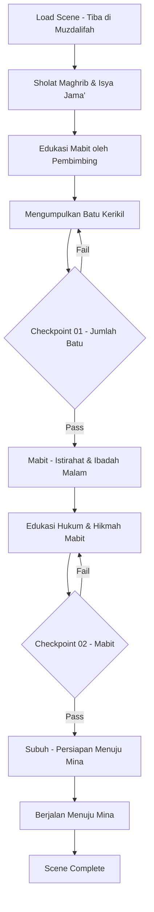

# 08_SCENE_07_MUZDALIFAH.md
# ============================================
# VR EDUCATION HAJI & UMRAH
# SCENE 07 — MUZDALIFAH
# Version : 1.0
# ============================================

---

## Daftar Isi

- [Scene Information](#scene-information)
- [Learning Objective](#learning-objective)
- [Background](#background)
- [Environment](#environment)
- [Asset List](#asset-list)
- [Asset Source](#asset-source)
- [Character](#character)
- [Animation](#animation)
- [Audio](#audio)
- [Camera](#camera)
- [UI](#ui)
- [Interaction](#interaction)
- [Education](#education)
- [Activity Flow](#activity-flow)
- [Validation](#validation)
- [Performance](#performance)
- [Acceptance Criteria](#acceptance-criteria)

---

## Scene Information

| Atribut | Nilai |
|---------|-------|
| **Nomor Scene** | 07 |
| **Nama Scene** | Muzdalifah |
| **Versi** | 1.0 |
| **Deskripsi** | Scene ini mensimulasikan pengalaman Mabit (bermalam) di Muzdalifah setelah meninggalkan Arafah. Pengguna akan tiba di Muzdalifah pada malam hari, merasakan suasana padang pasir yang dipenuhi jutaan jamaah, mengumpulkan batu kerikil untuk melontar Jumrah, mendengarkan edukasi tentang hukum dan hikmah Mabit di Muzdalifah, serta mempersiapkan diri menuju Mina untuk melontar Jumrah Aqabah. Scene ini merupakan scene pertama dalam rangkaian inti ibadah Haji setelah Wukuf di Arafah. |

---

## Learning Objective

Setelah menyelesaikan Scene 07, pengguna diharapkan mampu:

| No | Tujuan Pembelajaran | Target |
|----|---------------------|--------|
| 1 | Memahami pengertian dan hukum Mabit di Muzdalifah | 85% benar pada checkpoint |
| 2 | Mengetahui tata cara dan adab bermalam di Muzdalifah | 85% benar pada checkpoint |
| 3 | Mampu mengumpulkan batu kerikil sesuai jumlah yang ditentukan | 85% benar pada checkpoint |
| 4 | Memahami keutamaan dan hikmah Mabit di Muzdalifah | 85% benar pada checkpoint |
| 5 | Mengetahui persiapan menuju Mina untuk melontar Jumrah | 85% benar pada checkpoint |

---

## Background

Muzdalifah adalah sebuah daerah terbuka yang terletak di antara Arafah dan Mina, sekitar 12 kilometer dari Mekkah. Setelah melaksanakan Wukuf di Arafah pada tanggal 9 Dzulhijjah, jamaah Haji bergerak menuju Muzdalifah setelah matahari terbenam untuk melaksanakan Mabit (bermalam).

Mabit di Muzdalifah merupakan salah satu wajib Haji yang harus dilaksanakan oleh setiap jamaah. Di tempat ini, jamaah mengumpulkan batu kerikil yang akan digunakan untuk melontar Jumrah di Mina pada hari-hari Tasyrik. Jumlah batu yang dikumpulkan minimal 7 butir untuk melontar Jumrah Aqabah, namun dianjurkan untuk mengumpulkan 70 butir (atau 49 butir) untuk kebutuhan melontar di hari-hari berikutnya.

Muzdalifah memiliki sejarah yang sangat penting dalam rangkaian ibadah Haji. Di tempat inilah Nabi Muhammad SAW melaksanakan sholat Maghrib dan Isya secara jama' taqdim (digabung dan dimajukan) saat Haji Wada'. Malam di Muzdalifah dihabiskan dengan berdoa, berdzikir, dan mempersiapkan diri untuk rangkaian ibadah selanjutnya.

Scene Muzdalifah menjadi scene pertama dalam rangkaian Haji setelah scene sebelumnya (Scene 06 Sa'i Umrah) yang merupakan penutup rangkaian Umrah. Scene ini menjadi awal dari rangkaian panjang ibadah Haji yang dimulai dengan Mabit di Muzdalifah.

---

## Environment

### Lokasi

| Area | Deskripsi | Dimensi |
|------|-----------|---------|
| **Area Muzdalifah** | Padang pasir luas dengan penerangan terbatas, dipenuhi tenda dan jamaah | 300m x 250m |
| **Area Mabit** | Zona khusus bermalam dengan alas/tikar di tanah terbuka | 100m x 80m |
| **Area Pengumpulan Batu** | Area berbatu di sekitar Muzdalifah untuk mengambil kerikil | 50m x 40m |
| **Area Sholat Jama'** | Area sholat terbuka untuk sholat Maghrib dan Isya jama' taqdim | 60m x 50m |
| **Area Doa dan Dzikir** | Area khusus untuk berdoa dan berdzikir di malam hari | 40m x 30m |
| **Area Edukasi** | Area dengan papan edukasi dan pembimbing | 30m x 20m |
| **Area Persiapan Mina** | Area transisi menuju Mina | 50m x 30m |

### Waktu

| Aspek | Setting |
|-------|---------|
| Waktu | Malam hari (pukul 19:00 - 04:00 waktu Arab) |
| Musim | Musim panas (45°C siang, 30°C malam) |

### Cuaca

| Elemen | Deskripsi |
|--------|-----------|
| Langit | Malam cerah dengan bintang dan bulan sabit |
| Suhu | 30°C (hangat di malam hari) |
| Angin | Angin gurun yang sejuk dan kering |
| Kelembaban | 20% (sangat kering) |

### Lighting

| Sumber | Tipe | Intensity | Shadow |
|--------|------|-----------|--------|
| Bulan | DirectionalLight (rendah) | 0.2 | Enabled |
| Bintang | AmbientLight (very low) | 0.05 | - |
| Lampu Tenda | PointLight (x30) | 0.6 | Disabled |
| Lampu Penerangan Jalan | PointLight (x15) | 0.5 | Enabled |
| Lampu Emergency | SpotLight (x5) | 0.7 | Disabled |
| Cahaya Handphone Jamaah | PointLight (x20) | 0.2 | Disabled |

### Atmosfer

| Efek | Implementasi |
|------|--------------|
| Skybox | Langit malam dengan Milky Way dan bintang terang |
| Ambient | Suasana malam di Muzdalifah, suara doa dan dzikir |
| Particle | Debu halus gurun di malam hari |
| Fog | THREE.FogExp2 densitas 0.0008 |
| Moon Glow | Efek cahaya bulan di cakrawala |
| Star Twinkle | Efek bintang berkelap-kelip |

---

## Asset List

### Bangunan

| Asset | Deskripsi | LOD Levels |
|-------|-----------|------------|
| Area_Muzdalifah_Terbuka | Padang pasir luas dengan topografi landai | LOD 0-3 |
| Tenda_Mabit | Tenda besar untuk jamaah beristirahat (x15) | LOD 0-2 |
| Papan_Petunjuk | Papan petunjuk arah dan informasi (x5) | LOD 0-1 |
| Tiang_Lampu | Tiang penerangan tinggi (x15) | LOD 0-2 |
| Area_Sholat_Outdoor | Area sholat terbuka dengan penanda kiblat | LOD 0-2 |
| Pembatas_Zona | Pembatas area Mabit dan area lainnya | LOD 0-1 |

### Karakter

| Asset | Jumlah | Tipe |
|-------|--------|------|
| Player_Character | 1 | Main character (first person) dalam ihram |
| Pembimbing_Haji | 1 | NPC interaktif (pembimbing utama) |
| Ustadz_Muzdalifah | 1 | NPC interaktif (edukasi) |
| Petugas_Muzdalifah | 4 | NPC interaktif (pengatur) |
| Jamaah_Mabit_Laki | 30 | NPC background beristirahat |
| Jamaah_Mabit_Perempuan | 25 | NPC background beristirahat |
| Jamaah_Cari_Batu_Laki | 10 | NPC sedang mengumpulkan batu |
| Jamaah_Cari_Batu_Perempuan | 8 | NPC sedang mengumpulkan batu |
| Jamaah_Sholat | 15 | NPC sholat berjamaah |
| Jamaah_Doa | 12 | NPC berdoa dan berdzikir |

### Ground

| Asset | Material | Tekstur |
|-------|----------|---------|
| Tanah_Muzdalifah | Pasir gurun berbatu | 4096x4096 PBR |
| Area_Mabit | Alas tikar/karpet di atas pasir | 2048x2048 PBR |
| Area_Sholat | Karpet sholat besar di tanah | 2048x2048 PBR |
| Area_Batu | Tanah berbatu kerikil | 4096x4096 PBR |

### Vegetasi

| Asset | Jumlah | Keterangan |
|-------|--------|------------|
| Semak_Gurun | 20 | Vegetasi kering gurun |
| Rumput_Kering | Area | Rumput gurun jarang |

### Langit

| Asset | Format | Resolusi |
|-------|--------|----------|
| Skybox_Malam_Bintang | CubeTexture | 4096x4096 per face |
| Bulan_Texture | PNG | 1024x1024 |

### Props

| Asset | Jumlah | Interaktif |
|-------|--------|------------|
| Batu_Kerikil | 200+ | Ya (dapat diambil) |
| Tas_Kerikil | 5 | Ya (untuk menyimpan batu) |
| Tikar_Alas | 30 | Ya (dapat digunakan) |
| Karpet_Sholat | 20 | Ya |
| Tenda_Individual | 5 | Ya (dapat dimasuki) |
| Air_Minum_Botol | 10 | Ya (interaktif) |
| Senter | 5 | Ya (dapat digunakan) |
| Al_Quran | 5 | Ya (dapat dibaca) |
| Buku_Doa | 3 | Ya (dapat dibaca) |
| Tasbih | 10 | Ya (interaktif) |
| Papan_Edukasi | 4 | Ya (informasi) |
| Penanda_Jumlah_Batu | 2 | Ya (informasi) |
| Lampu_Senter | 8 | Ya (dapat diambil) |
| Botol_Air | 15 | Ya |

### Dekorasi

| Asset | Jumlah | Keterangan |
|-------|--------|------------|
| Spanduk_Panduan_Haji | 4 | Informasi tata cara Mabit |
| Poster_Doa | 3 | Doa-doa di Muzdalifah |
| Lampu_Hias_Tenda | 20 | Dekorasi tenda |
| Umbul_Umbul | 5 | Penanda arah |

### Karakter Tambahan

| Asset | Jumlah | Tipe |
|-------|--------|------|
| Jamaah_Lansia_Duduk | 6 | NPC lansia beristirahat |
| Jamaah_Kelompok | 4 | NPC berkelompok mencari batu |
| Relawan | 4 | NPC relawan membantu jamaah |

---

## Asset Source

### Fab Marketplace

| Kategori | Nama Asset | Format | Texture | LOD | Ukuran |
|----------|-----------|--------|---------|-----|--------|
| Landscape | Desert Plains Night | GLB | 4096x4096 | 3 level | 40MB |
| Architecture | Large Tent Middle Eastern | GLB | 2048x2048 | 2 level | 15MB |
| Architecture | Prayer Area Outdoor | GLB | 2048x2048 | 2 level | 12MB |
| Props | Stone Pebbles Collection | GLB | 1024x1024 | 1 level | 3MB |
| Props | Desert Camping Set | GLB | 1024x1024 | 2 level | 8MB |
| Character | Pilgrims Resting | GLB | 2048x2048 | 2 level | 20MB |
| Props | Lighting Poles Desert | GLB | 1024x1024 | 1 level | 5MB |
| Props | Prayer Mat Collection | GLB | 1024x1024 | 1 level | 4MB |
| Props | Water Bottle Set | GLB | 512x512 | 1 level | 2MB |
| Props | Religious Items Pack | GLB | 1024x1024 | 1 level | 5MB |

---

## Character

### Player

| Atribut | Spesifikasi |
|---------|-------------|
| Perspektif | First person (kamera sebagai mata player) |
| Pakaian | Pakaian Ihram putih (dari scene Miqat) |
| Collision | Capsule collider (0.5m radius, 1.8m height) |
| Mode Malam | Night vision mode terbatas (dengan senter) |

### NPC

| NPC | Posisi | Fungsi | Dialog |
|-----|--------|--------|--------|
| Pembimbing_Haji | Area Mabit | Memandu proses Mabit dan edukasi | 12 dialog |
| Ustadz_Muzdalifah | Area Edukasi | Menjelaskan hukum dan hikmah Mabit | 10 dialog |
| Petugas1 | Area Masuk | Mengarahkan jamaah ke zona Mabit | 4 dialog |
| Petugas2 | Area Batu | Memandu pengumpulan batu | 4 dialog |
| Petugas3 | Area Sholat | Mengatur sholat jama' | 3 dialog |
| Petugas4 | Area Keluar | Mengarahkan ke Mina | 3 dialog |

### Petugas

| Tipe | Jumlah | Pergerakan |
|------|--------|------------|
| Petugas Kebersihan | 3 | Patroli area |
| Petugas Keamanan | 5 | Berjaga di titik strategis |
| Relawan Medis | 2 | Siap siaga di posko |
| Petugas Penerangan | 2 | Memeriksa lampu |

### Jamaah

| Tipe | Jumlah | Aktivitas |
|------|--------|-----------|
| Jamaah Istirahat | 20 | Beristirahat di area Mabit |
| Jamaah Cari Batu | 12 | Mengumpulkan batu kerikil |
| Jamaah Sholat | 15 | Sholat sunnah dan berdoa |
| Jamaah Berdzikir | 10 | Berdzikir di malam hari |
| Jamaah Makan | 8 | Makan bekal |
| Jamaah Berkelompok | 6 | Berdiskusi dengan kelompok |
| Jamaah Lansia | 6 | Istirahat dengan kursi |

---

## Animation

| Animasi | Durasi | Loop | Trigger |
|---------|--------|------|---------|
| Idle | 3s | Yes | Default |
| Walk | 1.5s | Yes | Keyboard WASD |
| Walk Malam | 2s | Yes | Berjalan di malam hari |
| Membungkuk Ambil Batu | 2.5s | No | Interaksi batu kerikil |
| Menghitung Batu | 3s | No | Di tangan |
| Memasukkan Batu ke Tas | 2s | No | Menyimpan batu |
| Duduk Istirahat | 5s | Yes | Di tikar |
| Sholat Malam | 8s | No | Sholat sunnah |
| Sujud | 3s | No | Sujud syukur |
| Berdoa Angkat Tangan | 3s | No | Berdoa |
| Dzikir | 6s | Yes | Memegang tasbih |
| Berbaring | 4s | Yes | Istirahat |
| Makan | 5s | No | Makan bekal |
| Minum | 3s | No | Minum air |
| Melihat Bintang | 3s | No | Melihat langit |
| Berjalan ke Mina | 3s | No | Persiapan berangkat |

---

## Audio

### Ambient

| Sumber | File | Volume | Loop |
|--------|------|--------|------|
| Suasana Malam Muzdalifah | ambient_malam_muzdalifah.mp3 | 0.3 | Yes |
| Suara Doa Jamaah Malam | ambient_doa_malam.mp3 | 0.2 | Yes |
| Suara Dzikir | ambient_dzikir.mp3 | 0.3 | Yes |
| Angin Gurun Malam | ambient_wind_desert_night.mp3 | 0.2 | Yes |
| Suara Batu Kerikil | ambient_stones.mp3 | 0.1 | Yes |
| Suara Jangkrik Gurun | ambient_crickets.mp3 | 0.05 | Yes |
| Suara Sholat Berjamaah | ambient_sholat_jamaah_malam.mp3 | 0.3 | Yes |

### Narration

| Momen | File | Durasi | Prioritas |
|-------|------|--------|-----------|
| Scene Start | nar_07_intro_muzdalifah.mp3 | 80s | High |
| Pengertian Mabit | nar_07_pengertian_mabit.mp3 | 70s | High |
| Hukum Mabit | nar_07_hukum_mabit.mp3 | 65s | High |
| Tata Cara Mabit | nar_07_tata_cara_mabit.mp3 | 75s | High |
| Mengumpulkan Batu | nar_07_kumpul_batu.mp3 | 80s | High |
| Jumlah Batu | nar_07_jumlah_batu.mp3 | 60s | High |
| Hikmah Mabit | nar_07_hikmah_mabit.mp3 | 90s | Medium |
| Doa Malam | nar_07_doa_malam.mp3 | 65s | High |
| Persiapan Mina | nar_07_persiapan_mina.mp3 | 55s | High |
| Checkpoint | nar_checkpoint_07.mp3 | 30s | High |

### Instruction

| Momen | File | Deskripsi |
|-------|------|-----------|
| Navigasi | instr_nav_muzdalifah.mp3 | Panduan gerakan di area gelap |
| Ambil Batu | instr_ambil_batu.mp3 | Cara mengambil dan menyimpan batu |
| Mabit | instr_mabit.mp3 | Cara bermalam di Muzdalifah |

### Effect

| Efek | File | Volume |
|------|------|--------|
| Langkah di Pasir | sfx_footstep_sand.mp3 | 0.3 |
| Batu Diambil | sfx_stone_pickup.mp3 | 0.4 |
| Batu Dimasukkan | sfx_stone_put.mp3 | 0.3 |
| Batu Berjatuhan | sfx_stone_fall.mp3 | 0.3 |
| Tenda Terbuka | sfx_tent_open.mp3 | 0.5 |
| Senter Dinyalakan | sfx_flashlight_on.mp3 | 0.4 |
| Air Minum | sfx_water_drink.mp3 | 0.3 |
| Adzan Malam | adzan_malam.mp3 | 0.6 |
| Takbir | sfx_takbir_malam.mp3 | 0.5 |
| Doa Bersama | sfx_doa_jamaah.mp3 | 0.4 |
| Suara Salam | sfx_salam_malam.mp3 | 0.3 |
| Transition | sfx_transition_muzdalifah.mp3 | 0.5 |

### Voice Over

| Karakter | File | Durasi |
|----------|------|--------|
| Pembimbing Haji | vo_muzdalifah_pembimbing_01-12.mp3 | 12s each |
| Ustadz Muzdalifah | vo_muzdalifah_ustadz_01-10.mp3 | 15s each |
| Petugas Pengumpul Batu | vo_muzdalifah_petugas_01-4.mp3 | 8s each |

---

## Camera

### Spawn

| Parameter | Nilai |
|-----------|-------|
| Posisi Awal | x: 0, y: 1.7, z: -10 (tepi area Muzdalifah) |
| Look At | Arah area Mabit dengan tenda-tenda |
| FOV | 65 derajat (lebih luas untuk night vision) |
| Near | 0.1 |
| Far | 1000 |

### Movement

| Mode | Kontrol | Kecepatan |
|------|---------|-----------|
| Walk | W/A/S/D | 3 m/s |
| Slow Walk | Shift + W | 1.5 m/s (di area ramai) |
| Look | Mouse move | Sensitivitas 0.002 |
| Teleport | Klik titik biru | Instant |
| Night Mode | Auto | Pencahayaan otomatis menyesuaikan |

### Reset

| Trigger | Aksi |
|---------|------|
| Tekan R | Reset ke posisi spawn terakhir |
| Out of bounds | Auto-reset ke area Mabit |
| Bug collision | Auto-reset setelah 3 detik |

### Transition

| Momen | Durasi | Easing |
|-------|--------|--------|
| Masuk scene (malam) | 3s | Cubic InOut (dark fade) |
| Menuju area batu | 1.5s | Quad InOut |
| Mabit (duduk) | 1s | Smooth Sine |
| Mode edukasi | 0.8s | Linear |
| Persiapan Mina | 2s | Fade to black (subuh) |
| End scene | 2.5s | Fade to white (pagi) |

### Special Camera — Night Adaptation

| Parameter | Nilai |
|-----------|-------|
| Mode | Night vision gradual |
| Durasi Adaptasi | 5 detik (dari gelap ke visibilitas) |
| Efek | Peningkatan exposure bertahap |
| Glow | Efek moonlight glow pada landscape |
| Depth of Field | Fokus pada area sekitar, blur area jauh |

---

## UI

### Subtitle

| Atribut | Spesifikasi |
|---------|-------------|
| Posisi | Bawah tengah |
| Font | Arial, 20px |
| Warna | Putih dengan shadow tebal |
| Background | Semi-transparan (rgba 0,0,0,0.6) — lebih gelap untuk malam |
| Max Lines | 2 baris |
| Arabic Support | Doa-doa dalam Arab |

### Progress

| Elemen | Deskripsi |
|--------|-----------|
| Progress Bar | Horizontal bar di atas (5 segmen) |
| Segmen | Tiba → Cari Batu → Sholat → Mabit → Persiapan Mina |
| Active | Segmen berwarna emas |
| Completed | Segmen berwarna hijau |
| Locked | Segmen berwarna abu-abu |

### Hint

| Tipe | Warna | Posisi |
|------|-------|--------|
| Navigasi | Biru muda | Tengah bawah |
| Interaksi | Hijau (glow) | Atas objek |
| Edukasi | Emas | Kanan bawah |
| Ibadah | Putih terang | Atas kiri |
| Peringatan | Merah | Tengah |
| Pengumpulan Batu | Cyan | Atas kanan |

### Compass

| Elemen | Spesifikasi |
|--------|-------------|
| Bentuk | Circular dengan arah kiblat |
| Ukuran | 80x80px |
| Posisi | Atas kanan |
| Arah | U/T/S/B + penanda khusus area |
| Marker | Area Batu, Tenda Mabit, Sholat, Pintu Keluar |

### Notification

| Tipe | Durasi | Warna |
|------|--------|-------|
| Info | 3s | Biru |
| Success | 3s | Hijau |
| Ibadah | 5s | Emas |
| Batu Terkumpul | 4s | Cyan |
| Warning | 4s | Merah |
| Checkpoint | 6s | Emas terang |

### Mini Map

| Atribut | Spesifikasi |
|---------|-------------|
| Ukuran | 220x220px |
| Posisi | Kiri bawah |
| Style | Top-down dengan tema malam |
| Ikon | Player, area batu, tenda, titik penting |
| Kontras | High contrast untuk visibilitas malam |
| Night Mode | Background gelap, garis terang |

### Popup

| Tipe | Konten | Aksi |
|------|--------|------|
| Edukasi | Teks + gambar + dalil | Next/Back |
| Doa | Teks doa arab + latin + arti | Baca & tutup |
| Dialog | Opsi percakapan | Pilih opsi |
| Checkpoint | Pertanyaan + jawaban | Submit |
| Informasi | Detail objek | Tutup |
| Panduan Batu | Cara ambil dan jumlah batu | Next/Back |
| Batu Counter | Jumlah batu terkumpul | Real-time update |

### Batu Counter UI

| Elemen | Spesifikasi |
|--------|-------------|
| Posisi | Atas tengah (di bawah progress bar) |
| Ikon | Batu kerikil kecil |
| Angka | Jumlah terkumpul / Target (contoh: 15/70) |
| Warna Default | Putih |
| Warna Lengkap | Hijau berkedip |

### Senter UI

| Elemen | Spesifikasi |
|--------|-------------|
| Toggle | Tekan F untuk menyalakan/mematikan senter |
| Lingkaran Cahaya | Area terang di depan player |
| Radius | 15 meter |
| Battery Indicator | Ikon battery di pojok |
| Auto-off | 30 detik tidak digunakan |

---

## Interaction

### Click

| Objek | Aksi | Feedback |
|-------|------|----------|
| Batu Kerikil | Ambil batu | Animasi ambil + counter bertambah |
| Pembimbing | Mulai dialog | UI dialog + audio |
| Ustadz | Mulai edukasi | Panel edukasi + audio |
| Tikar | Duduk/istirahat | Animasi duduk |
| Karpet Sholat | Sholat sunnah | Animasi sholat |
| Tenda | Masuk tenda | Kamera transisi |
| Air Minum | Minum | Animasi minum |
| Al Quran | Baca | Popup Al Quran |
| Tasbih | Berdzikir | Animasi dzikir + counter |
| Papan Edukasi | Lihat info | Popup informasi |
| Senter | Ambil/gunakan | Senter menyala |
| Tas Kerikil | Cek jumlah batu | Popup counter |

### Hover

| Objek | Highlight | Cursor |
|-------|-----------|--------|
| NPC | Glow emas | Pointer |
| Batu Kerikil | Outline putih terang | Pointer |
| Interaktif | Outline biru | Pointer |
| Tenda | Outline kuning | Pointer |
| Papan Info | Outline hijau | Pointer |

### Inspect

| Objek | Hasil | Format |
|-------|-------|--------|
| Batu Kerikil | Info ukuran dan jumlah yang dianjurkan | Popup |
| Papan Edukasi | Tata cara Mabit | Popup |
| Tenda | Info kapasitas | Popup |
| Tas Kerikil | Isi batu | Counter display |

### Walk

| Metode | Kontrol | Keterangan |
|--------|---------|------------|
| Keyboard | WASD | Gerakan relatif kamera |
| Slow Walk | Shift + W | Berjalan pelan di area ramai |
| Mouse | Klik kanan tahan | Look around |
| Auto-walk | Klik tujuan | Jalan otomatis ke titik |

### Teleport

| Area | Titik Teleport | Biaya |
|------|---------------|-------|
| Area Masuk | 1 titik | Gratis |
| Area Mabit | 2 titik | Gratis |
| Area Batu | 2 titik | Gratis |
| Area Sholat | 1 titik | Gratis |
| Area Edukasi | 1 titik | Gratis |
| Area Keluar | 1 titik | Gratis |

### Dialog

| Struktur | Format | Opsi |
|----------|--------|------|
| NPC Speech | Teks + audio | - |
| Player Choice | 2-3 opsi | Pilih satu |
| NPC Response | Teks + audio | - |
| Edukasi | Info tambahan | Klik untuk detail |
| Konfirmasi | Ya/Tidak | Konfirmasi pemahaman |
| Tanya Jawab | Pertanyaan | Pilih jawaban |

### Highlight

| Metode | Warna | Durasi |
|--------|-------|--------|
| Outline | Emas (0xffaa00) | Selama hover |
| Pulse | Hijau (0x44ff88) | 2 detik |
| Glow | Putih (0xffffff) | Terus menerus |
| Guide | Biru (0x4488ff) | 1 detik pulse |
| Area Batu | Cyan (0x00ffcc) | Selama pencarian batu |
| Warning | Merah (0xff4444) | 3 detik |

### Information

| Tipe | Format | Contoh |
|------|--------|--------|
| Tempat | Info box | "Muzdalifah — Tempat Mabit jamaah Haji" |
| Hukum | Fatwa box | "Hukum Mabit di Muzdalifah adalah Wajib" |
| Dalil | Quote box arab | HR Abu Daud tentang Mabit di Muzdalifah |
| Panduan | Step cards | "Cara mengumpulkan batu kerikil..." |
| Doa | Teks arab + latin | "Doa di malam Muzdalifah" |

---

## Education

### Penjelasan

| Topik | Konten | Durasi |
|-------|--------|--------|
| Pengertian Mabit | Bermalam di Muzdalifah setelah Wukuf di Arafah | 70s |
| Hukum Mabit | Wajib Haji — jika ditinggalkan harus membayar Dam | 65s |
| Waktu Mabit | Setelah tengah malam (setelah sholat jama') hingga sebelum fajar | 60s |
| Sejarah Muzdalifah | Tempat sholat jama' Nabi Muhammad SAW saat Haji Wada' | 75s |
| Tata Cara Mabit | Sholat jama' taqdim, berdoa, dzikir, istirahat | 80s |
| Jumlah Batu | Minimal 7 butir, dianjurkan 70 butir (atau 49) | 60s |
| Ukuran Batu | Sebesar biji kurma atau kelereng kecil | 50s |
| Cara Mengumpulkan | Ambil di area berbatu, genggam, masukkan ke tas | 55s |
| Adab di Muzdalifah | Menjaga ketenangan, tidak berdesakan, perbanyak doa | 65s |
| Hikmah Mabit | Melatih kesabaran, tawakal, dan kebersamaan | 70s |

### Dalil

| Referensi | Ayat/Hadits | Konteks |
|-----------|-------------|---------|
| QS Al-Baqarah: 198 | "Tidak ada dosa bagimu untuk mencari karunia Tuhanmu. Apabila kamu bertolak dari Arafah, berdzikirlah kepada Allah di Masy'aril Haram (Muzdalifah)" | Perintah berdzikir di Muzdalifah |
| HR Muslim | "Rasulullah SAW sholat Maghrib dan Isya di Muzdalifah dengan satu iqamah" | Sholat jama' di Muzdalifah |
| HR Abu Daud | "Barangsiapa yang tidak bermalam di Muzdalifah, maka hajinya tidak sempurna" | Wajib Mabit |
| QS Al-Hajj: 29 | "Kemudian hendaklah mereka menghilangkan kotoran (rambut) dan menyempurnakan nazar-nazar mereka dan melakukan tawaf sekeliling Baitul Atiq" | Rangkaian setelah Muzdalifah |

### Hikmah

| Hikmah | Penjelasan |
|--------|------------|
| Kesabaran | Mabit di tanah terbuka mengajarkan kesabaran |
| Kesederhanaan | Tidur di atas pasir tanpa kemewahan |
| Kebersamaan | Beribadah bersama jutaan muslim |
| Tawakal | Berserah diri kepada Allah di alam terbuka |
| Perenungan | Malam di Muzdalifah untuk introspeksi diri |
| Kesiapan | Mempersiapkan fisik dan mental untuk lontar jumrah |
| Doa | Malam yang mustajab untuk berdoa |

### Larangan

| Larangan | Keterangan |
|----------|------------|
| Meninggalkan Mabit tanpa uzur | Wajib Haji yang harus dilaksanakan |
| Berdesak-desakan saat ambil batu | Berbahaya dan mengganggu jamaah lain |
| Mengambil batu terlalu besar | Ukuran maksimal sebesar biji kurma |
| Membuang sampah sembarangan | Menjaga kebersihan Muzdalifah |
| Berteriak dan gaduh | Mengganggu jamaah lain yang istirahat |
| Berkelahi atau bertengkar | Dilarang selama ihram |
| Meninggalkan area sebelum waktunya | Dianjurkan keluar setelah sholat subuh |

### Kesalahan Umum

| Kesalahan | Solusi |
|-----------|--------|
| Tidak berniat Mabit | Niatkan dalam hati untuk bermalam |
| Mengambil batu terlalu sedikit | Ambil minimal 7, dianjurkan 70 |
| Mengambil batu terlalu besar | Pilih batu sebesar biji kurma |
| Lupa sholat jama' | Segera sholat setelah tiba di Muzdalifah |
| Tidur berlebihan sehingga subuh kesiangan | Atur waktu istirahat yang cukup |
| Tidak berdoa dan berdzikir | Manfaatkan malam untuk beribadah |
| Bingung arah menuju Mina | Ikuti petunjuk dan panduan pembimbing |

### Tips

| No | Tips |
|----|------|
| 1 | Segera sholat Maghrib dan Isya jama' taqdim setelah tiba di Muzdalifah |
| 2 | Ambil batu kerikil secukupnya (70 butir) untuk kebutuhan 3 hari |
| 3 | Pilih batu sebesar biji kurma, tidak terlalu besar atau kecil |
| 4 | Simpan batu dalam tas yang aman agar tidak tercecer |
| 5 | Perbanyak doa dan istighfar di malam hari |
| 6 | Istirahat yang cukup karena besok akan menjalani hari yang panjang |
| 7 | Siapkan bekal air minum yang cukup |
| 8 | Tetap bersama rombongan agar tidak tersesat |
| 9 | Jaga kebersihan area Mabit |
| 10 | Bersiap berangkat ke Mina setelah sholat Subuh |

---

## Activity Flow

### Alur Scene

### Langkah Detail

| Langkah | Area | Aksi | Durasi |
|---------|------|------|--------|
| 1 | Masuk | Spawn di area Muzdalifah, dengar narator intro | 80s |
| 2 | Area Sholat | Sholat Maghrib dan Isya jama' taqdim | 30s |
| 3 | Area Edukasi | Edukasi Mabit oleh pembimbing | 70s |
| 4 | Area Batu | Mengumpulkan batu kerikil (min 7, target 70) | 180s |
| 5 | Area Batu | Checkpoint 01 — Jumlah dan ukuran batu | 30s |
| 6 | Area Mabit | Istirahat, berdoa, dzikir | 120s |
| 7 | Area Mabit | Edukasi hukum dan hikmah Mabit | 90s |
| 8 | Edukasi | Checkpoint 02 — Pemahaman Mabit | 30s |
| 9 | Area Mabit | Sholat Subuh | 15s |
| 10 | Persiapan | Persiapan menuju Mina | 45s |
| 11 | Keluar | Berjalan menuju Mina | 30s |
| 12 | Complete | Scene selesai, transisi ke Scene 08 | 5s |

---

## Validation

### Berhasil

| Checkpoint | Kriteria | Reward |
|------------|----------|--------|
| CP-01 | Mengumpulkan minimal 7 batu (target 70) dan menjawab 3/4 pertanyaan tentang batu | Dapat melanjutkan ke Mabit |
| CP-01 Sempurna | Mengumpulkan 70 batu + menjawab 4/4 pertanyaan | Score +100, badge "Pengumpul Batu" |
| CP-02 | Menjawab benar minimal 4 dari 5 pertanyaan tentang Mabit | Scene 08 (Mina) terbuka |
| Scene Complete | Scene 07 selesai semua | Badge "Muzdalifah" |

### Gagal

| Checkpoint | Kriteria | Konsekuensi |
|------------|----------|-------------|
| CP-01 | Kurang dari 7 batu atau jawaban < 3 benar | Ulang area pengumpulan batu |
| CP-02 | Kurang dari 4 jawaban benar | Ulang edukasi Mabit |
| Timeout | Tidak menjawab dalam 5 menit | Scene restart dari checkpoint |

### Checkpoint List

#### Checkpoint 01 — Pengumpulan Batu

| No | Pertanyaan | Jawaban Benar | Opsi |
|----|-----------|---------------|------|
| 1 | Berapa minimal batu yang harus dikumpulkan? | 7 butir | 4 opsi |
| 2 | Berapa jumlah batu yang dianjurkan? | 70 butir | 4 opsi |
| 3 | Ukuran batu yang ideal sebesar? | Biji kurma | 4 opsi |
| 4 | Batu ini digunakan untuk apa? | Melontar Jumrah | 4 opsi |

#### Checkpoint 02 — Mabit di Muzdalifah

| No | Pertanyaan | Jawaban Benar | Opsi |
|----|-----------|---------------|------|
| 1 | Apa hukum Mabit di Muzdalifah? | Wajib Haji | 4 opsi |
| 2 | Sholat apa yang dilakukan di Muzdalifah? | Maghrib dan Isya jama' taqdim | 4 opsi |
| 3 | Sampai kapan Mabit di Muzdalifah? | Hingga sebelum fajar/subuh | 4 opsi |
| 4 | Setelah Muzdalifah, jamaah menuju? | Mina | 4 opsi |
| 5 | Dzikir di Muzdalifah disebut dalam surat? | QS Al-Baqarah: 198 | 4 opsi |

---

## Performance

| Aspek | Target | Metrik |
|-------|--------|--------|
| Frame Rate | 60 FPS | Average FPS |
| Scene Load | < 5 detik | Load time |
| Memory | < 300MB | Memory usage |
| Texture | < 150MB | GPU memory |
| Draw Calls | < 600 | Draw call count |
| Triangles | < 500.000 | Triangle count |

### Optimization

| Teknik | Penerapan |
|--------|-----------|
| LOD | Landscape 3 level, tenda 2 level |
| Texture Atlas | Pasir, karpet, tenda sejenis |
| Draco Compression | Semua GLB file |
| Instancing | Batu kerikil, tenda, lampu |
| Frustum Culling | Auto untuk semua mesh |
| Occlusion Culling | Area tenda dan bukit |
| Night LOD | LOD lebih agresif di malam hari (visibilitas rendah) |
| Dynamic Lights | Hanya render lampu dalam radius tertentu |

### Texture Budget

| Kategori | Budget | Catatan |
|----------|--------|---------|
| Landscape Muzdalifah | 48MB | 4096x4096 |
| Tenda dan Bangunan | 32MB | 2048x2048 |
| Karakter | 32MB | 2048x2048 |
| Props Batu | 8MB | 512x512 (banyak instancing) |
| Environment | 16MB | Skybox night + ground |

---

## Acceptance Criteria

| No | Kriteria | Status |
|----|----------|--------|
| 1 | Scene dapat dimuat dalam waktu < 5 detik | ☐ |
| 2 | Area Muzdalifah malam hari dirender dengan pencahayaan realistis | ☐ |
| 3 | Suasana Mabit (bermalam) terasa dengan tenda, tikar, dan jamaah | ☐ |
| 4 | Aktivitas mengumpulkan batu kerikil interaktif dan berfungsi | ☐ |
| 5 | NPC Jamaah terlihat beristirahat dan mencari batu | ☐ |
| 6 | NPC Pembimbing memandu seluruh proses dengan dialog yang sesuai | ☐ |
| 7 | NPC Ustadz memberikan edukasi Mabit dengan benar | ☐ |
| 8 | Edukasi pengertian dan hukum Mabit ditampilkan lengkap | ☐ |
| 9 | Edukasi jumlah batu (7 atau 70) ditampilkan dengan jelas | ☐ |
| 10 | Audio narasi berjalan di setiap tahapan penting | ☐ |
| 11 | Audio ambient malam hari (doa, dzikir, angin) terdengar | ☐ |
| 12 | Subtitle muncul untuk semua audio narasi dan dialog | ☐ |
| 13 | UI tutorial untuk mengumpulkan batu tersedia | ☐ |
| 14 | Objective (Kumpulkan batu) ditampilkan dengan jelas | ☐ |
| 15 | Counter batu real-time menampilkan jumlah terkumpul | ☐ |
| 16 | Checkpoint 01 berfungsi dengan validasi jumlah batu | ☐ |
| 17 | Checkpoint 02 berfungsi dengan validasi pemahaman Mabit | ☐ |
| 18 | Senter dapat digunakan untuk menerangi area gelap | ☐ |
| 19 | Mini map menampilkan area Muzdalifah dengan jelas | ☐ |
| 20 | Kompas berfungsi dengan arah yang akurat | ☐ |
| 21 | Transisi sholat Maghrib dan Isya jama' berjalan lancar | ☐ |
| 22 | Suasana spiritual malam hari terasa melalui audio dan visual | ☐ |
| 23 | Persiapan menuju Mina diinformasikan dengan jelas | ☐ |
| 24 | Transisi ke Scene 08 (Mina) berjalan halus | ☐ |
| 25 | Frame rate stabil di 60 FPS | ☐ |

---

## Integrasi dengan Scene Lain

### Hubungan Scene

| Scene Sebelumnya | Scene Saat Ini | Scene Selanjutnya |
|-----------------|----------------|-------------------|
| Scene 06 — Sa'i Umrah | **Scene 07 — Muzdalifah** | Scene 08 — Mina Jumrah Aqabah |

### Data yang Dilewatkan

| Data | Dari Scene | Ke Scene | Format |
|------|-----------|----------|--------|
| Status Ihram | Scene 06 | Scene 07 | Boolean (dalam ihram haji) |
| Jumlah Batu | Scene 07 | Scene 08 | Integer (jumlah batu terkumpul) |
| Skor Checkpoint | Scene 07 | Scene 08 | Integer |
| Progress Pembelajaran | Scene 07 | Scene 08 | Persentase |

### Trigger Scene Berikutnya

Setelah menyelesaikan Scene 07, sistem akan mengarahkan pengguna ke Scene 08 (Mina Jumrah Aqabah) dengan:
- Transisi fade to black (malam ke fajar) — 2.5 detik
- Load screen dengan info scene berikutnya
- Progress tersimpan otomatis
- Data jumlah batu kerikil diteruskan

---

> **Dokumen Terkait:**
> - [00_Project_Overview.md](./00_Project_Overview.md)
> - [01_Technology_Stack.md](./01_Technology_Stack.md)
> - [06_Scene_05_Tawaf_Umrah.md](./06_Scene_05_Tawaf_Umrah.md)
> - [07_Scene_06_Sai_Umrah.md](./07_Scene_06_Sai_Umrah.md)
> - [09_Scene_08_Mina_Jumrah_Aqabah.md](./09_Scene_08_Mina_Jumrah_Aqabah.md)
> - [MASTER_GENERATOR.md](./MASTER_GENERATOR.md)

---
