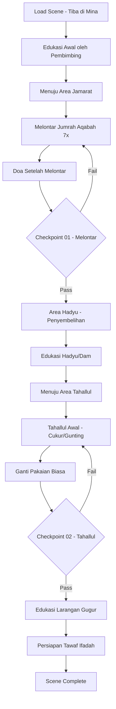

# 09_SCENE_08_MINA_JUMRAH_AQABAH.md
# ============================================
# VR EDUCATION HAJI & UMRAH
# SCENE 08 — MINA JUMRAH AQABAH
# Version : 1.0
# ============================================

---

## Daftar Isi

- [Scene Information](#scene-information)
- [Learning Objective](#learning-objective)
- [Background](#background)
- [Environment](#environment)
- [Asset List](#asset-list)
- [Asset Source](#asset-source)
- [Character](#character)
- [Animation](#animation)
- [Audio](#audio)
- [Camera](#camera)
- [UI](#ui)
- [Interaction](#interaction)
- [Education](#education)
- [Activity Flow](#activity-flow)
- [Validation](#validation)
- [Performance](#performance)
- [Acceptance Criteria](#acceptance-criteria)

---

## Scene Information

| Atribut | Nilai |
|---------|-------|
| **Nomor Scene** | 08 |
| **Nama Scene** | Mina & Jumrah Aqabah |
| **Versi** | 1.0 |
| **Deskripsi** | Scene ini mensimulasikan hari pertama di Mina (10 Dzulhijjah) setelah jamaah tiba dari Muzdalifah. Pengguna akan memasuki area Jamarat untuk melontar 7 batu kerikil ke Jumrah Aqabah, melaksanakan aktivitas Menyembelih Hadyu (Dam) bagi yang wajib, melaksanakan Tahallul Awal (mencukur atau memotong rambut), dan mempelajari larangan-larangan ihram yang gugur setelah Tahallul. Scene ini merupakan puncak dari rangkaian ibadah Haji di Mina. |

---

## Learning Objective

Setelah menyelesaikan Scene 08, pengguna diharapkan mampu:

| No | Tujuan Pembelajaran | Target |
|----|---------------------|--------|
| 1 | Memahami tata cara melontar Jumrah Aqabah | 90% benar pada checkpoint |
| 2 | Mengetahui makna simbolis dari melontar Jumrah | 90% benar pada checkpoint |
| 3 | Mampu melafalkan doa saat melontar dengan benar | 90% benar pada checkpoint |
| 4 | Memahami proses Tahallul Awal dan konsekuensinya | 90% benar pada checkpoint |
| 5 | Mengetahui larangan ihram yang gugur setelah Tahallul Awal | 90% benar pada checkpoint |

---

## Background

Mina adalah sebuah lembah yang terletak sekitar 5 kilometer di sebelah timur Mekkah. Tempat ini menjadi pusat aktivitas jamaah Haji selama beberapa hari, terutama pada hari-hari Tasyrik (11, 12, 13 Dzulhijjah). Di Mina terdapat tiga Jamarat (tiang) yang melambangkan setan: Jumrah Ula (kecil), Jumrah Wustha (tengah), dan Jumrah Aqabah (besar).

Pada tanggal 10 Dzulhijjah — yang dikenal sebagai Hari Raya Idul Adha atau Yaumun Nahr (hari penyembelihan) — jamaah Haji melaksanakan beberapa aktivitas penting setelah tiba dari Muzdalifah. Aktivitas tersebut meliputi melontar Jumrah Aqabah dengan 7 batu kerikil, menyembelih hadyu (hewan kurban) bagi yang wajib atau mampu, dan melaksanakan Tahallul Awal (mencukur atau memotong rambut).

Melontar Jumrah memiliki makna simbolis yang sangat dalam, yaitu mengingat peristiwa ketika Nabi Ibrahim AS melempar setan dengan batu ketika hendak menyembelih putranya, Ismail AS. Aktivitas ini mengajarkan perlawanan terhadap godaan setan dan keteguhan iman.

Setelah Tahallul Awal, sebagian larangan ihram gugur, seperti memakai pakaian berjahit, memakai wewangian, dan memotong kuku. Namun, larangan berhubungan suami istri masih berlaku sampai Tahallul Tsani yang akan dilaksanakan setelah Tawaf Ifadah.

---

## Environment

### Lokasi

| Area | Deskripsi | Dimensi |
|------|-----------|---------|
| **Area Jamarat Aqabah** | Tiang Jumrah Aqabah dengan area melontar | 50m x 40m |
| **Jalur Menuju Jamarat** | Koridor/jembatan menuju area Jamarat | 100m x 20m |
| **Area Penyembelihan** | Tempat penyembelihan hadyu (Dam) | 40m x 30m |
| **Area Tahallul** | Tempat cukur rambut massal | 30m x 20m |
| **Area Edukasi** | Ruang terbuka untuk edukasi | 25m x 20m |
| **Area Istirahat** | Tenda dan tempat istirahat | 60m x 40m |
| **Lembah Mina** | Pemandangan lembah Mina dengan tenda | 200m x 150m |
| **Area Persiapan Tawaf** | Area transisi menuju Makkah | 30m x 20m |

### Waktu

| Aspek | Setting |
|-------|---------|
| Waktu | Pagi hingga siang (pukul 06:00 - 13:00 waktu Arab) |
| Tanggal | 10 Dzulhijjah (Yaumun Nahr / Idul Adha) |
| Musim | Musim panas |

### Cuaca

| Elemen | Deskripsi |
|--------|-----------|
| Langit | Cerah terik, sinar matahari kuat |
| Suhu | 42°C (sangat panas) |
| Angin | Angin panas kering |
| Kelembaban | 15% (sangat kering) |

### Lighting

| Sumber | Tipe | Intensity | Shadow |
|--------|------|-----------|--------|
| Matahari | DirectionalLight | 1.2 | Enabled |
| Langit | HemisphereLight | 0.5 | - |
| Pantulan Marmer | AmbientLight | 0.3 | - |
| Lampu Area Jamarat | PointLight (x10) | 0.5 | Disabled |
| Tenda Terpal | AmbientLight (warna) | 0.2 | - |

### Atmosfer

| Efek | Implementasi |
|------|--------------|
| Skybox | Langit cerah biru terang (heat haze) |
| Ambient | Suasana Mina ramai, suara takbir, doa |
| Particle | Debu dan pasir halus di udara |
| Fog | THREE.FogExp2 densitas 0.0005 |
| Heat Haze | Efek shimmer udara panas |
| Sun Shaft | Efek sinar matahari dari celah bangunan |

---

## Asset List

### Bangunan

| Asset | Deskripsi | LOD Levels |
|-------|-----------|------------|
| Jamarat_Area | Area melontar dengan tiang Jumrah Aqabah | LOD 0-3 |
| Tiang_Jumrah_Aqabah | Tiang besar tempat melontar batu | LOD 0-2 |
| Jembatan_Jamarat | Jembatan/jalur menuju Jamarat | LOD 0-3 |
| Area_Penyembelihan | Tempat penyembelihan hewan kurban | LOD 0-2 |
| Tempat_Tahallul | Area cukur rambut massal | LOD 0-2 |
| Tenda_Mina | Tenda-tenda di lembah Mina | LOD 0-2 |
| Pembatas_Jalur | Pembatas koridor pejalan kaki | LOD 0-1 |

### Karakter

| Asset | Jumlah | Tipe |
|-------|--------|------|
| Player_Character | 1 | Main character (first person) dalam ihram |
| Pembimbing_Mina | 1 | NPC interaktif (pembimbing utama) |
| Ustadz_Mina | 1 | NPC interaktif (edukasi) |
| Petugas_Jamarat | 4 | NPC interaktif (pengatur) |
| Petugas_Penyembelihan | 2 | NPC interaktif |
| Tukang_Cukur | 3 | NPC interaktif |
| Jamaah_Lontar_Laki | 25 | NPC sedang melontar |
| Jamaah_Lontar_Perempuan | 20 | NPC sedang melontar |
| Jamaah_Antri | 15 | NPC antri |
| Jamaah_Tahallul | 10 | NPC sedang cukur rambut |
| Jamaah_Istirahat | 8 | NPC beristirahat |

### Ground

| Asset | Material | Tekstur |
|-------|----------|---------|
| Lantai_Jamarat | Marmer putih | 4096x4096 PBR |
| Lantai_Koridor | Aspal/beton halus | 2048x2048 PBR |
| Area_Penyembelihan | Beton anti-slip | 2048x2048 PBR |
| Tanah_Mina | Pasir gurun | 4096x4096 PBR |
| Area_Cukur | Keramik mudah dibersihkan | 2048x2048 PBR |

### Vegetasi

| Asset | Jumlah | Keterangan |
|-------|--------|------------|
| Semak_Gurun | 10 | Vegetasi kering |
| Rumput_Kering | Area | Rumput jarang |

### Langit

| Asset | Format | Resolusi |
|-------|--------|----------|
| Skybox_Mina_Siang | CubeTexture | 4096x4096 per face |
| Sun_Texture | PNG | 1024x1024 |

### Props

| Asset | Jumlah | Interaktif |
|-------|--------|------------|
| Batu_Kerikil | 200 (di inventori) | Ya (untuk melontar) |
| Tiang_Jumrah | 1 (Aqabah) | Ya (target lontaran) |
| Sapi_Kurban | 2 | Visual (animasi) |
| Kambing_Kurban | 5 | Visual (animasi) |
| Pisau_Sembelih | 3 | Ya (simbolis) |
| Gunting_Rambut | 5 | Ya (interaktif) |
| Mesin_Cukur | 3 | Ya (interaktif) |
| Cermin | 5 | Ya (melihat hasil) |
| Kain_Putih | 10 | Ya (handuk) |
| Air_Minum | 10 | Ya |
| Karpet_Sholat | 15 | Ya |
| Tempat_Sampah | 10 | Tidak |
| Papan_Petunjuk | 8 | Ya (informasi) |

### Dekorasi

| Asset | Jumlah | Keterangan |
|-------|--------|------------|
| Spanduk_Takbir | 5 | Ucapan takbir Idul Adha |
| Poster_Panduan_Lontar | 4 | Tata cara melontar |
| Banner_Larangan | 3 | Informasi larangan ihram |
| Dekorasi_IdulAdha | 5 | Hiasan hari raya |

---

## Asset Source

### Fab Marketplace

| Kategori | Nama Asset | Format | Texture | LOD | Ukuran |
|----------|-----------|--------|---------|-----|--------|
| Architecture | Jamarat Bridge Complex | GLB | 4096x4096 | 3 level | 50MB |
| Architecture | Jamarat Pillar | GLB | 2048x2048 | 2 level | 12MB |
| Architecture | Mina Tent City | GLB | 2048x2048 | 3 level | 35MB |
| Architecture | Sacrifice Area | GLB | 2048x2048 | 2 level | 18MB |
| Character | Pilgrims Mina Activities | GLB | 2048x2048 | 2 level | 22MB |
| Props | Stone Throwing Set | GLB | 1024x1024 | 1 level | 4MB |
| Props | Barber Tools Set | GLB | 1024x1024 | 1 level | 3MB |
| Props | Animal Sacrifice Props | GLB | 1024x1024 | 1 level | 8MB |
| Architecture | Mina Tent Interior | GLB | 2048x2048 | 2 level | 15MB |
| Props | Water Station Mina | GLB | 1024x1024 | 1 level | 5MB |

---

## Character

### Player

| Atribut | Spesifikasi |
|---------|-------------|
| Perspektif | First person (kamera sebagai mata player) |
| Pakaian | Pakaian Ihram putih (sebelum Tahallul) |
| Pakaian Setelah | Pakaian biasa setelah Tahallul Awal |
| Collision | Capsule collider (0.5m radius, 1.8m height) |
| Kondisi Fisik | Mode panas — efek visual heat shimmer |

### NPC

| NPC | Posisi | Fungsi | Dialog |
|-----|--------|--------|--------|
| Pembimbing_Mina | Area Jamarat | Memandu tata cara melontar | 12 dialog |
| Ustadz_Mina | Area Edukasi | Menjelaskan makna simbolis | 10 dialog |
| Petugas_Jamarat1 | Tiang Aqabah | Mengatur antrian dan jalur | 4 dialog |
| Petugas_Jamarat2 | Jembatan | Mengarahkan jamaah | 3 dialog |
| Petugas_Sembelih | Area Sembelih | Membantu penyembelihan | 4 dialog |
| Tukang_Cukur | Area Tahallul | Mencukur rambut | 3 dialog |

### Petugas

| Tipe | Jumlah | Pergerakan |
|------|--------|------------|
| Petugas Kebersihan | 4 | Membersihkan area Jamarat |
| Petugas Keamanan | 6 | Berjaga di titik strategis |
| Petugas Medis | 3 | Posko kesehatan |
| Relawan | 5 | Membantu jamaah lansia |

### Jamaah

| Tipe | Jumlah | Aktivitas |
|------|--------|-----------|
| Jamaah Melontar | 20 | Melontar batu ke Jumrah |
| Jamaah Antri | 12 | Antri menunggu giliran |
| Jamaah Berdoa | 10 | Berdoa setelah melontar |
| Jamaah Sembelih | 6 | Menyembelih hadyu |
| Jamaah Cukur | 10 | Tahallul (cukur/gunting) |
| Jamaah Istirahat | 8 | Berteduh di tenda |
| Jamaah Sholat | 8 | Sholat di area |

---

## Animation

| Animasi | Durasi | Loop | Trigger |
|---------|--------|------|---------|
| Idle | 3s | Yes | Default |
| Walk | 1.5s | Yes | Keyboard WASD |
| Melontar Batu | 2.5s | No | Interaksi lempar batu |
| Mengangkat Tangan | 2s | No | Doa |
| Menyembelih | 4s | No | Simbolis penyembelihan |
| Cukur Rambut | 5s | No | Tahallul |
| Gunting Rambut | 3s | No | Tahallul gunting |
| Berdiri Doa | 4s | No | Berdoa usai lontar |
| Sholat Syukur | 6s | No | Sujud syukur |
| Duduk Istirahat | 5s | Yes | Berteduh |
| Minum | 3s | No | Minum air |
| Berjalan ke Area | 3s | No | Pindah area |
| Melepas Ihram | 4s | No | Ganti pakaian (setelah tahallul) |

---

## Audio

### Ambient

| Sumber | File | Volume | Loop |
|--------|------|--------|------|
| Suasana Mina | ambient_mina_pagi.mp3 | 0.4 | Yes |
| Suara Takbir | ambient_takbir_iduladha.mp3 | 0.5 | Yes |
| Suara Doa Jamaah | ambient_doa_mina.mp3 | 0.3 | Yes |
| Suara Hentakan Batu | ambient_stone_throw.mp3 | 0.2 | Yes |
| Suara Ternak | ambient_livestock.mp3 | 0.2 | Yes (area sembelih) |
| Suara Gunting/Mesin Cukur | ambient_barber.mp3 | 0.2 | Yes (area tahallul) |

### Narration

| Momen | File | Durasi | Prioritas |
|-------|------|--------|-----------|
| Scene Start | nar_08_intro_mina.mp3 | 85s | High |
| Makna Melontar | nar_08_makna_melontar.mp3 | 80s | High |
| Tata Cara Melontar | nar_08_tata_cara_lontar.mp3 | 75s | High |
| Doa Melontar | nar_08_doa_melontar.mp3 | 60s | High |
| Doa Setelah Melontar | nar_08_doa_setelah.mp3 | 55s | High |
| Hadyu (Dam) | nar_08_hadyu.mp3 | 70s | High |
| Tahallul Awal | nar_08_tahallul_awal.mp3 | 65s | High |
| Larangan Gugur | nar_08_larangan_gugur.mp3 | 80s | High |
| Makna Simbolis | nar_08_makna_simbolis.mp3 | 90s | Medium |
| Persiapan Tawaf | nar_08_persiapan_tawaf.mp3 | 50s | High |
| Checkpoint | nar_checkpoint_08.mp3 | 30s | High |

### Instruction

| Momen | File | Deskripsi |
|-------|------|-----------|
| Panduan Melontar | instr_lontar_jumrah.mp3 | Cara melontar yang benar |
| Panduan Tahallul | instr_tahallul_awal.mp3 | Proses tahallul |
| Panduan Doa | instr_doa_lontar.mp3 | Doa saat dan setelah melontar |

### Effect

| Efek | File | Volume |
|------|------|--------|
| Batu Dilempar | sfx_stone_throw.mp3 | 0.5 |
| Batu Mengenai Tiang | sfx_stone_hit.mp3 | 0.6 |
| Batu Jatuh | sfx_stone_drop.mp3 | 0.3 |
| Suara Ternak | sfx_animal_sacrifice.mp3 | 0.4 |
| Gunting Rambut | sfx_scissors_cut.mp3 | 0.5 |
| Mesin Cukur | sfx_clipper.mp3 | 0.4 |
| Takbir Massal | sfx_takbir_ramai.mp3 | 0.7 |
| Kain Bergerak | sfx_cloth_change.mp3 | 0.2 |
| Langkah di Marmer | sfx_footstep_marble_mina.mp3 | 0.3 |
| Adzan Dhuhur | adzan_dhuhur.mp3 | 0.5 |

### Voice Over

| Karakter | File | Durasi |
|----------|------|--------|
| Pembimbing Mina | vo_mina_pembimbing_01-12.mp3 | 12s each |
| Ustadz Mina | vo_mina_ustadz_01-10.mp3 | 15s each |
| Petugas Jamarat | vo_mina_petugas_01-4.mp3 | 8s each |
| Tukang Cukur | vo_mina_tukangcukur_01-3.mp3 | 8s each |

---

## Camera

### Spawn

| Parameter | Nilai |
|-----------|-------|
| Posisi Awal | x: 0, y: 1.7, z: -15 (pintu masuk area Jamarat) |
| Look At | Arah Tiang Jumrah Aqabah |
| FOV | 60 derajat |
| Near | 0.1 |
| Far | 1000 |

### Movement

| Mode | Kontrol | Kecepatan |
|------|---------|-----------|
| Walk | W/A/S/D | 3 m/s |
| Look | Mouse move | Sensitivitas 0.002 |
| Teleport | Klik titik biru | Instant |
| Crowd Mode | Auto slow | 1.5 m/s di area ramai |

### Reset

| Trigger | Aksi |
|---------|------|
| Tekan R | Reset ke posisi spawn terakhir |
| Out of bounds | Auto-reset ke area Jamarat |
| Bug collision | Auto-reset setelah 3 detik |

### Transition

| Momen | Durasi | Easing |
|-------|--------|--------|
| Masuk scene | 2s | Cubic InOut |
| Menuju Jamarat | 1.5s | Quad InOut |
| Melontar | 0.5s | Smooth Sine |
| Menuju Sembelih | 1s | Quad InOut |
| Tahallul | 1.5s | Fade |
| Ganti Pakaian | 2s | Fade to white |
| Persiapan Tawaf | 1.5s | Fade |

### Special Camera — Throwing View

| Parameter | Nilai |
|-----------|-------|
| Mode | First person with arm view |
| Arm | Tangan player terlihat saat melontar |
| Target | Crosshair di tiang Jumrah |
| Trajectory | Garis putus-putus menunjukkan arah lemparan |

---

## UI

### Subtitle

| Atribut | Spesifikasi |
|---------|-------------|
| Posisi | Bawah tengah |
| Font | Arial, 20px |
| Warna | Putih dengan shadow |
| Background | Semi-transparan (rgba 0,0,0,0.5) |
| Max Lines | 2 baris |
| Arabic Support | Doa melontar dalam Arab |

### Progress

| Elemen | Deskripsi |
|--------|-----------|
| Progress Bar | Horizontal bar di atas (5 segmen) |
| Segmen | Melontar → Doa → Dam → Tahallul → Edukasi |
| Active | Segmen berwarna emas |
| Completed | Segmen berwarna hijau |

### Hint

| Tipe | Warna | Posisi |
|------|-------|--------|
| Navigasi | Biru muda | Tengah bawah |
| Interaksi | Hijau | Atas objek |
| Edukasi | Emas | Kanan bawah |
| Ibadah | Putih | Atas kiri |
| Peringatan | Merah | Tengah |

### Melontar Counter UI

| Elemen | Spesifikasi |
|--------|-------------|
| Posisi | Atas tengah |
| Ikon | Batu + angka putaran |
| Angka | "Batu ke-3 / 7" |
| Progress | 7 lingkaran kecil yang terisi |
| Target | Tanda silang di tiang Jumrah |

### Notification

| Tipe | Durasi | Warna |
|------|--------|-------|
| Info | 3s | Biru |
| Success | 3s | Hijau |
| Ibadah | 5s | Emas |
| Lontaran Sempurna | 4s | Emas terang |
| Warning | 4s | Merah |

### Mini Map

| Atribut | Spesifikasi |
|---------|-------------|
| Ukuran | 220x220px |
| Posisi | Kiri bawah |
| Style | Top-down area Mina |
| Ikon | Player, Jamarat, area sembelih, tahallul |
| Marker | Tujuan selanjutnya |

### Popup

| Tipe | Konten | Aksi |
|------|--------|------|
| Edukasi | Teks + gambar + dalil | Next/Back |
| Doa | Teks doa arab + latin + arti | Baca & tutup |
| Dialog | Opsi percakapan | Pilih opsi |
| Checkpoint | Pertanyaan + jawaban | Submit |
| Panduan | Langkah melontar | Next/Back |
| Info Tahallul | Larangan gugur | Baca & tutup |

---

## Interaction

### Click

| Objek | Aksi | Feedback |
|-------|------|----------|
| Tiang Jumrah | Melontar batu | Animasi lempar + hit counter |
| Batu di Tangan | Siapkan untuk melontar | Batu siap di tangan |
| Area Sembelih | Menyembelih hadyu | Animasi + popup |
| Tukang Cukur | Mulai tahallul | Animasi cukur |
| Gunting Rambut | Gunting sendiri | Animasi gunting |
| Cermin | Lihat hasil | Popup tampilan |
| Pembimbing | Dialog panduan | UI dialog |
| Ustadz | Dialog edukasi | Panel edukasi |
| Karpet Sholat | Sholat syukur | Animasi sholat |
| Air Minum | Minum | Animasi minum |
| Papan Info | Lihat informasi | Popup info |

### Hover

| Objek | Highlight | Cursor |
|-------|-----------|--------|
| Tiang Jumrah | Outline merah target | Crosshair |
| NPC | Glow emas | Pointer |
| Batu | Outline putih | Pointer |
| Interaktif | Outline biru | Pointer |

### Inspect

| Objek | Hasil | Format |
|-------|-------|--------|
| Tiang Jumrah | Info dan makna | Popup |
| Area Sembelih | Info hadyu | Popup |
| Papan Panduan | Tata cara melontar | Popup |

### Walk

| Metode | Kontrol | Keterangan |
|--------|---------|------------|
| Keyboard | WASD | Gerakan relatif kamera |
| Mouse | Klik kanan tahan | Look around |
| Auto-walk | Klik tujuan | Jalan otomatis |

### Teleport

| Area | Titik Teleport | Biaya |
|------|---------------|-------|
| Jamarat Aqabah | 1 titik | Gratis |
| Area Doa | 1 titik | Gratis |
| Area Sembelih | 1 titik | Gratis |
| Area Tahallul | 1 titik | Gratis |
| Area Edukasi | 1 titik | Gratis |
| Area Istirahat | 1 titik | Gratis |

### Dialog

| Struktur | Format | Opsi |
|----------|--------|------|
| NPC Speech | Teks + audio | - |
| Player Choice | 2-3 opsi | Pilih satu |
| NPC Response | Teks + audio | - |
| Edukasi | Info tambahan | Klik detail |
| Konfirmasi | Ya/Tidak | Konfirmasi |

### Highlight

| Metode | Warna | Durasi |
|--------|-------|--------|
| Outline | Emas (0xffaa00) | Selama hover |
| Pulse | Hijau (0x44ff88) | 2 detik |
| Guide | Biru (0x4488ff) | 1 detik pulse |
| Target | Merah (0xff4444) | Pada tiang |

### Information

| Tipe | Format | Contoh |
|------|--------|--------|
| Tempat | Info box | "Jumrah Aqabah — Melambangkan godaan besar" |
| Hukum | Fatwa box | "Hukum melontar Jumrah adalah wajib" |
| Dalil | Quote box arab | QS Al-Hajj: 28 |
| Panduan | Step cards | "Langkah: Ambil batu, lempar, baca doa" |

---

## Education

### Penjelasan

| Topik | Konten | Durasi |
|-------|--------|--------|
| Sejarah Melontar | Peristiwa Nabi Ibrahim melawan godaan setan | 80s |
| Makna Simbolis | Melawan godaan setan dengan keyakinan | 75s |
| Tata Cara Melontar | 7 kali lemparan, takbir setiap lemparan | 70s |
| Doa Saat Melontar | "Bismillahi Allahu Akbar..." | 60s |
| Doa Setelah Melontar | Berdoa setelah selesai melontar | 55s |
| Hadyu (Dam) | Menyembelih hewan kurban bagi yang wajib | 80s |
| Tahallul Awal | Mencukur/memotong rambut minimal 3 helai | 65s |
| Larangan Gugur | Larangan ihram yang gugur setelah Tahallul | 90s |
| Larangan Tersisa | Larangan yang masih berlaku hingga Tahallul Tsani | 70s |

### Dalil

| Referensi | Ayat/Hadits | Konteks |
|-----------|-------------|---------|
| QS Al-Hajj: 28 | "Supaya mereka menyaksikan berbagai manfaat bagi mereka dan supaya mereka menyebut nama Allah pada hari yang telah ditentukan..." | Hari Tasyrik dan melontar |
| QS Al-Baqarah: 196 | "Dan sempurnakanlah ibadah haji dan umrah karena Allah..." | Rangkaian Haji |
| HR Bukhari | "Rasulullah SAW melontar Jumrah Aqabah dengan 7 batu kerikil" | Tata cara melontar |
| HR Muslim | "Bertakbirlah setiap kali melempar batu" | Bacaan saat melontar |
| QS Al-Hajj: 36 | "Dan telah Kami jadikan untuk kamu unta-unta itu sebahagian dari syi'ar Allah" | Hadyu/Dam |

### Hikmah

| Hikmah | Penjelasan |
|--------|------------|
| Melawan Setan | Simbol perlawanan terhadap godaan setan |
| Ketaatan | Meneladani ketaatan Nabi Ibrahim |
| Pengorbanan | Hadyu melambangkan pengorbanan harta |
| Kesabaran | Proses panjang mengajarkan kesabaran |
| Pembersihan | Tahallul melambangkan kembali fitrah |
| Syukur | Bersyukur atas nikmat Allah |
| Kesetaraan | Semua jamaah sama di hadapan Allah |

### Larangan (Ihram)

| Larangan Sebelum Tahallul | Larangan Setelah Tahallul Awal | Larangan Sampai Tahallul Tsani |
|---------------------------|-------------------------------|-------------------------------|
| Memakai pakaian berjahit | ✅ Gugur | ✅ Gugur |
| Memakai wewangian | ✅ Gugur | ✅ Gugur |
| Memotong kuku | ✅ Gugur | ✅ Gugur |
| Menutup kepala (pria) | ✅ Gugur | ✅ Gugur |
| Berburu | ✅ Gugur | ✅ Gugur |
| Berhubungan suami istri | ❌ Masih berlaku | ✅ Gugur |
| Akad nikah | ❌ Masih berlaku | ✅ Gugur |

### Kesalahan Umum

| Kesalahan | Solusi |
|-----------|--------|
| Melontar kurang dari 7 kali | Hitung setiap lemparan dengan seksama |
| Melontar dengan batu terlalu besar | Gunakan batu sebesar biji kurma |
| Tidak membaca doa | Baca "Bismillahi Allahu Akbar" setiap lontar |
| Melempar ke arah sembarangan | Arahkan tepat ke tiang Jumrah |
| Tidak langsung tahallul | Segera tahallul setelah melontar |
| Bingung larangan yang gugur | Pelajari larangan sebelum dan sesudah tahallul |
| Meninggalkan hadyu padahal wajib | Konsultasi dengan pembimbing |

### Tips

| No | Tips |
|----|------|
| 1 | Siapkan 7 batu kerikil di tangan sebelum melontar |
| 2 | Ucapkan "Bismillahi Allahu Akbar" setiap kali melontar |
| 3 | Lontar dengan tangan kanan, 7 kali berturut-turut |
| 4 | Usahakan batu mengenai tiang atau area sekitar |
| 5 | Setelah melontar, berdoa menghadap kiblat |
| 6 | Segera menuju tempat tahallul setelah melontar |
| 7 | Cukur habis rambut lebih utama daripada gunting sebagian |
| 8 | Minimal potong 3 helai rambut untuk tahallul |
| 9 | Ganti pakaian biasa setelah tahallul |

---

## Activity Flow

### Alur Scene

### Langkah Detail

| Langkah | Area | Aksi | Durasi |
|---------|------|------|--------|
| 1 | Masuk | Spawn di area Mina, dengar narator intro | 85s |
| 2 | Edukasi | Edukasi awal oleh pembimbing | 75s |
| 3 | Jamarat | Berjalan ke area Jamarat Aqabah | 45s |
| 4 | Jamarat | Melontar 7 batu ke Jumrah Aqabah | 120s |
| 5 | Doa | Berdoa setelah melontar | 30s |
| 6 | Checkpoint | Checkpoint 01 — Melontar | 30s |
| 7 | Sembelih | Edukasi dan simulasi hadyu | 60s |
| 8 | Tahallul | Menuju area cukur | 20s |
| 9 | Tahallul | Proses cukur/potong rambut | 45s |
| 10 | Ganti | Ganti pakaian biasa | 30s |
| 11 | Checkpoint | Checkpoint 02 — Tahallul | 30s |
| 12 | Edukasi | Edukasi larangan gugur | 80s |
| 13 | Persiapan | Persiapan menuju Makkah (Tawaf Ifadah) | 45s |
| 14 | Complete | Scene selesai, transisi | 5s |

---

## Validation

### Berhasil

| Checkpoint | Kriteria | Reward |
|------------|----------|--------|
| CP-01 | Melontar 7 batu + menjawab 3/4 pertanyaan | Dapat melanjutkan ke hadyu |
| CP-02 | Menjawab benar 4/5 pertanyaan tentang Tahallul | Scene 09 (Tawaf Ifadah) terbuka |
| Scene Complete | Scene 08 selesai | Badge "Al-Mina" |

### Gagal

| Checkpoint | Kriteria | Konsekuensi |
|------------|----------|-------------|
| CP-01 | Kurang dari 7 lontaran atau < 3 jawaban benar | Ulang area melontar |
| CP-02 | Kurang dari 4 jawaban benar | Ulang edukasi tahallul |

### Checkpoint List

#### Checkpoint 01 — Melontar Jumrah

| No | Pertanyaan | Jawaban Benar | Opsi |
|----|-----------|---------------|------|
| 1 | Berapa kali melontar Jumrah Aqabah? | 7 kali | 4 opsi |
| 2 | Bacaan saat melontar adalah? | Bismillahi Allahu Akbar | 4 opsi |
| 3 | Makna melontar Jumrah adalah? | Melawan godaan setan | 4 opsi |
| 4 | Jumrah Aqabah melambangkan? | Godaan setan yang besar | 4 opsi |

#### Checkpoint 02 — Tahallul Awal

| No | Pertanyaan | Jawaban Benar | Opsi |
|----|-----------|---------------|------|
| 1 | Apa itu Tahallul Awal? | Mencukur/memotong rambut | 4 opsi |
| 2 | Minimal rambut yang dipotong? | 3 helai | 4 opsi |
| 3 | Larangan apa yang MASIH berlaku setelah Tahallul? | Berhubungan suami istri | 4 opsi |
| 4 | Aktivitas setelah melontar adalah? | Tahallul | 4 opsi |
| 5 | Setelah Tahallul, jamaah bisa memakai? | Pakaian biasa | 4 opsi |

---

## Performance

| Aspek | Target | Metrik |
|-------|--------|--------|
| Frame Rate | 60 FPS | Average FPS |
| Scene Load | < 5 detik | Load time |
| Memory | < 350MB | Memory usage |
| Texture | < 200MB | GPU memory |
| Draw Calls | < 800 | Draw call count |
| Triangles | < 800.000 | Triangle count |

### Optimization

| Teknik | Penerapan |
|--------|-----------|
| LOD | Jembatan 3 level, tiang 2 level |
| Texture Atlas | Marmer sejenis |
| Draco Compression | Semua GLB file |
| Instancing | Batu kerikil, tenda |
| Frustum Culling | Auto |
| Occlusion Culling | Tiang Jamarat |

### Texture Budget

| Kategori | Budget | Catatan |
|----------|--------|---------|
| Area Jamarat | 64MB | 4096x4096 |
| Tenda Mina | 32MB | 2048x2048 |
| Karakter | 32MB | 2048x2048 |
| Props | 16MB | 1024x1024 |
| Environment | 16MB | Skybox + ground |

---

## Acceptance Criteria

| No | Kriteria | Status |
|----|----------|--------|
| 1 | Scene dapat dimuat dalam waktu < 5 detik | ☐ |
| 2 | Area Jamarat (Jumrah Aqabah) dirender detail | ☐ |
| 3 | Suasana Mina dengan tenda-tenda dan jamaah | ☐ |
| 4 | Aktivitas melontar 7 batu berfungsi interaktif | ☐ |
| 5 | Tiang Jumrah menjadi target lontaran | ☐ |
| 6 | Counter melontar bekerja dengan akurat | ☐ |
| 7 | Doa saat melontar ditampilkan | ☐ |
| 8 | Edukasi makna simbolis melontar | ☐ |
| 9 | Aktivitas menyembelih hadyu tersedia | ☐ |
| 10 | Aktivitas Tahallul (cukur) berfungsi | ☐ |
| 11 | Perubahan pakaian setelah tahallul | ☐ |
| 12 | NPC Pembimbing memandu seluruh proses | ☐ |
| 13 | Edukasi larangan ihram yang gugur | ☐ |
| 14 | Edukasi larangan yang masih berlaku | ☐ |
| 15 | Audio narasi berjalan di setiap tahapan | ☐ |
| 16 | Audio suasana Jamarat terdengar | ☐ |
| 17 | Checkpoint 01 berfungsi | ☐ |
| 18 | Checkpoint 02 berfungsi | ☐ |
| 19 | Persiapan menuju Makkah (Tawaf Ifadah) jelas | ☐ |
| 20 | Frame rate stabil di 60 FPS | ☐ |

---

## Integrasi dengan Scene Lain

### Hubungan Scene

| Scene Sebelumnya | Scene Saat Ini | Scene Selanjutnya |
|-----------------|----------------|-------------------|
| Scene 07 — Muzdalifah | **Scene 08 — Mina Jumrah Aqabah** | Scene 09 — Tawaf Ifadah Sai Haji |

### Data yang Dilewatkan

| Data | Dari Scene | Ke Scene | Format |
|------|-----------|----------|--------|
| Status Tahallul | Scene 08 | Scene 09 | Boolean (sudah tahallul awal) |
| Jumlah Batu Terpakai | Scene 08 | - | Integer |
| Skor Checkpoint | Scene 08 | Scene 09 | Integer |

---

> **Dokumen Terkait:**
> - [00_Project_Overview.md](./00_Project_Overview.md)
> - [01_Technology_Stack.md](./01_Technology_Stack.md)
> - [08_Scene_07_Muzdalifah.md](./08_Scene_07_Muzdalifah.md)
> - [10_Scene_09_Tawaf_Ifadah_Sai_Haji.md](./10_Scene_09_Tawaf_Ifadah_Sai_Haji.md)

---
