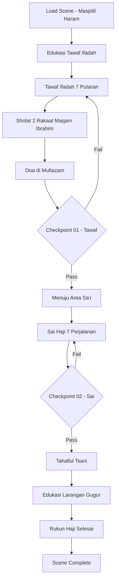

# 10_SCENE_09_TAWAF_IFADAH_SAI_HAJI.md
# ============================================
# VR EDUCATION HAJI & UMRAH
# SCENE 09 — TAWAF IFADAH & SA'I HAJI
# Version : 1.0
# ============================================

---

## Daftar Isi

- [Scene Information](#scene-information)
- [Learning Objective](#learning-objective)
- [Background](#background)
- [Environment](#environment)
- [Asset List](#asset-list)
- [Asset Source](#asset-source)
- [Character](#character)
- [Animation](#animation)
- [Audio](#audio)
- [Camera](#camera)
- [UI](#ui)
- [Interaction](#interaction)
- [Education](#education)
- [Activity Flow](#activity-flow)
- [Validation](#validation)
- [Performance](#performance)
- [Acceptance Criteria](#acceptance-criteria)

---

## Scene Information

| Atribut | Nilai |
|---------|-------|
| **Nomor Scene** | 09 |
| **Nama Scene** | Tawaf Ifadah & Sa'i Haji |
| **Versi** | 1.0 |
| **Deskripsi** | Scene ini mensimulasikan pelaksanaan Tawaf Ifadah (Rukun Haji) dan Sa'i Haji di Masjidil Haram setelah jamaah kembali dari Mina. Pengguna telah melalui Tahallul Awal dan sekarang memakai pakaian biasa/bebas. Setelah menyelesaikan Tawaf Ifadah 7 putaran dan Sa'i Haji 7 perjalanan, pengguna mencapai Tahallul Tsani yang menggugurkan seluruh larangan ihram. Scene ini merupakan rukun utama dalam ibadah Haji yang wajib dilaksanakan. |

---

## Learning Objective

Setelah menyelesaikan Scene 09, pengguna diharapkan mampu:

| No | Tujuan Pembelajaran | Target |
|----|---------------------|--------|
| 1 | Memahami pengertian Tawaf Ifadah dan perbedaannya dengan Tawaf Umrah | 90% benar pada checkpoint |
| 2 | Mampu melaksanakan Tawaf Ifadah 7 putaran dengan benar | 90% benar pada checkpoint |
| 3 | Mampu melaksanakan Sa'i Haji 7 perjalanan dengan benar | 90% benar pada checkpoint |
| 4 | Memahami status Tahallul Tsani dan seluruh larangan yang gugur | 90% benar pada checkpoint |
| 5 | Mengetahui perbedaan rukun Haji dan rukun Umrah | 90% benar pada checkpoint |

---

## Background

Tawaf Ifadah merupakan salah satu rukun Haji yang wajib dilaksanakan oleh setiap jamaah. Tawaf ini dilaksanakan setelah jamaah kembali dari Mina ke Mekkah, yaitu setelah melontar Jumrah Aqabah dan melaksanakan Tahallul Awal. Tawaf Ifadah disebut juga Tawaf Ziarah atau Tawaf Rukun.

Berbeda dengan Tawaf Umrah yang dilakukan dalam rangkaian ibadah Umrah, Tawaf Ifadah dilakukan dalam rangkaian ibadah Haji. Setelah melaksanakan Tawaf Ifadah, jamaah kemudian melaksanakan Sa'i Haji antara Bukit Shafa dan Marwah. Bagi jamaah yang telah melaksanakan Sa'i saat Umrah sebelumnya, beberapa ulama membolehkan tidak mengulang Sa'i, namun dalam simulasi ini pengguna akan melaksanakan Sa'i Haji secara lengkap.

Setelah menyelesaikan Tawaf Ifadah dan Sa'i Haji, jamaah mencapai Tahallul Tsani (tahallul kedua) yang menggugurkan seluruh larangan ihram, termasuk larangan berhubungan suami istri. Dengan demikian, jamaah telah menyelesaikan seluruh rukun Haji dan dapat beraktivitas seperti biasa.

Dalam scene ini, pengguna telah melewati Tahallul Awal sehingga memakai pakaian biasa/bebas. NPC jamaah lain juga terlihat memakai pakaian biasa, menandakan bahwa mereka telah melaksanakan Tahallul Awal.

---

## Environment

### Lokasi

| Area | Deskripsi | Dimensi |
|------|-----------|---------|
| **Area Mataf** | Area tawaf mengelilingi Ka'bah | 120m x 100m |
| **Ka'bah** | Bangunan Ka'bah dengan kiswah hitam | 15m x 12m x 15m |
| **Area Hajar Aswad** | Titik start/finish tawaf | 10m x 8m |
| **Area Maqam Ibrahim** | Tempat sholat 2 rakaat setelah tawaf | 15m x 12m |
| **Area Multazam** | Tempat mustajab berdoa | 8m x 5m |
| **Area Masa'a (Sa'i)** | Koridor antara Shafa dan Marwah | 400m x 15m |
| **Bukit Shafa** | Titik start Sa'i | 30m x 20m |
| **Bukit Marwah** | Titik finish Sa'i | 30m x 20m |
| **Lampu Hijau** | Penanda area lari kecil di jalur Sa'i | 2 titik |

### Waktu

| Aspek | Setting |
|-------|---------|
| Waktu | Siang hingga sore (pukul 10:00 - 16:00 waktu Arab) |
| Tanggal | 10-11 Dzulhijjah |
| Musim | Musim panas |

### Cuaca

| Elemen | Deskripsi |
|--------|-----------|
| Langit | Cerah dengan sedikit awan |
| Suhu | 38°C (panas) |
| Cahaya | Natural daylight |

### Lighting

| Sumber | Tipe | Intensity | Shadow |
|--------|------|-----------|--------|
| Matahari | DirectionalLight | 1.0 | Enabled |
| Langit | HemisphereLight | 0.5 | - |
| Pantulan Marmer | AmbientLight | 0.3 | - |
| Lampu Area | PointLight (x15) | 0.5 | Disabled |
| Lampu Sorot Ka'bah | SpotLight (x6) | 0.8 | Enabled |

### Atmosfer

| Efek | Implementasi |
|------|--------------|
| Skybox | Langit biru cerah |
| Ambient | Suasana Masjidil Haram, suara talbiyah dan doa |
| Particle | Debu halus |
| Fog | THREE.FogExp2 densitas 0.0005 |
| Heat Haze | Efek shimmer di area terbuka |

---

## Asset List

### Bangunan

| Asset | Deskripsi | LOD Levels |
|-------|-----------|------------|
| Area_Mataf | Area tawaf mengelilingi Ka'bah | LOD 0-3 |
| Ka'bah_Detail | Ka'bah dengan kiswah tekstur tinggi | LOD 0-3 |
| Hajar_Aswad | Batu hitam dengan bingkai perak | LOD 0-2 |
| Maqam_Ibrahim | Bangunan kaca berisi batu pijakan Nabi Ibrahim | LOD 0-2 |
| Hijr_Ismail | Area setengah lingkaran di utara Ka'bah | LOD 0-2 |
| Bukit_Shafa | Area berbukit start Sa'i | LOD 0-3 |
| Bukit_Marwah | Area berbukit finish Sa'i | LOD 0-3 |
| Koridor_Sai | Koridor lurus dengan AC | LOD 0-3 |

### Karakter

| Asset | Jumlah | Tipe |
|-------|--------|------|
| Player_Character | 1 | Main character (pakaian biasa/bebas) |
| Pembimbing_Mekkah | 1 | NPC interaktif |
| Ustadz_Haji | 1 | NPC interaktif (edukasi) |
| Petugas_Mataf | 4 | NPC pengatur tawaf |
| Imam_Doa | 1 | NPC memimpin doa |
| Jamaah_Laki_Biasa | 30 | NPC pakaian biasa (telah tahallul) |
| Jamaah_Perempuan_Biasa | 25 | NPC pakaian biasa |
| Jamaah_Tawaf | 20 | NPC sedang tawaf |
| Jamaah_Sai | 15 | NPC sedang sa'i |

### Ground

| Asset | Material | Tekstur |
|-------|----------|---------|
| Lantai_Mataf | Marmer putih halus | 4096x4096 PBR |
| Lantai_Koridor_Sai | Marmer putih | 4096x4096 PBR |
| Area_Sholat | Karpet area sholat | 2048x2048 PBR |
| Area_HajarAswad | Marmer khusus area start | 2048x2048 PBR |

### Props

| Asset | Jumlah | Interaktif |
|-------|--------|------------|
| Lampu_Hijau_Tawaf | 3 | Ya (penanda start/finish) |
| Lampu_Hijau_Sai | 4 | Ya (penanda lari) |
| Karpet_Sholat_Sunnah | 15 | Ya |
| Air_ZamZam | 5 | Ya |
| Payung | 10 | Ya |

### Dekorasi

| Asset | Jumlah | Keterangan |
|-------|--------|------------|
| Lampu_Gantung | 20 | Dekorasi masjid |
| Kaligrafi | 8 | Hiasan |
| Spanduk | 4 | Informasi |

---

## Asset Source

### Fab Marketplace

| Kategori | Nama Asset | Format | Texture | LOD | Ukuran |
|----------|-----------|--------|---------|-----|--------|
| Architecture | Grand Mosque Mataf | GLB | 4096x4096 | 3 level | 80MB |
| Architecture | Ka'bah Ultra HD | GLB | 4096x4096 | 3 level | 50MB |
| Architecture | Safa Marwa Corridor | GLB | 2048x2048 | 3 level | 50MB |
| Character | Pilgrims Normal Clothes | GLB | 2048x2048 | 2 level | 25MB |
| Props | Tawaf Guidance Set | GLB | 1024x1024 | 1 level | 8MB |
| Props | Sa'i Guidance Signs | GLB | 1024x1024 | 1 level | 5MB |

---

## Character

### Player

| Atribut | Spesifikasi |
|---------|-------------|
| Perspektif | First person (kamera sebagai mata player) |
| Pakaian | Pakaian biasa/bebas (telah Tahallul Awal) |
| Collision | Capsule collider (0.5m radius, 1.8m height) |
| Status | Tahallul Awal — larangan terbatas masih berlaku |

### NPC

| NPC | Posisi | Fungsi | Dialog |
|-----|--------|--------|--------|
| Pembimbing_Mekkah | Area Mataf | Memandu Tawaf Ifadah | 10 dialog |
| Ustadz_Haji | Area Edukasi | Menjelaskan perbedaan tawaf | 8 dialog |
| Petugas_Mataf1 | Mataf | Mengatur jalur | 3 dialog |
| Petugas_Mataf2 | Hajar Aswad | Membantu istilam | 3 dialog |
| Imam_Doa | Multazam | Memimpin doa | 5 dialog |
| Petugas_ZamZam | Area ZamZam | Membantu | 3 dialog |

### Jamaah

| Tipe | Jumlah | Aktivitas | Pakaian |
|------|--------|-----------|---------|
| Jamaah Tawaf | 20 | Sedang tawaf | Biasa/bebas |
| Jamaah Sai | 15 | Sedang sa'i | Biasa/bebas |
| Jamaah Sholat | 12 | Sholat di area | Biasa/bebas |
| Jamaah Doa | 10 | Berdoa | Biasa/bebas |
| Jamaah Istirahat | 8 | Istirahat | Biasa/bebas |

---

## Animation

| Animasi | Durasi | Loop | Trigger |
|---------|--------|------|---------|
| Idle | 3s | Yes | Default |
| Walk | 1.5s | Yes | Keyboard WASD |
| Walk Tawaf | 2s | Yes | Auto-wawaf |
| Istilam Hajar Aswad | 4s | No | Interaksi Hajar Aswad |
| Sholat 2 Rakaat | 8s | No | Sholat di Maqam Ibrahim |
| Sai Walk | 2s | Yes | Auto-sai |
| Run Sai | 1.2s | Yes | Lari di area hijau |
| Sujud Syukur | 4s | No | Tahallul Tsani |
| Doa | 3s | No | Berdoa |

---

## Audio

### Ambient

| Sumber | File | Volume | Loop |
|--------|------|--------|------|
| Suasana Masjidil Haram | ambient_haram_tawaf.mp3 | 0.4 | Yes |
| Suara Talbiyah | ambient_talbiyah_haji.mp3 | 0.4 | Yes |
| Suara Doa | ambient_doa_mataf.mp3 | 0.3 | Yes |

### Narration

| Momen | File | Durasi | Prioritas |
|-------|------|--------|-----------|
| Scene Start | nar_09_intro_tawaf_ifadah.mp3 | 85s | High |
| Pengertian Tawaf Ifadah | nar_09_pengertian_ifadah.mp3 | 75s | High |
| Perbedaan Tawaf Umrah | nar_09_perbedaan_tawaf.mp3 | 80s | High |
| Cara Tawaf Ifadah | nar_09_cara_tawaf_ifadah.mp3 | 70s | High |
| Sa'i Haji | nar_09_sai_haji.mp3 | 75s | High |
| Tahallul Tsani | nar_09_tahallul_tsani.mp3 | 65s | High |
| Rukun Haji Selesai | nar_09_rukun_selesai.mp3 | 90s | High |
| Checkpoint | nar_checkpoint_09.mp3 | 30s | High |

### Effect

| Efek | File | Volume |
|------|------|--------|
| Langkah Kaki | sfx_footstep_mataf.mp3 | 0.3 |
| Air ZamZam | sfx_zamzam_pour.mp3 | 0.5 |
| Counter Beep | sfx_counter_beep.mp3 | 0.4 |
| Transition | sfx_transition_ifadah.mp3 | 0.5 |

---

## Camera

### Spawn

| Parameter | Nilai |
|-----------|-------|
| Posisi Awal | x: 0, y: 1.7, z: -20 (tepi area mataf) |
| Look At | Arah Ka'bah |
| FOV | 60 derajat |
| Near | 0.1 |
| Far | 1500 |

### Movement

| Mode | Kontrol | Kecepatan |
|------|---------|-----------|
| Walk | W/A/S/D | 3 m/s |
| Tawaf Auto | Auto-walk | 2.5 m/s |
| Look | Mouse move | Sensitivitas 0.002 |
| Teleport | Klik titik biru | Instant |

### Transition

| Momen | Durasi | Easing |
|-------|--------|--------|
| Masuk scene | 2s | Cubic InOut |
| Tawaf ke Sa'i | 2s | Fade |
| Selesai Haji | 3s | Fade to white |

---

## UI

### Subtitle

| Atribut | Spesifikasi |
|---------|-------------|
| Posisi | Bawah tengah |
| Font | Arial, 20px |
| Warna | Putih dengan shadow |
| Background | Semi-transparan |
| Max Lines | 2 baris |

### Progress

| Elemen | Deskripsi |
|--------|-----------|
| Progress Bar | Horizontal bar (2 segmen besar) |
| Segmen | Tawaf Ifadah → Sa'i Haji |
| Sub-segmen | Putaran 1-7 → Perjalanan 1-7 |

### Tawaf Counter

| Elemen | Spesifikasi |
|--------|-------------|
| Posisi | Atas tengah |
| Angka | "Putaran 3/7" |
| Visual | 7 lingkaran terisi bertahap |

### Sai Counter

| Elemen | Spesifikasi |
|--------|-------------|
| Posisi | Atas tengah (setelah tawaf selesai) |
| Angka | "Perjalanan 3/7" |
| Visual | 7 lingkaran Shafa→Marwah |

### Notification

| Tipe | Durasi | Warna |
|------|--------|-------|
| Info | 3s | Biru |
| Success | 3s | Hijau |
| Tawaf Selesai | 5s | Emas |
| Sa'i Selesai | 5s | Emas |
| Tahallul Tsani | 7s | Emas dengan confetti |

---

## Interaction

### Click

| Objek | Aksi | Feedback |
|-------|------|----------|
| Hajar Aswad | Istilam | Animasi angkat tangan |
| Lampu Hijau | Mulai/akhir putaran | Counter +1 |
| Maqam Ibrahim | Sholat 2 rakaat | Animasi sholat |
| Multazam | Berdoa | Popup doa |
| Bukit Shafa | Mulai Sa'i | Counter mulai |
| Bukit Marwah | Checkpoint Sa'i | Counter +1 |
| Pembimbing | Dialog | UI dialog |

### Teleport

| Area | Titik Teleport |
|------|---------------|
| Start Tawaf | 1 titik |
| Maqam Ibrahim | 1 titik |
| Area ZamZam | 1 titik |
| Bukit Shafa | 1 titik |
| Bukit Marwah | 1 titik |

---

## Education

### Penjelasan

| Topik | Konten | Durasi |
|-------|--------|--------|
| Tawaf Ifadah | Tawaf rukun Haji, disebut juga Tawaf Ziarah | 75s |
| Perbedaan Tawaf | Tawaf Umrah (sunat) vs Tawaf Ifadah (rukun) | 80s |
| Niat Tawaf Ifadah | Lafadz niat khusus Tawaf Ifadah | 60s |
| Sa'i Haji | Sa'i dalam rangkaian Haji | 70s |
| Tahallul Tsani | Tahallul kedua, seluruh larangan gugur | 65s |
| Rukun Haji Lengkap | Ihram, Wukuf, Tawaf Ifadah, Sa'i | 90s |
| Haji Mabrur | Ciri-ciri dan keutamaan haji mabrur | 60s |

### Dalil

| Referensi | Ayat/Hadits | Konteks |
|-----------|-------------|---------|
| QS Al-Hajj: 29 | "...dan melakukan tawaf sekeliling Baitul Atiq" | Tawaf Ifadah |
| QS Al-Baqarah: 158 | "Sesungguhnya Shafa dan Marwah adalah sebahagian dari syiar Allah" | Sa'i |
| HR Bukhari & Muslim | "Barangsiapa yang mengerjakan haji karena Allah..." | Haji Mabrur |
| QS Ali Imran: 97 | "Dan di antara kewajiban manusia kepada Allah..." | Kewajiban Haji |

### Hikmah

| Hikmah | Penjelasan |
|--------|------------|
| Kesempurnaan | Tawaf Ifadah menyempurnakan rukun Haji |
| Kembali Fitri | Tahallul Tsani mengembalikan ke keadaan normal |
| Kebersamaan | Beribadah di momen puncak Haji |

### Larangan

| Larangan | Status Setelah Tahallul Tsani |
|----------|------------------------------|
| Berhubungan suami istri | ✅ Gugur |
| Akad nikah | ✅ Gugur |
| Memakai pakaian berjahit | ✅ Gugur (sudah sejak Tahallul Awal) |
| Wewangian | ✅ Gugur |
| Seluruh larangan ihram | ✅ Gugur total |

---

## Activity Flow

### Alur Scene

### Langkah Detail

| Langkah | Area | Aksi | Durasi |
|---------|------|------|--------|
| 1 | Mataf | Spawn, dengar narator intro | 85s |
| 2 | Mataf | Edukasi Tawaf Ifadah | 75s |
| 3 | Hajar Aswad | Niat dan mulai tawaf | 30s |
| 4-10 | Mataf | 7 putaran tawaf | 7 x 50s |
| 11 | Maqam Ibrahim | Sholat 2 rakaat | 30s |
| 12 | Multazam | Berdoa | 30s |
| 13 | Checkpoint | Checkpoint 01 | 30s |
| 14 | Shafa | Mulai Sa'i Haji | 20s |
| 15-21 | Koridor | 7 perjalanan Sa'i | 7 x 60s |
| 22 | Checkpoint | Checkpoint 02 | 30s |
| 23 | Edukasi | Tahallul Tsani | 65s |
| 24 | Complete | Scene selesai | 10s |

---

## Validation

### Berhasil

| Checkpoint | Kriteria | Reward |
|------------|----------|--------|
| CP-01 | 7 putaran + 3/4 pertanyaan benar | Scene 10 terbuka |
| CP-02 | 7 perjalanan + 4/5 pertanyaan benar | Tahallul Tsani tercapai |

### Checkpoint List

#### Checkpoint 01 — Tawaf Ifadah

| No | Pertanyaan | Jawaban Benar |
|----|-----------|---------------|
| 1 | Tawaf Ifadah disebut juga? | Tawaf Ziarah / Tawaf Rukun |
| 2 | Hukum Tawaf Ifadah? | Rukun Haji |
| 3 | Dilaksanakan setelah? | Kembali dari Mina |
| 4 | Perbedaan Tawaf Ifadah dan Umrah? | Tawaf Ifadah adalah rukun Haji |

#### Checkpoint 02 — Sa'i dan Tahallul Tsani

| No | Pertanyaan | Jawaban Benar |
|----|-----------|---------------|
| 1 | Sa'i Haji dilaksanakan? | Setelah Tawaf Ifadah |
| 2 | Tahallul Tsani menggugurkan? | Seluruh larangan ihram |
| 3 | Setelah Tahallul Tsani, apa yang boleh? | Berhubungan suami istri |
| 4 | Rukun Haji ada berapa? | 4 (Ihram, Wukuf, Tawaf, Sa'i) |

---

## Performance

| Aspek | Target | Metrik |
|-------|--------|--------|
| Frame Rate | 60 FPS | Average FPS |
| Scene Load | < 5 detik | Load time |
| Memory | < 350MB | Memory usage |
| Draw Calls | < 900 | Draw call count |
| Triangles | < 900.000 | Triangle count |

---

## Acceptance Criteria

| No | Kriteria | Status |
|----|----------|--------|
| 1 | Scene dapat dimuat dalam waktu < 5 detik | ☐ |
| 2 | Area Masjidil Haram (Ka'bah dan Masa'a) lengkap | ☐ |
| 3 | Tawaf Ifadah 7 putaran dapat dilakukan | ☐ |
| 4 | Sa'i Haji 7 perjalanan dapat dilakukan | ☐ |
| 5 | Status Tahallul Tsani tercapai setelah selesai | ☐ |
| 6 | NPC Jamaah memakai pakaian biasa/bebas | ☐ |
| 7 | Edukasi perbedaan Tawaf Umrah dan Ifadah | ☐ |
| 8 | Counter tawaf dan sa'i berfungsi | ☐ |
| 9 | Audio narasi lengkap di setiap tahap | ☐ |
| 10 | Checkpoint 01 dan 02 berfungsi | ☐ |
| 11 | Transisi ke scene berikutnya berjalan | ☐ |
| 12 | Frame rate stabil di 60 FPS | ☐ |

---

## Integrasi dengan Scene Lain

### Hubungan Scene

| Scene Sebelumnya | Scene Saat Ini | Scene Selanjutnya |
|-----------------|----------------|-------------------|
| Scene 08 — Mina Jumrah Aqabah | **Scene 09 — Tawaf Ifadah & Sa'i Haji** | Scene 10 — Mabit Mina Tiga Jumrah |

### Data yang Dilewatkan

| Data | Format |
|------|--------|
| Status Tahallul Tsani | Boolean |
| Skor Tawaf Ifadah | Integer |
| Skor Sa'i Haji | Integer |

---

> **Dokumen Terkait:**
> - [00_Project_Overview.md](./00_Project_Overview.md)
> - [09_Scene_08_Mina_Jumrah_Aqabah.md](./09_Scene_08_Mina_Jumrah_Aqabah.md)
> - [11_Scene_10_Mabit_Mina_Tiga_Jumrah.md](./11_Scene_10_Mabit_Mina_Tiga_Jumrah.md)

---
