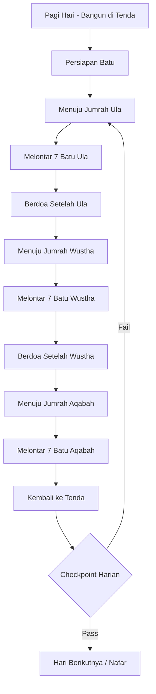

# 11_SCENE_10_MABIT_MINA_TIGA_JUMRAH.md
# ============================================
# VR EDUCATION HAJI & UMRAH
# SCENE 10 — MABIT MINA & TIGA JUMRAH
# Version : 1.0
# ============================================

---

## Daftar Isi

- [Scene Information](#scene-information)
- [Learning Objective](#learning-objective)
- [Background](#background)
- [Environment](#environment)
- [Asset List](#asset-list)
- [Asset Source](#asset-source)
- [Character](#character)
- [Animation](#animation)
- [Audio](#audio)
- [Camera](#camera)
- [UI](#ui)
- [Interaction](#interaction)
- [Education](#education)
- [Activity Flow](#activity-flow)
- [Validation](#validation)
- [Performance](#performance)
- [Acceptance Criteria](#acceptance-criteria)

---

## Scene Information

| Atribut | Nilai |
|---------|-------|
| **Nomor Scene** | 10 |
| **Nama Scene** | Mabit Mina & Tiga Jumrah |
| **Versi** | 1.0 |
| **Deskripsi** | Scene ini mensimulasikan aktivitas jamaah selama hari-hari Tasyrik (11, 12, 13 Dzulhijjah) di Mina. Pengguna akan melaksanakan Mabit (bermalam) di Mina dan melontar 3 Jumrah (Ula, Wustha, Aqabah) secara berurutan setiap hari. Scene ini mencakup edukasi tentang Nafar Awal (keluar hari ke-12) dan Nafar Tsani (keluar hari ke-13), urutan melontar, doa di antara lontaran, serta persiapan menuju Makkah setelah selesai. |

---

## Learning Objective

Setelah menyelesaikan Scene 10, pengguna diharapkan mampu:

| No | Tujuan Pembelajaran | Target |
|----|---------------------|--------|
| 1 | Memahami pengertian hari Tasyrik dan hukum Mabit di Mina | 85% benar pada checkpoint |
| 2 | Mengetahui urutan melontar 3 Jumrah (Ula, Wustha, Aqabah) | 85% benar pada checkpoint |
| 3 | Mampu melontar total 21 batu per hari di 3 Jumrah | 85% benar pada checkpoint |
| 4 | Memahami konsep Nafar Awal dan Nafar Tsani | 85% benar pada checkpoint |
| 5 | Mengetahui doa-doa yang dibaca saat melontar | 85% benar pada checkpoint |

---

## Background

Hari Tasyrik adalah tiga hari setelah Hari Raya Idul Adha, yaitu tanggal 11, 12, dan 13 Dzulhijjah. Hari-hari ini memiliki keistimewaan tersendiri dalam Islam. Rasulullah SAW bersabda bahwa hari Tasyrik adalah hari makan, minum, dan banyak berdzikir kepada Allah.

Selama hari Tasyrik, jamaah Haji melaksanakan Mabit (bermalam) di Mina dan melontar Jumrah setiap hari. Terdapat tiga Jumrah yang dilontar secara berurutan:

1. **Jumrah Ula (Kecil)** — Dilontar 7 batu, berdoa setelahnya
2. **Jumrah Wustha (Tengah)** — Dilontar 7 batu, berdoa setelahnya
3. **Jumrah Aqabah (Besar)** — Dilontar 7 batu, tidak berdoa setelahnya

Total batu yang diperlukan setiap hari adalah 21 butir (7 + 7 + 7).

Jamaah dapat memilih untuk keluar dari Mina lebih awal, yaitu pada tanggal 12 Dzulhijjah setelah melontar (Nafar Awal), atau tetap di Mina hingga tanggal 13 Dzulhijjah (Nafar Tsani). Nafar Tsani lebih utama karena memberikan kesempatan lebih banyak untuk beribadah.

---

## Environment

### Lokasi

| Area | Deskripsi | Dimensi |
|------|-----------|---------|
| **Area Perkemahan Mina** | Tenda-tenda tempat Mabit | 200m x 150m |
| **Jumrah Ula** | Tiang Jumrah pertama (paling dekat) | 30m x 25m |
| **Jumrah Wustha** | Tiang Jumrah kedua (tengah) | 30m x 25m |
| **Jumrah Aqabah** | Tiang Jumrah ketiga (paling jauh) | 30m x 25m |
| **Jalur Antara Jumrah** | Koridor penghubung 3 Jumrah | 200m x 15m |
| **Area Doa Setelah Ula** | Tempat berdoa setelah Jumrah Ula | 20m x 15m |
| **Area Doa Setelah Wustha** | Tempat berdoa setelah Jumrah Wustha | 20m x 15m |

### Waktu

| Aspek | Setting |
|-------|---------|
| Waktu | Pagi hingga sore (pukul 07:00 - 17:00) — loop 3 hari |
| Tanggal | 11, 12, 13 Dzulhijjah |
| Musim | Musim panas |

### Cuaca

| Elemen | Deskripsi |
|--------|-----------|
| Langit | Cerah terik |
| Suhu | 40-45°C (sangat panas) |
| Angin | Angin panas |

### Lighting

| Sumber | Tipe | Intensity | Shadow |
|--------|------|-----------|--------|
| Matahari | DirectionalLight | 1.2 | Enabled |
| Langit | HemisphereLight | 0.5 | - |
| Lampu Tenda | PointLight (x20) | 0.4 | Disabled |
| Lampu Jamarat | PointLight (x10) | 0.6 | Disabled |

---

## Asset List

### Bangunan

| Asset | Deskripsi | LOD Levels |
|-------|-----------|------------|
| Tenda_Mina | Tenda besar perkemahan Mina | LOD 0-2 |
| Jumrah_Ula | Tiang Jumrah pertama | LOD 0-2 |
| Jumrah_Wustha | Tiang Jumrah kedua | LOD 0-2 |
| Jumrah_Aqabah | Tiang Jumrah ketiga | LOD 0-2 |
| Jembatan_Jamarat | Jembatan penghubung | LOD 0-3 |
| Area_Doa | Area khusus berdoa | LOD 0-1 |

### Karakter

| Asset | Jumlah | Tipe |
|-------|--------|------|
| Player_Character | 1 | Main character (pakaian biasa) |
| Pembimbing_Mina | 1 | NPC interaktif |
| Ustadz_Tasyrik | 1 | NPC interaktif (edukasi) |
| Petugas_Jamarat | 4 | NPC interaktif |
| Jamaah_Laki | 30 | NPC background |
| Jamaah_Perempuan | 25 | NPC background |

### Props

| Asset | Jumlah | Interaktif |
|-------|--------|------------|
| Batu_Kerikil | 300 (inventori) | Ya |
| Tiang_Jumrah | 3 | Ya (target) |
| Karpet_Sholat | 10 | Ya |
| Air_Minum | 10 | Ya |
| Tas_Batu | 1 | Ya |

---

## Asset Source

### Fab Marketplace

| Kategori | Nama Asset | Format | Texture | LOD | Ukuran |
|----------|-----------|--------|---------|-----|--------|
| Architecture | Mina Tent City | GLB | 2048x2048 | 3 level | 35MB |
| Architecture | 3 Jamarat Pillars | GLB | 2048x2048 | 2 level | 25MB |
| Architecture | Jamarat Bridge | GLB | 4096x4096 | 3 level | 45MB |
| Character | Pilgrims Tasyrik | GLB | 2048x2048 | 2 level | 22MB |
| Props | Stone Throwing Set | GLB | 1024x1024 | 1 level | 4MB |

---

## Character

### Player

| Atribut | Spesifikasi |
|---------|-------------|
| Perspektif | First person |
| Pakaian | Pakaian biasa (telah Tahallul Tsani) |
| Collision | Capsule collider |

### NPC

| NPC | Posisi | Fungsi |
|-----|--------|--------|
| Pembimbing_Mina | Area tenda | Memandu Mabit dan melontar |
| Ustadz_Tasyrik | Area edukasi | Menjelaskan Nafar |
| Petugas1 | Jumrah Ula | Mengatur jalur |
| Petugas2 | Jumrah Wustha | Mengatur jalur |
| Petugas3 | Jumrah Aqabah | Mengatur jalur |
| Petugas4 | Area tenda | Mengatur Mabit |

---

## Animation

| Animasi | Durasi | Loop | Trigger |
|---------|--------|------|---------|
| Idle | 3s | Yes | Default |
| Walk | 1.5s | Yes | WASD |
| Melontar Batu | 2.5s | No | Interaksi tiang |
| Doa Angkat Tangan | 3s | No | Setelah lontar |
| Duduk Istirahat | 5s | Yes | Di tenda |
| Minum | 3s | No | Minum |

---

## Audio

### Ambient

| Sumber | File | Volume | Loop |
|--------|------|--------|------|
| Suasana Mina | ambient_mina_siang.mp3 | 0.4 | Yes |
| Suara Takbir | ambient_takbir_tasyrik.mp3 | 0.5 | Yes |
| Suara Doa | ambient_doa_tasyrik.mp3 | 0.3 | Yes |

### Narration

| Momen | File | Durasi | Prioritas |
|-------|------|--------|-----------|
| Scene Start | nar_10_intro_tasyrik.mp3 | 80s | High |
| Hari Tasyrik | nar_10_hari_tasyrik.mp3 | 75s | High |
| Tata Cara 3 Jumrah | nar_10_tata_cara_3.mp3 | 85s | High |
| Urutan Melontar | nar_10_urutan_melontar.mp3 | 60s | High |
| Doa Setelah Ula | nar_10_doa_setelah_ula.mp3 | 55s | High |
| Doa Setelah Wustha | nar_10_doa_setelah_wustha.mp3 | 55s | High |
| Nafar Awal | nar_10_nafar_awal.mp3 | 70s | High |
| Nafar Tsani | nar_10_nafar_tsani.mp3 | 65s | High |
| Persiapan Makkah | nar_10_persiapan_makkah.mp3 | 50s | High |

### Effect

| Efek | File | Volume |
|------|------|--------|
| Batu Dilempar | sfx_stone_throw.mp3 | 0.5 |
| Batu Kena Tiang | sfx_stone_hit.mp3 | 0.6 |
| Transition | sfx_transition_tasyrik.mp3 | 0.5 |

---

## Camera

### Spawn

| Parameter | Nilai |
|-----------|-------|
| Posisi Awal | x: 0, y: 1.7, z: 0 (area tenda Mina) |
| Look At | Arah tenda |
| FOV | 60 derajat |
| Far | 1000 |

### Movement

| Mode | Kontrol | Kecepatan |
|------|---------|-----------|
| Walk | W/A/S/D | 3.5 m/s |
| Look | Mouse move | Sensitivitas 0.002 |
| Teleport | Klik titik biru | Instant |

### Transition

| Momen | Durasi | Easing |
|-------|--------|--------|
| Masuk scene | 2s | Cubic InOut |
| Antar Jumrah | 1.5s | Quad InOut |
| Ganti hari | 3s | Fade |
| End scene | 2s | Fade |

---

## UI

### Subtitle

| Atribut | Spesifikasi |
|---------|-------------|
| Posisi | Bawah tengah |
| Font | Arial, 20px |
| Max Lines | 2 baris |
| Arabic Support | Ya |

### Progress

| Elemen | Deskripsi |
|--------|-----------|
| Progress Bar | Horizontal (hari + jumrah) |
| Hari | Hari 1/3 (11 Zulhijjah) |
| Jumrah | Jumrah 1/3 (Ula) |

### Jumrah Counter

| Elemen | Spesifikasi |
|--------|-------------|
| Posisi | Atas tengah |
| Angka | "Lontaran 5/7 — Jumrah Ula" |
| Visual | 7 lingkaran per Jumrah |

### Hari Indicator

| Elemen | Spesifikasi |
|--------|-------------|
| Posisi | Atas kiri |
| Teks | "Hari Tasyrik ke-1 (11 Dzulhijjah)" |

---

## Interaction

### Click

| Objek | Aksi |
|-------|------|
| Tiang Jumrah Ula | Melontar 7 batu, berdoa |
| Tiang Jumrah Wustha | Melontar 7 batu, berdoa |
| Tiang Jumrah Aqabah | Melontar 7 batu, tidak berdoa |
| Pembimbing | Dialog panduan |
| Ustadz | Dialog edukasi Nafar |
| Tenda | Masuk/istirahat |

### Teleport

| Area | Titik Teleport |
|------|---------------|
| Tenda Mabit | 1 titik |
| Jumrah Ula | 1 titik |
| Jumrah Wustha | 1 titik |
| Jumrah Aqabah | 1 titik |
| Area Doa | 1 titik |

---

## Education

### Penjelasan

| Topik | Konten | Durasi |
|-------|--------|--------|
| Hari Tasyrik | 11, 12, 13 Dzulhijjah, hari makan dan dzikir | 75s |
| Mabit di Mina | Hukum Mabit pada hari Tasyrik | 65s |
| Urutan Melontar | Ula → Wustha → Aqabah | 60s |
| 3 Jumrah | Makna dan sejarah masing-masing | 80s |
| Doa Setelah Ula | Doa khusus setelah melontar Jumrah Ula | 55s |
| Doa Setelah Wustha | Doa khusus setelah melontar Jumrah Wustha | 55s |
| Nafar Awal | Keluar Mina pada 12 Dzulhijjah setelah lontar | 70s |
| Nafar Tsani | Keluar Mina pada 13 Dzulhijjah setelah lontar | 65s |
| Keutamaan Nafar Tsani | Lebih utama karena lebih lama beribadah | 50s |

### Dalil

| Referensi | Ayat/Hadits | Konteks |
|-----------|-------------|---------|
| HR Muslim | "Hari Tasyrik adalah hari makan, minum, dan dzikir kepada Allah" | Keutamaan hari Tasyrik |
| QS Al-Baqarah: 203 | "Dan berdzikirlah kepada Allah pada beberapa hari yang berjumlah terbatas..." | Hari Tasyrik |
| HR Bukhari | "Rasulullah SAW melontar Jumrah dengan 7 batu, bertakbir setiap lontaran" | Tata cara melontar |
| QS Al-Baqarah: 203 | "Barangsiapa ingin cepat (selesai) dalam 2 hari, tidak ada dosa baginya" | Nafar Awal |

### Hikmah

| Hikmah | Penjelasan |
|--------|------------|
| Konsistensi | Melontar setiap hari melatih konsistensi ibadah |
| Kesabaran | Menghadapi panas dan keramaian |
| Perlawanan | Terus melawan godaan setan setiap hari |
| Pilihan | Nafar mengajarkan fleksibilitas dalam ibadah |

### Nafar Awal vs Nafar Tsani

| Aspek | Nafar Awal | Nafar Tsani |
|-------|-----------|-------------|
| Waktu Keluar | 12 Dzulhijjah setelah lontar | 13 Dzulhijjah setelah lontar |
| Jumlah Lontaran | 3 Jumrah x 7 batu = 21 batu | 3 Jumrah x 7 batu = 21 batu |
| Hukum | Boleh | Lebih utama |
| Waktu di Mina | 2 malam (10-11 malam) | 3 malam (10-11-12 malam) |

---

## Activity Flow

### Alur Scene (Per Hari)

### Langkah Detail

| Langkah | Hari | Aksi | Durasi |
|---------|------|------|--------|
| 1 | 11 | Bangun di tenda, dengar narator | 60s |
| 2 | 11 | Edukasi hari Tasyrik | 75s |
| 3 | 11 | Melontar Ula 7x | 90s |
| 4 | 11 | Doa setelah Ula | 30s |
| 5 | 11 | Melontar Wustha 7x | 90s |
| 6 | 11 | Doa setelah Wustha | 30s |
| 7 | 11 | Melontar Aqabah 7x (tanpa doa) | 90s |
| 8 | 11 | Checkpoint hari ke-1 | 30s |
| 9 | 11-12 | Mabit di Mina (malam) | 60s (simulasi) |
| 10 | 12 | Ulang melontar 3 Jumrah (siklus) | 210s |
| 11 | 12 | Checkpoint hari ke-2 | 30s |
| 12 | 12-13 | Mabit / Nafar Awal | 45s |
| 13 | 13 | Opsional: melontar + Nafar Tsani | 210s |
| 14 | Selesai | Persiapan kembali ke Makkah | 45s |
| 15 | Complete | Scene selesai | 5s |

---

## Validation

### Berhasil

| Checkpoint | Kriteria | Reward |
|------------|----------|--------|
| CP-01 (Hari 11) | Melontar 21 batu + 3/4 pertanyaan benar | Lanjut hari ke-12 |
| CP-02 (Hari 12) | Melontar 21 batu + 3/4 pertanyaan benar | Nafar Awal/Nafar Tsani |
| CP-03 (Nafar) | Memilih Nafar dan menjawab benar | Scene 11 terbuka |

### Checkpoint List

#### Checkpoint — Hari Tasyrik

| No | Pertanyaan | Jawaban Benar | Opsi |
|----|-----------|---------------|------|
| 1 | Hari Tasyrik tanggal berapa? | 11, 12, 13 Dzulhijjah | 4 opsi |
| 2 | Urutan melontar 3 Jumrah? | Ula → Wustha → Aqabah | 4 opsi |
| 3 | Total batu per hari? | 21 butir | 4 opsi |
| 4 | Apakah berdoa setelah Jumrah Aqabah? | Tidak | 4 opsi |
| 5 | Nafar Awal keluar pada? | 12 Dzulhijjah | 4 opsi |

---

## Performance

| Aspek | Target | Metrik |
|-------|--------|--------|
| Frame Rate | 60 FPS | Average FPS |
| Scene Load | < 5 detik | Load time |
| Memory | < 350MB | Memory usage |
| Draw Calls | < 800 | Draw call count |
| Triangles | < 800.000 | Triangle count |

---

## Acceptance Criteria

| No | Kriteria | Status |
|----|----------|--------|
| 1 | Scene dapat dimuat dalam waktu < 5 detik | ☐ |
| 2 | Area perkemahan Mina dirender dengan detail | ☐ |
| 3 | Area Jamarat Lengkap (Ula, Wustha, Aqabah) tersedia | ☐ |
| 4 | Hari Tasyrik (11, 12, 13) disimulasikan dengan benar | ☐ |
| 5 | Aktivitas Mabit di Mina berfungsi | ☐ |
| 6 | Melontar 3 Jumrah secara berurutan berfungsi | ☐ |
| 7 | NPC Pembimbing dan jamaah beraktivitas | ☐ |
| 8 | Edukasi Nafar Awal dan Nafar Tsani ditampilkan | ☐ |
| 9 | Urutan melontar (Ula → Wustha → Aqabah) dipandu | ☐ |
| 10 | Doa di antara lontaran Jumrah Ula dan Wustha | ☐ |
| 11 | Counter lontaran berfungsi (total 21 per hari) | ☐ |
| 12 | Audio narasi dan ambient berjalan | ☐ |
| 13 | Checkpoint harian berfungsi | ☐ |
| 14 | Frame rate stabil di 60 FPS | ☐ |

---

## Integrasi dengan Scene Lain

### Hubungan Scene

| Scene Sebelumnya | Scene Saat Ini | Scene Selanjutnya |
|-----------------|----------------|-------------------|
| Scene 09 — Tawaf Ifadah & Sa'i Haji | **Scene 10 — Mabit Mina Tiga Jumrah** | Scene 11 — Tawaf Wada' |

### Data yang Dilewatkan

| Data | Format |
|------|--------|
| Pilihan Nafar (Awal/Tsani) | String |
| Skor Akumulasi Harian | Integer |

---

> **Dokumen Terkait:**
> - [00_Project_Overview.md](./00_Project_Overview.md)
> - [10_Scene_09_Tawaf_Ifadah_Sai_Haji.md](./10_Scene_09_Tawaf_Ifadah_Sai_Haji.md)
> - [12_Scene_11_Tawaf_Wada.md](./12_Scene_11_Tawaf_Wada.md)

---
