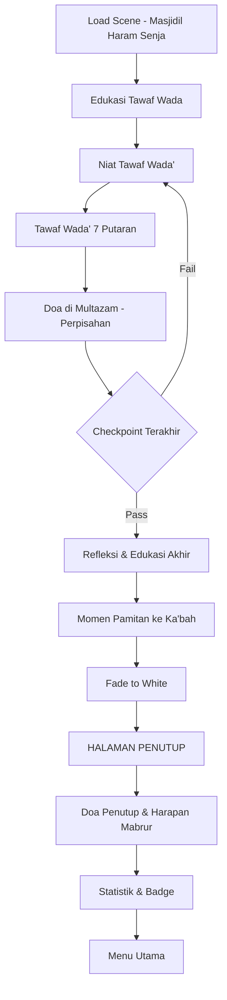

# 12_SCENE_11_TAWAF_WADA.md
# ============================================
# VR EDUCATION HAJI & UMRAH
# SCENE 11 — TAWAF WADA'
# Version : 1.0
# ============================================

---

## Daftar Isi

- [Scene Information](#scene-information)
- [Learning Objective](#learning-objective)
- [Background](#background)
- [Environment](#environment)
- [Asset List](#asset-list)
- [Asset Source](#asset-source)
- [Character](#character)
- [Animation](#animation)
- [Audio](#audio)
- [Camera](#camera)
- [UI](#ui)
- [Interaction](#interaction)
- [Education](#education)
- [Activity Flow](#activity-flow)
- [Validation](#validation)
- [Performance](#performance)
- [Acceptance Criteria](#acceptance-criteria)

---

## Scene Information

| Atribut | Nilai |
|---------|-------|
| **Nomor Scene** | 11 |
| **Nama Scene** | Tawaf Wada' |
| **Versi** | 1.0 |
| **Deskripsi** | Scene ini merupakan scene penutup dari seluruh rangkaian simulasi ibadah Haji. Pengguna akan melaksanakan Tawaf Wada' (Tawaf Perpisahan) di area Mataf Masjidil Haram sebanyak 7 putaran. Scene ini penuh dengan nuansa emosional dan spiritual karena merupakan perpisahan dengan Baitullah. Setelah menyelesaikan Tawaf Wada', pengguna akan dihadapkan pada halaman penutup yang menyentuh: "Selamat, Anda telah menyelesaikan simulasi ibadah haji." — disertai doa perpisahan dan harapan menjadi haji yang mabrur. |

---

## Learning Objective

Setelah menyelesaikan Scene 11, pengguna diharapkan mampu:

| No | Tujuan Pembelajaran | Target |
|----|---------------------|--------|
| 1 | Memahami pengertian dan hukum Tawaf Wada' | 90% benar pada checkpoint |
| 2 | Mengetahui tata cara Tawaf Wada' dan larangan setelahnya | 90% benar pada checkpoint |
| 3 | Mampu melaksanakan Tawaf Wada' 7 putaran dengan khusyuk | 90% benar pada checkpoint |
| 4 | Memahami doa perpisahan dan harapan haji mabrur | 90% benar pada checkpoint |
| 5 | Menginternalisasi makna spiritual dari keseluruhan ibadah Haji | Refleksi pribadi |

---

## Background

Tawaf Wada' atau Tawaf Perpisahan adalah tawaf yang dilakukan oleh jamaah Haji ketika akan meninggalkan Mekkah. Tawaf ini merupakan wajib Haji bagi siapa pun yang akan meninggalkan kota suci Mekkah. Hukumnya adalah wajib bagi jamaah yang tidak tinggal di Mekkah.

Tawaf Wada' dilakukan dengan 7 putaran mengelilingi Ka'bah, sama seperti tawaf lainnya. Namun, yang membedakan adalah nuansa perpisahan yang menyertainya. Jamaah dilarang untuk menetap di Mekkah setelah melaksanakan Tawaf Wada', dan dianjurkan untuk segera meninggalkan kota suci.

Setelah menyelesaikan Tawaf Wada', seluruh rangkaian ibadah Haji telah selesai dilaksanakan. Jamaah telah menyempurnakan rukun, wajib, dan sunnah Haji. Scene ini menjadi penutup yang emosional karena pengguna harus berpamitan dengan Ka'bah dan Masjidil Haram.

Dalam scene penutup, pengguna akan melihat halaman "Selamat, Anda telah menyelesaikan simulasi ibadah haji" yang diiringi dengan doa perpisahan, harapan menjadi haji mabrur, serta ucapan terima kasih kepada pengguna yang telah mengikuti seluruh rangkaian simulasi.

---

## Environment

### Lokasi

| Area | Deskripsi | Dimensi |
|------|-----------|---------|
| **Area Mataf** | Area tawaf mengelilingi Ka'bah | 120m x 100m |
| **Ka'bah** | Bangunan Ka'bah dengan kiswah hitam | 15m x 12m x 15m |
| **Area Hajar Aswad** | Titik start/finish tawaf | 10m x 8m |
| **Area Multazam** | Tempat mustajab berdoa terakhir | 8m x 5m |
| **Area Perpisahan** | Area khusus untuk momen perpisahan | 20m x 15m |
| **Halaman Penutup** | Layar penutup dengan doa dan statistik | Full screen |

### Waktu

| Aspek | Setting |
|-------|---------|
| Waktu | Menjelang malam (pukul 17:00 - 19:00 waktu Arab) — golden hour |
| Tanggal | 13-14 Dzulhijjah |
| Musim | Musim panas |

### Cuaca

| Elemen | Deskripsi |
|--------|-----------|
| Langit | Senja jingga keemasan — sangat indah |
| Suhu | 35°C (menurun menjelang malam) |
| Cahaya | Golden hour — sinar matahari keemasan |

### Lighting

| Sumber | Tipe | Intensity | Shadow |
|--------|------|-----------|--------|
| Matahari Senja | DirectionalLight (rendah, warm) | 0.8 | Enabled |
| Langit Senja | HemisphereLight | 0.6 | - |
| Warm Ambient | AmbientLight (orange) | 0.4 | - |
| Lampu Masjid | PointLight (x20) | 0.7 | Disabled |
| Sorot Ka'bah | SpotLight (x6) | 0.9 | Enabled |

### Atmosfer

| Efek | Implementasi |
|------|--------------|
| Skybox | Senja gradien jingga, ungu, biru |
| Ambient | Suasana Masjidil Haram sore hari, suara doa menusuk hati |
| Particle | Partikel cahaya keemasan |
| Fog | THREE.FogExp2 densitas 0.0005 |
| Lens Flare | Efek lensa dari sinar senja |
| Vignette | Pinggiran gelap untuk fokus ke Ka'bah |
| Warm Tone | Tone mapping hangat untuk suasana haru |

---

## Asset List

### Bangunan

| Asset | Deskripsi | LOD Levels |
|-------|-----------|------------|
| Area_Mataf | Area tawaf lengkap | LOD 0-3 |
| Ka'bah_Senja | Ka'bah dengan pencahayaan senja | LOD 0-3 |
| Menara_Masjid | Menara dengan lampu senja | LOD 0-3 |
| Area_Perpisahan | Area khusus dengan dekorasi | LOD 0-2 |

### Karakter

| Asset | Jumlah | Tipe |
|-------|--------|------|
| Player_Character | 1 | Main character (pakaian biasa) |
| Pembimbing_Akhir | 1 | NPC interaktif (perpisahan) |
| Petugas_Mataf | 2 | NPC pengatur |
| Jamaah_Wada | 20 | NPC tawaf perpisahan |
| Jamaah_Doa | 10 | NPC berdoa |

### Props

| Asset | Jumlah | Interaktif |
|-------|--------|------------|
| Karpet_Sholat | 10 | Ya |
| Air_ZamZam | 3 | Ya |
| Lampu_Lilin | 20 | Dekorasi suasana senja |
| Buku_Doa | 5 | Ya |
| Tempat_Air_Mata | 3 | Simbolis |

### Dekorasi

| Asset | Jumlah | Keterangan |
|-------|--------|------------|
| Lampu_Gantung | 20 | Dekorasi senja |
| Spanduk_Perpisahan | 3 | "Sampai Jumpa Baitullah" |
| Dekorasi_Nur | 5 | Cahaya lembut |

---

## Asset Source

### Fab Marketplace

| Kategori | Nama Asset | Format | Texture | LOD | Ukuran |
|----------|-----------|--------|---------|-----|--------|
| Architecture | Grand Mosque Sunset | GLB | 4096x4096 | 3 level | 80MB |
| Architecture | Ka'bah Golden Hour | GLB | 4096x4096 | 3 level | 50MB |
| Character | Pilgrims Farewell | GLB | 2048x2048 | 2 level | 20MB |
| Props | Evening Mosque Props | GLB | 1024x1024 | 1 level | 8MB |
| Environment | Mecca Sunset Skybox | CubeTexture | 4096x4096 | - | 25MB |

---

## Character

### Player

| Atribut | Spesifikasi |
|---------|-------------|
| Perspektif | First person |
| Pakaian | Pakaian biasa/bebas |
| Emosi | Mode emosional — efek visual haru |

### NPC

| NPC | Posisi | Fungsi | Dialog |
|-----|--------|--------|--------|
| Pembimbing_Akhir | Area Perpisahan | Memandu Tawaf Wada' dan doa | 8 dialog (emosional) |
| Imam_Doa | Multazam | Memimpin doa perpisahan | 5 dialog |
| Petugas1 | Mataf | Mengatur jalur | 2 dialog |
| Petugas2 | Pintu Keluar | Mengarahkan | 2 dialog |

### Jamaah

| Tipe | Jumlah | Aktivitas |
|------|--------|-----------|
| Jamaah Tawaf Wada | 15 | Tawaf perpisahan |
| Jamaah Menangis | 8 | Menangis haru |
| Jamaah Doa | 10 | Berdoa khusyuk |
| Jamaah Foto | 5 | Foto perpisahan (dari jauh) |

---

## Animation

| Animasi | Durasi | Loop | Trigger |
|---------|--------|------|---------|
| Idle | 3s | Yes | Default |
| Walk Khusyuk | 2.5s | Yes | Berjalan pelan |
| Walk Tawaf | 2s | Yes | Auto-wawaf |
| Istilam | 4s | No | Hajar Aswad |
| Angkat Tangan Doa | 3s | No | Berdoa |
| Sujud Syukur | 5s | No | Syukur selesai haji |
| Menangis | 4s | No | Momen haru |
| Melambai | 3s | No | Pamitan ke Ka'bah |
| Menatap Ka'bah | 6s | Yes | Menatap lama |
| Sholat Sunnah | 6s | No | Sholat |

---

## Audio

### Ambient

| Sumber | File | Volume | Loop |
|--------|------|--------|------|
| Suasana Sore | ambient_sore_haram.mp3 | 0.3 | Yes |
| Suara Adzan Maghrib | adzan_maghrib_haram.mp3 | 0.6 | No (triggered) |
| Suara Doa Haru | ambient_doa_haru.mp3 | 0.3 | Yes |
| Suara Tangis | ambient_tangis_haru.mp3 | 0.2 | Yes |

### Narration

| Momen | File | Durasi | Prioritas |
|-------|------|--------|-----------|
| Scene Start | nar_11_intro_wada.mp3 | 90s | High |
| Pengertian Tawaf Wada | nar_11_pengertian_wada.mp3 | 70s | High |
| Hukum Tawaf Wada | nar_11_hukum_wada.mp3 | 65s | High |
| Cara Tawaf Wada | nar_11_cara_wada.mp3 | 60s | High |
| Doa Perpisahan | nar_11_doa_perpisahan.mp3 | 80s | High |
| Refleksi Haji | nar_11_refleksi_haji.mp3 | 120s | High |
| Harapan Mabrur | nar_11_harapan_mabrur.mp3 | 75s | High |
| Doa Penutup | nar_11_doa_penutup.mp3 | 90s | High |
| Checkpoint Akhir | nar_checkpoint_11.mp3 | 25s | High |

### Effect

| Efek | File | Volume |
|------|------|--------|
| Langkah Sepi | sfx_footstep_sepi.mp3 | 0.2 |
| Adzan Bergema | sfx_adzan_sore.mp3 | 0.6 |
| Suara Tangis | sfx_tangis_haru.mp3 | 0.3 |
| Suara Angin Sore | sfx_wind_evening.mp3 | 0.2 |
| Transition | sfx_transition_wada.mp3 | 0.5 |

### Voice Over

| Karakter | File | Durasi |
|----------|------|--------|
| Pembimbing Akhir | vo_wada_pembimbing_01-08.mp3 | 12s each |
| Imam Doa | vo_wada_imam_01-05.mp3 | 15s each |

---

## Camera

### Spawn

| Parameter | Nilai |
|-----------|-------|
| Posisi Awal | x: 0, y: 1.7, z: -15 (tepi mataf) |
| Look At | Arah Ka'bah dengan cahaya senja |
| FOV | 65 derajat |
| Near | 0.1 |
| Far | 1500 |

### Movement

| Mode | Kontrol | Kecepatan |
|------|---------|-----------|
| Walk | W/A/S/D | 2.5 m/s (lebih lambat, khusyuk) |
| Look | Mouse move | Sensitivitas 0.002 |
| Teleport | Klik titik biru | Instant |
| Slow Walk | Shift + W | 1 m/s (sangat pelan) |

### Transition

| Momen | Durasi | Easing |
|-------|--------|--------|
| Masuk scene | 3s | Cubic InOut (slow fade in) |
| Mulai tawaf | 2s | Smooth Sine |
| Selesai tawaf | 2s | Ease In |
| Doa perpisahan | 3s | Fade to warm |
| Halaman penutup | 4s | Fade to white (slow) |

### Special Camera — Farewell View

| Parameter | Nilai |
|-----------|-------|
| Mode | Cinematic — slow pan |
| Saat doa | Zoom in ke Ka'bah |
| Akhir tawaf | Slow motion — melihat Ka'bah dari jauh |
| Durasi | 10 detik momen akhir |

---

## UI

### Subtitle

| Atribut | Spesifikasi |
|---------|-------------|
| Posisi | Bawah tengah |
| Font | Arial, 22px (lebih besar) |
| Warna | Putih dengan shadow emas |
| Background | Semi-transparan (rgba 0,0,0,0.5) |
| Max Lines | 2 baris |
| Style | Warm gold accent untuk kesan haru |

### Progress

| Elemen | Deskripsi |
|--------|-----------|
| Progress Bar | Lingkaran (bukan bar) — melambangkan kesempurnaan |
| Segmen | 7 lingkaran untuk 7 putaran |
| Complete | Semua terisi emas saat selesai |

### Tawaf Counter

| Elemen | Spesifikasi |
|--------|-------------|
| Posisi | Atas tengah (style minimalis) |
| Angka | "Putaran 5/7" |
| Style | Emas lembut, tidak mencolok |

### Halaman Penutup

| Elemen | Konten |
|--------|--------|
| Judul | "🏛️ SELAMAT! 🏛️" |
| Subjudul | "Anda telah menyelesaikan simulasi ibadah haji" |
| Quote | "Dan sempurnakanlah ibadah haji dan umrah karena Allah" (QS Al-Baqarah: 196) |
| Doa | "Ya Allah, terimalah ibadah haji kami, jadikanlah kami haji yang mabrur" |
| Statistik | Total scene, skor, badge terkumpul |
| Tombol | "Ulang Simulasi" / "Kembali ke Menu Utama" |
| Background | Gradien emas dengan siluet Ka'bah |
| Musik | Audio narasi penutup yang menyentuh |

### Notification

| Tipe | Durasi | Warna |
|------|--------|-------|
| Info | 3s | Biru |
| Putaran Selesai | 3s | Emas |
| Tawaf Selesai | 5s | Emas terang |
| Haji Selesai | 10s | Emas dengan confetti |

### Mini Map

| Atribut | Spesifikasi |
|---------|-------------|
| Ukuran | 180x180px (lebih kecil, tidak mengganggu) |
| Style | Minimalis, warm tone |

### Popup

| Tipe | Konten | Aksi |
|------|--------|------|
| Doa | Teks doa arab + latin + arti perpisahan | Baca & tutup |
| Edukasi | Refleksi akhir haji | Next |
| Halaman Penutup | Selamat + statistik + doa | Menu utama |

---

## Interaction

### Click

| Objek | Aksi | Feedback |
|-------|------|----------|
| Hajar Aswad | Istilam terakhir | Animasi angkat tangan (slow) |
| Lampu Hijau | Mulai/akhir putaran | Counter +1 |
| Multazam | Doa perpisahan | Popup doa khusus |
| Pembimbing | Dialog perpisahan | UI dialog emosional |
| Ka'bah | Tatapan terakhir | Animasi menatap + narasi |
| Air ZamZam | Minum terakhir | Animasi minum |

### Teleport

| Area | Titik Teleport |
|------|---------------|
| Start Tawaf | 1 titik |
| Multazam | 1 titik |
| Area Perpisahan | 1 titik |

---

## Education

### Penjelasan

| Topik | Konten | Durasi |
|-------|--------|--------|
| Pengertian Tawaf Wada' | Tawaf perpisahan sebelum meninggalkan Mekkah | 70s |
| Hukum Tawaf Wada' | Wajib Haji bagi yang akan meninggalkan Mekkah | 65s |
| Larangan Setelah Wada' | Tidak boleh menetap di Mekkah, harus segera pergi | 60s |
| Doa Perpisahan | Doa khusus saat pamitan dengan Baitullah | 75s |
| Refleksi Haji | Makna dan hikmah dari seluruh rangkaian haji | 120s |
| Haji Mabrur | Ciri-ciri haji mabrur dan tandanya | 80s |
| Doa Mabrur | Harapan agar diterima Allah | 50s |

### Dalil

| Referensi | Ayat/Hadits | Konteks |
|-----------|-------------|---------|
| QS Al-Baqarah: 196 | "Dan sempurnakanlah ibadah haji dan umrah karena Allah" | Kesempurnaan Haji |
| HR Bukhari | "Akhir perjalanan haji adalah tawaf di Baitullah" | Tawaf Wada' |
| HR Muslim | "Haji mabrur tidak ada balasan kecuali surga" | Keutamaan Haji Mabrur |
| QS Al-Hajj: 27 | "Dan berserulah kepada manusia untuk mengerjakan haji" | Panggilan Haji |

### Hikmah

| Hikmah | Penjelasan |
|--------|------------|
| Perpisahan | Mengajarkan arti kerinduan pada Baitullah |
| Kesempurnaan | Haji mengajarkan kepatuhan total |
| Kembali Fitri | Seperti bayi yang baru lahir |
| Doa Mabrur | Harapan untuk menjadi lebih baik |
| Perjuangan | Perjalanan panjang yang penuh makna |
| Persaudaraan | Ukhuwah Islamiyah sejati |

### Larangan

| Larangan Setelah Tawaf Wada' | Keterangan |
|-----------------------------|------------|
| Menetap di Mekkah | Harus segera meninggalkan Mekkah |
| Menunda keberangkatan | Segera keluar setelah tawaf |
| Kembali ke Masjidil Haram | Jika sudah keluar, tidak kembali untuk tawaf |
| Melakukan aktivitas duniawi | Fokus pada perpisahan |

### Tips

| No | Tips |
|----|------|
| 1 | Lakukan Tawaf Wada' dengan khusyuk dan penuh haru |
| 2 | Perbanyak doa di setiap putaran, ini kesempatan terakhir |
| 3 | Sempatkan berdoa di Multazam sebelum meninggalkan Mekkah |
| 4 | Minum air zamzam untuk bekal perjalanan pulang |
| 5 | Arahkan pandangan terakhir ke Ka'bah dengan penuh cinta |
| 6 | Jangan menunda keberangkatan setelah Tawaf Wada' |
| 7 | Perbanyak istighfar dan doa agar diterima hajinya |

---

## Activity Flow

### Alur Scene



### Langkah Detail

| Langkah | Area | Aksi | Durasi |
|---------|------|------|--------|
| 1 | Mataf | Spawn di area mataf senja, dengar narator intro | 90s |
| 2 | Mataf | Edukasi Tawaf Wada' oleh pembimbing | 70s |
| 3 | Hajar Aswad | Niat Tawaf Wada', istilam | 20s |
| 4-10 | Mataf | 7 putaran Tawaf Wada' dengan doa perpisahan | 7 x 50s |
| 11 | Multazam | Doa perpisahan di Multazam | 60s |
| 12 | Checkpoint | Checkpoint terakhir | 30s |
| 13 | Area Perpisahan | Refleksi dan edukasi akhir | 120s |
| 14 | Mataf | Momen pamitan — menatap Ka'bah | 30s |
| 15 | - | Fade to white | 4s |
| 16 | Layar Penutup | Halaman "Selamat! Haji Selesai" | 60s |
| 17 | Layar Penutup | Doa mabrur dan harapan | 30s |
| 18 | Selesai | Kembali ke Menu Utama | - |

---

## Validation

### Berhasil

| Checkpoint | Kriteria | Reward |
|------------|----------|--------|
| CP-01 (Terakhir) | 7 putaran + 4/5 pertanyaan benar | Halaman Penutup terbuka |
| Scene Complete | Tawaf Wada' + Checkpoint + Doa | Badge "Al-Hajj Al-Mabrur" |
| Seluruh Scene Selesai | Scene 01-11 selesai | Achievement "Haji Sempurna" |

### Gagal

| Checkpoint | Kriteria | Konsekuensi |
|------------|----------|-------------|
| CP-01 | Kurang dari 4 jawaban benar | Ulang edukasi Tawaf Wada' |
| Timeout | Tidak menjawab | Scene restart |

### Checkpoint List

#### Checkpoint Terakhir — Tawaf Wada'

| No | Pertanyaan | Jawaban Benar | Opsi |
|----|-----------|---------------|------|
| 1 | Apa hukum Tawaf Wada'? | Wajib Haji | 4 opsi |
| 2 | Kapan Tawaf Wada' dilakukan? | Saat akan meninggalkan Mekkah | 4 opsi |
| 3 | Berapa putaran Tawaf Wada'? | 7 putaran | 4 opsi |
| 4 | Larangan setelah Tawaf Wada'? | Tidak boleh menetap di Mekkah | 4 opsi |
| 5 | Haji mabrur balasannya? | Surga | 4 opsi |

---

## Performance

| Aspek | Target | Metrik |
|-------|--------|--------|
| Frame Rate | 60 FPS | Average FPS |
| Scene Load | < 4 detik | Load time |
| Memory | < 300MB | Memory usage |
| Draw Calls | < 700 | Draw call count |
| Triangles | < 700.000 | Triangle count |

### Optimization

| Teknik | Penerapan |
|--------|-----------|
| LOD | Semua model 2-3 level |
| Texture Atlas | Material sejenis |
| Draco Compression | Semua GLB |
| Instancing | Lampu, karpet |
| Frustum Culling | Auto |

---

## Halaman Penutup

### Layout Layar Penutup

```
┌─────────────────────────────────────────────────────┐
│                                                     │
│                    🏛️ SELAMAT! 🏛️                    │
│                                                     │
│    Anda telah menyelesaikan simulasi ibadah haji    │
│                                                     │
│  ┌─────────────────────────────────────────────┐   │
│  │  "Dan sempurnakanlah ibadah haji dan umrah  │   │
│  │          karena Allah" (QS Al-Baqarah: 196)  │   │
│  └─────────────────────────────────────────────┘   │
│                                                     │
│  ════════════════════════════════════════════════   │
│                                                     │
│  📊 Statistik Perjalanan                            │
│  ┌─────────────────────────────────────────────┐   │
│  │  Scene Diselesaikan:  11 / 11                │   │
│  │  Total Skor:          1.150 / 1.500          │   │
│  │  Badge Terkumpul:     7 / 10                  │   │
│  │  Total Waktu:         180 menit              │   │
│  └─────────────────────────────────────────────┘   │
│                                                     │
│  🏆 Badge Terkumpul                                 │
│  ┌─────────────────────────────────────────────┐   │
│  │  [Muttafa] [As-Sa'i] [Muzdalifah] [Al-Mina] │   │
│  │  [Al-Hajj Al-Mabrur] [Al-Haramain]          │   │
│  └─────────────────────────────────────────────┘   │
│                                                     │
│  ┌─────────────────────────────────────────────┐   │
│  │  Doa: "Ya Allah, terimalah ibadah haji kami, │   │
│  │  ampunilah dosa-dosa kami, dan jadikanlah    │   │
│  │  kami hamba-Mu yang kembali fitri,           │   │
│  │  bagaikan bayi yang baru lahir."             │   │
│  └─────────────────────────────────────────────┘   │
│                                                     │
│           [🔄 Ulang Simulasi] [🏠 Menu]             │
│                                                     │
│  ───────────────────────────────────────────────   │
│  Terima kasih telah mengikuti simulasi ibadah haji  │
│  Semoga Allah menerima amal ibadah kita semua       │
│                                                     │
└─────────────────────────────────────────────────────┘
```

---

## Acceptance Criteria

| No | Kriteria | Status |
|----|----------|--------|
| 1 | Scene dapat dimuat dalam waktu < 4 detik | ☐ |
| 2 | Area Mataf Masjidil Haram dirender dengan suasana senja | ☐ |
| 3 | Tawaf Wada' 7 putaran dapat dilaksanakan | ☐ |
| 4 | Doa perpisahan dan harapan mabrur ditampilkan | ☐ |
| 5 | Halaman Penutup muncul dengan benar | ☐ |
| 6 | Teks "Selamat, Anda telah menyelesaikan simulasi ibadah haji" muncul | ☐ |
| 7 | NPC Pembimbing memberikan panduan perpisahan yang emosional | ☐ |
| 8 | Edukasi Hukum Tawaf Wada' (Wajib Haji) ditampilkan | ☐ |
| 9 | Larangan menetap di Mekkah setelah Wada' dijelaskan | ☐ |
| 10 | Audio Narasi yang menyentuh/emosional berjalan | ☐ |
| 11 | Counter putaran Tawaf Wada' berfungsi | ☐ |
| 12 | Statistik perjalanan ditampilkan di halaman penutup | ☐ |
| 13 | Badge terkumpul ditampilkan | ☐ |
| 14 | Checkpoint Terakhir berfungsi dengan validasi | ☐ |
| 15 | Tombol "Ulang Simulasi" dan "Menu" berfungsi | ☐ |
| 16 | Doa penutup ditampilkan dengan arab, latin, dan arti | ☐ |
| 17 | Frame rate stabil di 60 FPS | ☐ |
| 18 | Tidak ada error atau crash | ☐ |

---

## Integrasi dengan Scene Lain

### Hubungan Scene

| Scene Sebelumnya | Scene Saat Ini | Scene Selanjutnya |
|-----------------|----------------|-------------------|
| Scene 10 — Mabit Mina & Tiga Jumrah | **Scene 11 — Tawaf Wada'** | Completion Screen |

### Data yang Dilewatkan

| Data | Dari Scene | Format |
|------|-----------|--------|
| Seluruh Skor | Scene 01-10 | Integer total |
| Badge Terkumpul | Scene 01-10 | Array string |
| Total Waktu | Scene 01-10 | TimeSpan |
| Status Haji Selesai | Scene 11 | Boolean |

### Completion Screen

Setelah Scene 11 selesai, sistem akan menampilkan halaman penutup yang berisi:

| Bagian | Konten |
|--------|--------|
| Header | "🏛️ Selamat! Anda telah menyelesaikan simulasi ibadah haji" |
| Dalil | QS Al-Baqarah: 196 |
| Statistik | Total scene, skor, badge, waktu tempuh |
| Badge | Semua badge yang terkumpul selama simulasi |
| Doa | Doa selesai haji dan harapan mabrur |
| Menu | Ulang simulasi dari awal atau kembali ke menu utama |
| Footer | Ucapan terima kasih kepada pengguna |

---

> **Dokumen Terkait:**
> - [00_Project_Overview.md](./00_Project_Overview.md)
> - [01_Technology_Stack.md](./01_Technology_Stack.md)
> - [11_Scene_10_Mabit_Mina_Tiga_Jumrah.md](./11_Scene_10_Mabit_Mina_Tiga_Jumrah.md)
> - [MASTER_GENERATOR.md](./MASTER_GENERATOR.md)

---
